<style type="text/css">
h1.title {
  font-size: 30px;
  color: Black;
}
h1 { /* Header 1 */
  font-size: 24px;
  color: Black;
}
h2 { /* Header 2 */
  font-size: 20px;
  color: Black;
}
h3 { /* Header 3 */
  font-size: 16px;
  color: Black;
}
h4 { /* Header 4 */
  font-size: 14px;
  color: Grey;
}
</style>

# Simulation experiments

Load packages, source code, change directory and define global variables.
```{r, message = FALSE}
###############################################################################
#Load packages,source code, change directory and define global variables
###############################################################################
if (!require("pacman")) install.packages("pacman")
pacman::p_load(rstan, SPIn, knitr, MMHP, beeswarm,
               grid, png, gridExtra)

#Change directory
setwd("~/Dropbox/Research/JASA_1/code")

#Specify directory for saving simulation and model fitting data (change based on your own system)
# data_path_input = '../../../../Google Drive/paper_data/simulation/'
data_path <- '../../../../Google Drive/paper_data_2/simulation/'

#Specify directory for saving plots
plot_path <- '../new_fig/'

#Load source code from ../lib/ 
source('../lib/mmhp.R')
source('../lib/mmpp.R')
source('../lib/handelExceptionMmhpsd.R')
source('../lib/intensityPlot.R')
source('../lib/simulationPlots.R')

#Define global variables
par_name <- c("lambda0","lambda1","alpha","beta","q1","q2") #q2 corresponds to q0 in the paper
no_vec_events <- c(50,100,200,500)
n_sim <- 50
###############################################################################
#Specify the r chunks that need to run
###############################################################################
chunk_run_list <- list(run.simulation=FALSE, #if you haven't simulate the data before, change this to TRUE
                       plot.simulation=FALSE, #if you haven't plot before, change this to TRUE
                       run.real=FALSE,
                       plot.real=FALSE)
```

## Estimation of parameters

To validate the accuracy of estimating parameters using our method, simulate 50 independent MMHPs including 50/100/200/500 events with parameter value $\lambda_0=0.9$, $\lambda_1=1.1$, $\alpha=0.8$, $\beta=1.2$, $q_1=0.4$, $q_0=0.2$, $\delta = (\frac{1}{3}, \frac{2}{3})^T$. The simulation procedure is based on *thinning theorem*. Then fit the data in `mmhp.stan`. The simulated data and fitting result will be saved in `data_path` folder specified in the initial chunk and as `common_pars_result_numberOfEvents.Rdata`.

```{r, eval=chunk_run_list$run.simulation}
object <-list(lambda0=0.9, lambda1=1.1, alpha=0.8, beta=1.2, q1=0.4, q2=0.2, delta=c(1/3,2/3))

for(no_events in no_vec_events[1]){
  common.pars.processes <- rep(list(),no_sim)
  common.pars.stan.result <- rep(list(),no_sim)
  common.pars.stan.time <- rep(NA,no_sim)
  
  for(i in 1:no_sim){
    common.pars.processes[i][[1]] <- simulate.mmhp(object,nsim=no_events)
    current_N <- length(common.pars.processes[i][[1]]$tau)
    current_interevent <- common.pars.processes[i][[1]]$tau[-1]-common.pars.processes[i][[1]]$tau[-current_N]
    start_time <- Sys.time()
    fit_mmhp <- stan("../lib/mmhp.stan", 
                     data=list(N=current_N-1, interevent=current_interevent,  
                               event=cumsum(current_interevent)),
                     refresh = -1, iter=1000, chains=4, control=list(adapt_delta=0.95))
    end_time <- Sys.time()
    common.pars.stan.time[i] <- end_time-start_time
    sim_mmhp <- extract(fit_mmhp)
    common.pars.stan.result[i][[1]] <- list(lambda0=sim_mmhp$lambda0,
                                            lambda1=sim_mmhp$lambda1,
                                            alpha=sim_mmhp$alpha,
                                            beta=sim_mmhp$beta,
                                            q1=sim_mmhp$q1,
                                            q2=sim_mmhp$q2,
                                            zt=sim_mmhp$zt, pzt=sim_mmhp$pzt,
                                            zt_v=sim_mmhp$zt_v, lp__=sim_mmhp$lp__)
  }
  save(common.pars.processes,common.pars.stan.result,common.pars.stan.time,object,
       file=paste(data_path,"common_pars_result_",no_events,".Rdata",sep=""))
}
```

### [Figure 4] Estimation of parameters for simulated MMHPs.

```{r, eval=chunk_run_list$plot.simulation}
for(no_events in no_vec_events[1]){
  load(paste(data_path,"common_pars_result_",no_events,".Rdata",sep=""))
  common.pars.array <- array(NA,dim=c(50,6,3))
  for(i in 1:50){
    for(j in 1:6){
      common.pars.array[i,j,1] <- median(unlist(common.pars.stan.result[i][[1]][par_name[j]])[1001:2000])
      common.pars.array[i,j,2] <- min(unlist(common.pars.stan.result[i][[1]][par_name[j]])[1001:2000])
      common.pars.array[i,j,3] <- max(unlist(common.pars.stan.result[i][[1]][par_name[j]])[1001:2000])
    }
  }
  ylim_ub <- c(3,2,2,1.2,4,5)
  xlim_ub <- c(2,4,5,5,3,3)
  par_name_expression <- c(expression(lambda[0]),expression(lambda[1]),expression(alpha),expression(beta),expression(q[1]),expression(q[0]))

  for(j in c(1:6)){
    if(j == 6){
      png(paste(plot_path,"sim_par_",no_events,"_q0.png",sep=""), height=420, width=400)
    }else{
      png(paste(plot_path,"sim_par_",no_events,"_",par_name[j],".png",sep=""), height=420, width=400)
    }
    par(mfrow=c(1,1),tcl=0.2,mgp=c(1.8,0.5,0),
        mar=c(5.25,4.5,3.5,0.5))
    lowerLimit <- min(common.pars.array[,j,2])
    upperLimit <- xlim_ub[j]
    plot(1,4,xlim=c(0,xlim_ub[j]),ylim=c(0,ylim_ub[j]), type="n",xlab="",ylab="Density",cex.lab=4,xaxt="n",yaxt="n")
    title(paste("(",letters[j],")",sep=""),line=1,cex.main=4)
    axis(2,cex.axis=2,lwd=0,lwd.ticks=0,pos=-0.08)
    axis(2,label=FALSE,lwd=0,lwd.ticks=1)
    axis(1,cex.axis=2,lwd=0,lwd.ticks=1)
    mtext(par_name_expression[j], side=1, line=4.4, cex=4.5)
    
    for(i in 1:50){
      lines(density(unlist(common.pars.stan.result[i][[1]][par_name[j]])[1001:2000]),col="grey",cex=0.6,lwd=0.8)
    }
    
    if(j==1){
      curve(1/(sqrt(2*pi)*x)*exp(-(log(x)^2/2)),0,upperLimit,add=TRUE,col="blue",lwd=4.5)
    }else if(j==2){
      x_plot <- seq(0,4,length.out = 1000)
      integrand_f <- function(x) 1/(sqrt(2*pi)*x)*exp(-(log(x)^2/2))
      y_plot <- sapply(x_plot,function(x) integrate(integrand_f, lower = x, upper = Inf)$value) 
      lines(x_plot,y_plot,col="blue",lwd=4.5)
    }else if(j==3){
      curve(1/(sqrt(2*pi)*5)*exp(-x^2/2/5**2),0,upperLimit,add=TRUE,col="blue",lwd=4.5)
    }else if(j==4){
      curve(1/(sqrt(2*pi)*x)*exp(-(log(x)^2/2)),0,upperLimit,add=TRUE,col="blue",lwd=4.5)
    }else{
      curve(1/(sqrt(2*pi)*x)*exp(-((log(x)+1)^2/2)),0,upperLimit,add=TRUE,col="blue",lwd=4.5)
    }
    abline(v=object[[j]],col="red",lwd=5.5)
    points(mean(common.pars.array[,j,1]),0,col="purple",cex=2.8,pch=16)
    spin_result <- SPIn(common.pars.array[,j,1])$spin
    segments(x0=spin_result[1],spin_result[2],y0=0,col="purple",lwd=5.5)
    segments(x0=spin_result[1],y0=0,y1=0.02,col="purple",lwd=5.5)
    segments(x0=spin_result[2],y0=0,y1=0.02,col="purple",lwd=5.5)
    invisible(dev.off())
  }
}
```

{ width=30% } { width=30% }
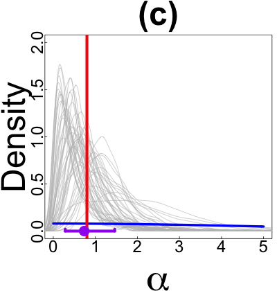{ width=30% } { width=30% } 
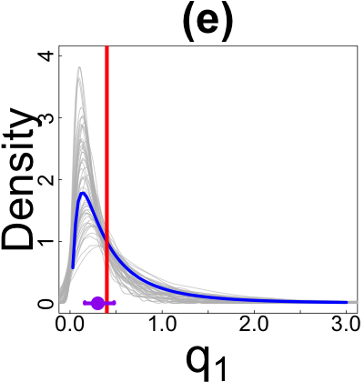{ width=30% } 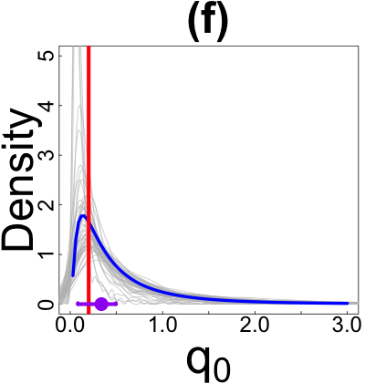{ width=30% }

## Estimation of latent Markov processes

To validate the accuracy of estimating latent state trajectory using our method, conditioning on the same latent Makov process with parameter $q_1=0.4$, $q_0=0.2$, $\delta = (\frac{2}{3}, \frac{1}{3})^T$, simulate 50 independent MMHPs including 500 events with parameter value $\lambda_0=1$, $\alpha=1.6$, $\beta=0.9$. The simulation procedure is based on *thinning theorem*. 

```{r, eval=chunk_run_list$run.simulation}
object <-list(lambda0=0.9, lambda1=1.1, alpha=0.8, beta=1.2, q1=0.4, q2=0.2, delta=c(1/3,2/3))
## Generating 500 events
no_events <- 500
test.mmhp.fix <- simulate.mmhp(object, nsim=no_events)

fixed.state.processes <- rep(list(),no_sim)
fixed.state.stan.result <- rep(list(),no_sim)
fixed.state.stan.time <- rep(NA,no_sim)

for(i in 1:no_sim){
  fixed.state.processes[i][[1]] <- simulate.mmhp.given.state(object, states=list(x=test.mmhp.fix$x,z=test.mmhp.fix$z),ending=tail(test.mmhp.fix$tau,1),max.nsim=1000)
  
  start_time <- Sys.time()
  current_N <- length(fixed.state.processes[i][[1]]$tau)
  current_interevent <- fixed.state.processes[i][[1]]$tau[-1]-fixed.state.processes[i][[1]]$tau[-current_N]
  fit_mmhp <- stan("../lib/mmhp.stan", 
                   data=list(N=current_N-1, interevent=current_interevent,event=cumsum(current_interevent)),
                   refresh = -1, iter=1000, chains=4, control = list(adapt_delta=0.95))
  end_time <- Sys.time()
  
  fixed.state.stan.time[i] <- end_time-start_time
  fixed.state.stan.result[i][[1]] <- extract(fit_mmhp)
}
save(fixed.state.processes,fixed.state.stan.result,
     fixed.state.stan.time,object,test.mmhp.fix,
     file=paste(data_path,"fixed_state_stan_result_",no_events,".Rdata",sep=""))
```

The scenarios with 50/100/200 events are generated by conditioning on truncated previous latent process (truncation length of latent process is according to the average number of emission events). Then fit the data in `mmhp.stan`. The simulated data and fitting result will be saved in `data_path` folder specified in the initial chunk and as `fixed_state_stan_result_numberOfEvents.Rdata`.

```{r, eval=chunk_run_list$run.simulation}
load(paste(data_path,"fixed_state_stan_result_500.Rdata",sep=""))
horizon_time_vec <- c(7.5,10,13)

for(l in c(1:3)){
  no_events <- no_vec_events[l]
  horizon_time <- horizon_time_vec[l]
  horizon_x <- max(which(test.mmhp.fix$x<=horizon_time))+1
  horizon_tau <- max(which(test.mmhp.fix$tau<=horizon_time))
  new.test.mmhp.fix <- list(x=test.mmhp.fix$x[1:horizon_x],
                            z=test.mmhp.fix$z[1:horizon_x],
                            tau=test.mmhp.fix$tau[1:horizon_tau],
                            zt=test.mmhp.fix$zt[1:horizon_tau])
  
  new.fixed.state.processes <- rep(list(),no_sim)
  fixed.state.stan.result <- rep(list(),no_sim)
  fixed.state.stan.time <- rep(NA,no_sim)

  for(i in 1:no_sim){
    horizon_tau <- max(which(fixed.state.processes[i][[1]]$tau<=horizon_time))
    if(horizon_tau<20){
      new.fixed.state.processes[i][[1]] <- simulate.mmhp.given.state(object, states=list(x=new.test.mmhp.fix$x,
                                                                                         z=new.test.mmhp.fix$z),
                                                                     ending=tail(new.test.mmhp.fix$tau,1),max.nsim=300)
    }else{
      new.fixed.state.processes[i][[1]] <- list(tau=fixed.state.processes[i][[1]]$tau[1:horizon_tau],
                                         zt=fixed.state.processes[i][[1]]$zt[1:horizon_tau])
    }
    current_N <- length(new.fixed.state.processes[i][[1]]$tau)
    current_interevent <- new.fixed.state.processes[i][[1]]$tau[-1]-new.fixed.state.processes[i][[1]]$tau[-current_N]
    start_time <- Sys.time()
    fit_mmhp <- stan("../lib/mmhp.stan", 
                     data=list(N=current_N-1,interevent=current_interevent),
                     refresh = -1, iter=1000, chains=4, control = list(adapt_delta=0.95))
    end_time <- Sys.time()
    fixed.state.stan.time[i] <- end_time-start_time
    fixed.state.stan.result[i][[1]] <- extract(fit_mmhp)
  }
  fixed.state.processes <- new.fixed.state.processes
  test.mmhp.fix <- new.test.mmhp.fix
  save(fixed.state.processes,fixed.state.stan.result,
       fixed.state.stan.time,test.mmhp.fix,object,
       file=paste(data_path,"fixed_state_stan_result_",no_events,".Rdata",sep=""))
}
```

### [Figure 5] Estimation of latent Markov processes

#### (a) Estimated MMHP latent trajectory

```{r, eval=chunk_run_list$plot.simulation}
png(paste(plot_path,"sim_state_plots_mmhp.png",sep=""), height=500, width=1000)
plotSimMMHP(data_path)
invisible(dev.off())
```


#### (c) Estimated MMPP latent trajectory

Fitting the above data in MMPP model.
```{r, eval=chunk_run_list$run.simulation}

for(l in c(1:length(no_vec_events))){
  no_events <- no_vec_events[l]
  load(paste(data_path,"fixed_state_stan_result_",no_events,".Rdata",sep=""))

  for(i in 1:50){
    current_N <- length(fixed.state.processes[i][[1]]$tau)
    current_interevent <- fixed.state.processes[i][[1]]$tau[-1]-fixed.state.processes[i][[1]]$tau[-current_N]
    fit_mmpp <- stan("../lib/mmpp.stan",
                     data=list(N=current_N-1,interevent=current_interevent),
                     refresh = -1, iter=1000, chains=4, control = list(adapt_delta=0.95))
    fixed.state.stan.result[i][[1]] <- extract(fit_mmpp)
  }
  
  save(fixed.state.processes,fixed.state.stan.result,
       test.mmhp.fix,object,
       file=paste(data_path,"mmpp_fixed_state_stan_result_",no_events,".Rdata",sep=""))
}
```

Plot the latent trajectory inferred by MMPP model.
```{r, eval=chunk_run_list$plot.simulation}
png(paste(plot_path,"sim_state_plots_mmpp.png",sep=""), height=500, width=1000)
plotSimMMPP(data_path)
invisible(dev.off())
```

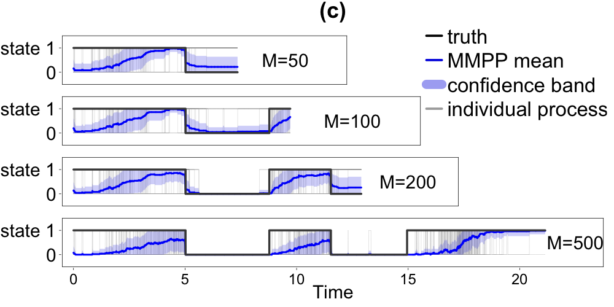

#### (d) Estimated MMHPSD latent trajectory

Fitting the above data in MMHPSD model.
```{r, eval=chunk_run_list$run.simulation}
for(l in c(1:length(no_vec_events))){
  no_events <- no_vec_events[l]
  load(paste(data_path,"fixed_state_stan_result_",no_events,".Rdata",sep=""))
  time_horizon <- tail(test.mmhp.fix$tau,1)
  time_segment <- 0.05
  
  mmhpsd_par_result <- rep(list(),50)
  for(i in 1:50){
    event_time <- fixed.state.processes[i][[1]]$tau
    mmhpsd_par_result[i][[1]] <- handelExceptionMmhpsd(event_time)
  }
  
  state_estimation_matrix <- matrix(0,nrow=50,ncol=1+(round(time_horizon/time_segment)))
  event_state_estimation <- rep(list(),50)
  for(i in 1:50){
    event_time <- fixed.state.processes[i][[1]]$tau
    for(j in 0:(round(time_horizon/time_segment))){
      if(j*time_segment>tail(event_time,1)){
        next
      }else{
        est_result <- tryCatch(estSInt(tims = j*time_segment,
                                       ti = event_time,
                                       lamb0 = mmhpsd_par_result[i][[1]]$lamb,
                                       nu0 = mmhpsd_par_result[i][[1]]$nu,
                                       eta0 = mmhpsd_par_result[i][[1]]$eta,
                                       Q0 = mmhpsd_par_result[i][[1]]$Q,
                                       pai0 = mmhpsd_par_result[i][[1]]$pai, fortran = TRUE),
                               warning = function(w) {0},
                               error = function(e) {0})
        state_estimation_matrix[i,j+1] <- ifelse(class(est_result)=="list",est_result$estStat[2],est_result)
      }
    }
    event_state_estimation[i][[1]] <- numeric(length(event_time))
    for(j in 1:length(event_time)){
      est_result <- tryCatch(estSInt(tims = event_time[j],
                                        ti = event_time,
                                        lamb0 = mmhpsd_par_result[i][[1]]$lamb,
                                        nu0 = mmhpsd_par_result[i][[1]]$nu,
                                        eta0 = mmhpsd_par_result[i][[1]]$eta,
                                        Q0 = mmhpsd_par_result[i][[1]]$Q,
                                        pai0 = mmhpsd_par_result[i][[1]]$pai, fortran = TRUE),
                               warning = function(w) {0},
                               error = function(e) {0})
      event_state_estimation[i][[1]][j] <- ifelse(class(est_result)=="list",est_result$estStat[2],est_result)
    }
  }
  save(fixed.state.processes,test.mmhp.fix,object,mmhpsd_par_result,state_estimation_matrix,event_state_estimation,
       file=paste(data_path,"fixed_state_mmhpsd_result_",no_events,".Rdata",sep=""))
}
```

Plot the latent trajectory inferred by MMHPSD model.
```{r, eval=chunk_run_list$plot.simulation}
png(paste(plot_path,"sim_state_plots_mmhpsd.png",sep=""), height=500, width=1000)
plotSimMMHPSD(data_path)
invisible(dev.off())
```


#### (b) Inferred intensity comparison 

Choose one of the simulated point processes with 100 events and plot the intensity function.
```{r, eval=chunk_run_list$plot.simulation}
png(paste(plot_path,"sim_intensity.png",sep=""), height=500, width=1000)
plotIntensityThreeModel(data_path, no.events=100, plot.idx=16)
invisible(dev.off())
```


```{r combine.fig.5, eval=chunk_run_list$plot.simulation}
### To combine above four plots
plots <- lapply(paste(plot_path,c("sim_state_plots_mmhp",
                                  "sim_state_plots_mmpp",
                                  "sim_intensity",
                                  "sim_state_plots_mmhpsd"),".png",sep=""),function(x){
    img <- as.raster(readPNG(x))
    rasterGrob(img, interpolate = FALSE)
})
ggsave(paste(plot_path,"sim_four_plots.png",sep=""), height=10, width=20, dpi=100,units = "in",
       marrangeGrob(grobs = plots, nrow=2, ncol=2,top=NULL))
```

### [Figure 6] Comparison of intergated absolute error between MMHP and MMHPSD latent process

To demonstrate that latent process of MMHPSD transits more frequent then MMHP, we use the integrated absolute error of inferred latent process $\hat{Z}(t)$: $\int_0^T|Z(t)-\hat{Z}(t)|dt$, where $Z(t)$ is the true latent process. Follwing plot demonstrates this quantity.

#### (a) Demonstration plot

```{r, eval=chunk_run_list$plot.simulation}
png(paste(plot_path,"mmhpsd_mmhp_area_difference.png",sep=""), height=350, width=500)
plotIntAbsErrorExample(data_path, no.events=200, plot.idx=37)
invisible(dev.off())
```


#### (b) Error comparison

Error comparison under different simulation scenarios.

```{r, eval=chunk_run_list$plot.simulation}
png(paste(plot_path,"mmhpsd_mmhp_beeswarm.png",sep=""), height=350, width=600)
plotIAEBeeswarm(data_path,c("fixed_state_stan_result_", "fixed_state_mmhpsd_result_"))
invisible(dev.off())
```


```{r combine.fig.6, eval=chunk_run_list$plot.simulation}
### To combine above four plots
plots <- lapply(paste(plot_path,c("mmhpsd_mmhp_area_difference",
                                  "mmhpsd_mmhp_beeswarm"),".png",sep=""),function(x){
    img <- as.raster(readPNG(x))
    rasterGrob(img, interpolate = FALSE)
})
ggsave(paste(plot_path,"sim_integrated_error.png",sep=""), height=3.5, width=11, dpi=100,units = "in",
       marrangeGrob(grobs = plots, nrow=1, ncol=2, widths = c(5,6), top=NULL))
```

# Real data experiments

Load packages,source code, change directory and define global variables.
```{r, message = FALSE}
###############################################################################
#Load packages,source code, change directory and define global variables
###############################################################################
pacman::p_load(devtools, RColorBrewer, dichromat, steepness, Hmisc, 
               igraph, dplyr, circlize, reshape2, ggplot2)
devtools::install_github('jalapic/compete')
library(compete)

#Change directory
setwd("~/Dropbox/Research/JASA_1/code")

#Specify directory for saving simulation and model fitting data (change based on your own system)
data_path = '../../../../Google Drive/paper_data_2/real_data/'

#Specify directory for saving plots
plot_path = '../new_fig/'

#Load source code from ../lib/ 
source('../lib/cleanData.R') 
source('../lib/naiveRankHierarchy.R') 
source('../lib/expertRankHierarchy.R')
source('../lib/stanResult.R') 
source('../lib/myImagePlot.R') 
source('../lib/matrixPlotParameter.R')
source('../lib/clusterAnalysis.R')
source('../lib/iAndSI.R') 
source('../lib/metricsStateSeparation.R') 
source('../lib/circularPlot.R')
source('../lib/sameTimeHorizonPlot.R')

#Define global variable
full_data <- readRDS("../data/mice.RData")
# A=c9, B=c10, C=c12, D=c15, E=c16, F=c17, G=c18, H=c37, I=c38. J=c45
cohort_names <- paste("cohort",c(9,10,12,15,16,17,18,37,38,45),sep='')
cohort_short_names <- paste("C",c(9,10,12,15,16,17,18,37,38,45),sep='')
cut_off <- 3
mice_number <- 12
```

## Load the data, clean and fit in the model

Load the data (10 cohorts), clean the data using source function `..\lib\cleanData.R`, fit the data into the model using `..\lib\mmhp_real_data.stan`. Store the model fitting result for next step analysis in the folder specified before (`r data_path`).

```{r, eval = chunk_run_list$run.real}
for(current_cohort in c(1:length(cohort_names))){
  clean_data <- cleanData(full_data[[cohort_names[current_cohort]]])
  fit_mmhp <- stan("../lib/mmhp_real_data.stan",
                   data=list(max_Nm=max(clean_data$N_count),
                             N_til=sum(clean_data$N_count>=cut_off),
                             Nm=as.vector(clean_data$N_count[clean_data$N_count>=cut_off]),
                             time_matrix=clean_data$time_matrix,
                             max_interevent=clean_data$max_interevent),
                   iter=1000, chains=4)
  sim_mmhp_pair <- rstan::extract(fit_mmhp)
  dir.create(paste(data_path, cohort_names[current_cohort],sep=''), recursive = TRUE)
  save(sim_mmhp_pair, 
       file = paste(data_path,cohort_names[current_cohort],
                    "/mmhp_stan_result_",cohort_names[current_cohort],
                    ".RData",sep=''))
}
```

## Infer the latent Markov processes and plotting

Load stan simulation result, infer the latent process and give the confidence band. Save all latent process result and the plots of inferred parameters (save as mmhp_latent_state_COHORTNAME.Rdata and parameter_COHORTNAME.pdf in the `r data_path`/COHORTNAME/ folder).

```{r, eval = chunk_run_list$run.real}
for(current_cohort in c(1:length(cohort_names))){
  clean_data <- cleanData(full_data[[cohort_names[current_cohort]]])
  I_fit <- clean_data$I_fit
  J_fit <- clean_data$J_fit
  N_count <- clean_data$N_count
  day_hour <- clean_data$day_hour
  time_matrix <- clean_data$time_matrix
  indicator_each_pair <- clean_data$indicator_each_pair
  naive_rank <- naiveRankHierarchy(full_data[[cohort_names[current_cohort]]])
  
  # ------------- Load the saved stan result using function ../lib/stanResult, 
  # ------------- and plot the inferred parameters and save
  parameter_result <- stanResult(cohort_number = current_cohort, 
                                 path = data_path)
  ztv_list_pair <- parameter_result$ztv_list_pair
  
  pdf(paste(data_path,cohort_names[current_cohort],"/parameter_",cohort_names[current_cohort],".pdf",sep=''))
  matrixPlotParameter(parameter_result$lambda0_matrix[rev(naive_rank),naive_rank],xLabels=naive_rank,yLabels=rev(naive_rank),title="lambda0 for mmhp")
  matrixPlotParameter(parameter_result$alpha_matrix[rev(naive_rank),naive_rank],xLabels=naive_rank,yLabels=rev(naive_rank),title="alpha for mmhp")
  mtext(paste("(mu,sigma)=(",round(parameter_result$mu_alpha,2),
              ",",round(parameter_result$sigma_alpha,2),")"),at=0.7)
  matrixPlotParameter(parameter_result$beta_matrix[rev(naive_rank),naive_rank],xLabels=naive_rank,yLabels=rev(naive_rank),title="beta for mmhp")
  mtext(paste("(mu,sigma)=(",round(parameter_result$mu_beta,2),
              ",",round(parameter_result$sigma_beta,2),")"),at=0.7)
  matrixPlotParameter(parameter_result$q1_matrix[rev(naive_rank),naive_rank],xLabels=naive_rank,yLabels=rev(naive_rank),title="q1 for mmhp",max=40)
  matrixPlotParameter(parameter_result$q2_matrix[rev(naive_rank),naive_rank],xLabels=naive_rank,yLabels=rev(naive_rank),title="q2 for mmhp")
  dev.off()
  
  fun.result.array.mmhp <- array(NA,dim=c(mice_number,mice_number,1000,2000))
  ztfunc.mmhp.df <- matrix(rep(list(),mice_number^2),mice_number,mice_number)
  time.segment <- seq(0,max(day_hour),length.out=2000)
  time.segment.delta <- time.segment[2]-time.segment[1]
  fun.result <- matrix(NA,1000,2000)
        
  for(i in naive_rank){
    for(k in 1:mice_number){
      j <- naive_rank[k]
      if(N_count[i,j]>=cut_off){
        temp_t <- c(0,day_hour[unlist(indicator_each_pair[i,j])])
        sample_zt_all <- ztv_list_pair[i,j][[1]]
        for(l in 1:1000){
          sample_ztv <- parameter_result$ztv_list_sample_pair[i,j,l][[1]]
          modified_sample_ztv <- modifiedLatentTrajectory(params=list(lambda0=parameter_result$lambda0_matrix[i,j],
                                                                      lambda1=parameter_result$lambda1_matrix[i,j],
                                                                      alpha=parameter_result$alpha_matrix[i,j],
                                                                      beta=parameter_result$beta_matrix[i,j],
                                                                      q1=parameter_result$q1_matrix[i,j],
                                                                      q2=parameter_result$q2_matrix[i,j]),
                                                              interevent = temp_t[-1]-temp_t[-length(temp_t)],
                                                              zt=sample_ztv,start=temp_t[1])
          if(modified_sample_ztv$z.hat[1]==1&tail(modified_sample_ztv$z.hat,1)==1){
            fun.result[l,]<-stepfun(c(temp_t[2]-0.0001,modified_sample_ztv$x.hat[-1],max(day_hour)),
                                    c(2,modified_sample_ztv$z.hat[-length(modified_sample_ztv$z.hat)],2,2))(time.segment)
          }
          if(modified_sample_ztv$z.hat[1]==1&tail(modified_sample_ztv$z.hat,1)==2){
            fun.result[l,]<-stepfun(c(temp_t[2],modified_sample_ztv$x.hat[-1]),
                                    c(2,modified_sample_ztv$z.hat))(time.segment)
          }
          if(modified_sample_ztv$z.hat[1]==2&tail(modified_sample_ztv$z.hat,1)==1){
            fun.result[l,]<-stepfun(c(modified_sample_ztv$x.hat[-1],max(day_hour)),
                                    c(modified_sample_ztv$z.hat[-length(modified_sample_ztv$z.hat)],2,2))(time.segment)
          }
          if(modified_sample_ztv$z.hat[1]==2&tail(modified_sample_ztv$z.hat,1)==2){
            fun.result[l,]<-stepfun(modified_sample_ztv$x.hat[-1],modified_sample_ztv$z.hat)(time.segment)
          }
          fun.result.array.mmhp[i,j,l,]<-fun.result[l,]
        }
        fun.result.int <- ifelse(apply(fun.result,2,mean)<1.5,rep(1,1000),rep(2,1000))
        #fun.result.int <- ifelse((apply(fun.result,2,mean)-apply(fun.result,2,sd))>1.5,rep(2,1000),rep(1,1000))
        ztfunc.mmhp.df[i,j][[1]] <- stepfun(time.segment,c(fun.result.int,2))
      }
    }
  }
  save(ztfunc.mmhp.df,fun.result.array.mmhp,ztv_list_pair,
       file=paste(data_path,cohort_names[current_cohort],
                  "/mmhp_latent_state_",cohort_names[current_cohort],".RData",sep=''))
}
```

Plot latent state using confidence band: compute mean and sd from each posterior draw of latent trajectory. (save as latent_state_COHORTNAME.png in the `r data_path`/COHORTNAME/ folder).

```{r, eval = chunk_run_list$run.real}
for(current_cohort in c(1:length(cohort_names))){
  clean_data <- cleanData(full_data[[cohort_names[current_cohort]]])
  I_fit <- clean_data$I_fit
  J_fit <- clean_data$J_fit
  N_count <- clean_data$N_count
  day_hour <- clean_data$day_hour
  time_matrix <- clean_data$time_matrix
  indicator_each_pair <- clean_data$indicator_each_pair

  naive_rank <- naiveRankHierarchy(full_data[[cohort_names[current_cohort]]])
  
  # ------------- Load the saved latent process result, plot the inferred latent process confidence band
  load(paste(data_path,cohort_names[current_cohort],"/mmhp_latent_state_",cohort_names[current_cohort],".RData",sep=''))

  png(paste(data_path,cohort_names[current_cohort],"/latent_state_",cohort_names[current_cohort],".png",sep=''), height=2000, width=2000)
  
  par(mfrow=c(3,4),
      mar=c(3,4,4,3), oma=c(0,0,0,0))
  time.segment <- seq(0,max(day_hour),length.out=2000)
  time.segment.delta <- time.segment[2]-time.segment[1]
  for(i in naive_rank){
    plot(0,0,xlim=c(-0.2,tail(day_hour,1)+1),ylim=c(1,24),type="n",main=paste(i,"->",sep=""))
    for(k in 1:mice_number){
      j <- naive_rank[k]
      if(N_count[i,j]>=cut_off){
        fun.result <- matrix(NA,1000,2000)
        temp_t <- c(0,day_hour[unlist(indicator_each_pair[i,j])])
        sample_zt_all <- ztv_list_pair[i,j][[1]]
        points(temp_t[-1],3-sample_zt_all+24-2*k,pch=4,cex=0.6,col="black")
        lines(3-apply(fun.result.array.mmhp[i,j,,],2,mean)+24-2*k~time.segment,type="l",col="blue",lwd=1)
        lines(3-apply(fun.result.array.mmhp[i,j,,],2,mean)-apply(fun.result.array.mmhp[i,j,,],2,sd)+24-2*k~time.segment,type="l",col="blue",lwd=0.5,lty=3)
        lines(3-apply(fun.result.array.mmhp[i,j,,],2,mean)+apply(fun.result.array.mmhp[i,j,,],2,sd)+24-2*k~time.segment,type="l",col="blue",lwd=0.5,lty=3) 
        text(tail(day_hour,1)+0.8,24-2*k+1.5,j)
        text(0,24-2*k+1.5,ifelse(sample_zt_all[1]==1,"A","IA"),cex=0.6)
      }else{
        text(tail(day_hour,1)+0.8,24-2*k+1.5,j)
      } 
    }
  }
  dev.off()
}
```

## Model diagonsis

[Time rescaling theorem](http://www.stat.cmu.edu/~kass/papers/rescaling.pdf) is a well-known result in probability theory and is commonly used for goodness-of-fit test for point process data. We use QQ plot and KS test to assess model goodness of fit, and save them as `diagonsis_COHORTNAME` in the folder `r data_path` specified before.

```{r, eval = chunk_run_list$run.real}
for(current_cohort in c(1:length(cohort_names))){
  clean_data <- cleanData(full_data[[cohort_names[current_cohort]]])
  I_fit <- clean_data$I_fit
  J_fit <- clean_data$J_fit
  N_count <- clean_data$N_count
  day_hour <- clean_data$day_hour
  time_matrix <- clean_data$time_matrix
  indicator_each_pair <- clean_data$indicator_each_pair

  naive_rank <- naiveRankHierarchy(full_data[[cohort_names[current_cohort]]])
  
  # ------------- Load the saved stan result, plot the inferred parameters and save
  parameter_result <- stanResult(cohort_number = current_cohort, 
                                 path = data_path)
  
  pdf(paste(data_path,cohort_names[current_cohort],"/diagonsis_",cohort_names[current_cohort],".pdf",sep=''))
  
  # -------------- qq plot
  par(mfrow=c(mice_number,mice_number),
      oma = c(2,2,.5,.5),
      mar=c(.5,.5,1.5,.5),
      mgp = c(0, .2, 0))
  for(k in 1:mice_number){
    for(l in 1:mice_number){
      if(k==l){
        plot(0,0,xlim=c(0,5),ylim=c(0,5),type="n", xlab="", ylab="", axes = FALSE, frame=TRUE)
        mtext(paste(naive_rank[k],"->",naive_rank[l],sep=""),
              side=3, line=0.8, cex=0.6)
        mtext(paste("N=",N_count[i,j],sep=""), side=3, line=0, cex=0.5)
      }else{
        i<-naive_rank[k]
        j<-naive_rank[l]
        if(N_count[i,j]<cut_off){
          plot(0,0,xlim=c(0,5),ylim=c(0,5),type="n", xlab="", ylab="", axes = FALSE, frame=TRUE)
          mtext(paste(i,"->",j), side=3, line=0.8, cex=0.6)
          mtext(paste("N=",clean_data$N_count[i,j],sep=""), side=3, line=0, cex=0.5)
        }else{
          temp_t <- c(0,day_hour[unlist(indicator_each_pair[i,j])])
          Lambda.test<-mmhpCompensator(params=list(lambda0=parameter_result$lambda0_matrix[i,j],
                                                   lambda1=parameter_result$lambda1_matrix[i,j],
                                                   alpha=parameter_result$alpha_matrix[i,j],
                                                   beta=parameter_result$beta_matrix[i,j],
                                                   q1=parameter_result$q1_matrix[i,j],
                                                   q2=parameter_result$q2_matrix[i,j]), 
                                       t=temp_t, 
                                       pzt=2-unlist(parameter_result$pztv_list_pair[i,j][[1]]),if.pzt=FALSE)
          p <- ppoints(100)    # 100 equally spaced points on (0,1), excluding endpoints
          q <- quantile(Lambda.test,p=p,na.rm=TRUE) # percentiles of the sample distribution
          plot(qexp(p), q, xlab="", ylab="", axes = FALSE, frame=TRUE, cex=0.5)
          qqline(q, distribution=qexp, col="blue", lty=2)
          mtext(paste(i,"->",j), side=3, line=0.8, cex=0.6)
          mtext(paste("N=",N_count[i,j],sep=""), side=3, line=0, cex=0.5)
        }
      }
    }
  }
  title(xlab = "Theoretical Quantiles",
        ylab = "Empirical Quantiles",
        outer = TRUE, line = 0)
  
  # -------------- KS plot
  KS.result.p <- matrix(NA,mice_number,mice_number)
  KS.result.stat <- matrix(NA,mice_number,mice_number)
  par(mfrow=c(mice_number,mice_number),
      oma = c(.5,.5,.5,.5),
      mar=c(.5,.5,1.5,.5),
      mgp = c(0, .2, 0))
  for(k in 1:mice_number){
    for(l in 1:mice_number){
      if(k==l){
        plot(0,0,xlim=c(0,5),ylim=c(0,5),type="n", xlab="", ylab="", axes = FALSE, frame=TRUE)
        mtext(paste(naive_rank[k],"->",naive_rank[l],sep=""),
              side=3, line=0.8, cex=0.6)
        mtext(paste("N=",N_count[i,j],sep=""), side=3, line=0, cex=0.5)
      }else{
        i<-naive_rank[k]
        j<-naive_rank[l]
        if(N_count[i,j]<cut_off){
          plot(0,0,xlim=c(0,5),ylim=c(0,5),type="n", xlab="", ylab="", axes = FALSE, frame=TRUE)
          mtext(paste(i,"->",j), side=3, line=0.8, cex=0.6)
          mtext(paste("N=",N_count[i,j],sep=""), side=3, line=0, cex=0.5)
        }else{
          temp_t <- c(0,day_hour[unlist(indicator_each_pair[i,j])])
          Lambda.test<-mmhpCompensator(params=list(lambda0=parameter_result$lambda0_matrix[i,j],
                                                   lambda1=parameter_result$lambda1_matrix[i,j],
                                                   alpha=parameter_result$alpha_matrix[i,j],
                                                   beta=parameter_result$beta_matrix[i,j],
                                                   q1=parameter_result$q1_matrix[i,j],
                                                   q2=parameter_result$q2_matrix[i,j]), 
                                       t=temp_t, 
                                       pzt=2-unlist(parameter_result$pztv_list_pair[i,j][[1]]),if.pzt=FALSE)
          KS.result.p[i,j]<-ks.test(Lambda.test,"pexp")$p.value
          KS.result.stat[i,j]<-ks.test(Lambda.test,"pexp")$statistic
          curve(pexp(x,1), min(Lambda.test), max(Lambda.test),
                ylab="",xlab="",axes = FALSE, frame=TRUE)
          plot(ecdf(Lambda.test), add=TRUE, do.points=FALSE, verticals=TRUE,col="red")
          mtext(paste(i,"->",j), side=3, line=0.8, cex=0.6)
          mtext(paste("N=",N_count[i,j],", p=",round(ks.test(Lambda.test,"pexp")$p.value,2),sep=""),
                side=3, line=0, cex=0.5)
        }
      }
    }
  }
  dev.off()
}
```

## Further analysis and plots in paper

### [Figure 1] Introduction - event arrival time and distribution

```{r}
current_cohort <- 5
current_i <- 2
current_j <- 12
clean_data <- cleanData(full_data[[cohort_names[current_cohort]]])
current_event_time <- clean_data$day_hour[unlist(clean_data$indicator_each_pair[current_i,current_j])]
```

To demonstrate the sporadic and bursty nature of event occurrences in the real data, we use the interactions of one pair of mice (`r current_i`->`r current_j`) mice interactions in cohort `r current_cohort`.

#### (a) Event arrival time
```{r, eval=chunk_run_list$plot.real}
png(paste(plot_path,"real_intro_event_time.png",sep=""), height=200, width=700)
par(mfrow=c(1,1),tcl=0.2,mgp=c(3,0,0),
    mar=c(4.5,4.8,3,0.8), oma=c(0,0,0,0))

## MMPP
plot(0.5,0,xlim=c(-0.2,45),ylim=c(0.7,2), type="n",
     xlab="Time (hours)",ylab="",xaxt="n",yaxt="n",cex.lab=1.8,bty="n")
title("(a)",line=1,cex.main=2)
axis(2,at=c(1,2),labels=FALSE,cex.lab=1.8,las=2,lwd=0,lwd.ticks=0)
axis(1,at=seq(0,45,5),labels=FALSE,cex.lab=1.8,las=2,lwd=1.5,lwd.ticks=1)
text(seq(0,45,5), y=0.5, labels=seq(0,45,5), cex=1.7, srt=0, xpd=TRUE)

segments(x0=0.1,x1=45,y0=1.5,col="lightgrey",lwd=2)
points(current_event_time,rep(1.5,length(current_event_time)),pch=4,col="black",cex=1.5,lwd=2)
for(i in 1:length(current_event_time)){
  segments(x0=current_event_time[i],x1=current_event_time[i],
           y0=0.5,y1=1.5,lty=3)
}
points(current_event_time,rep(1.5,length(current_event_time)),pch=4,col="black",cex=1.5,lwd=2)
text(-3.6, y=1.5, labels="Event arrival", cex=1.4, srt=0, xpd=TRUE)
text(-3.6, y=1.2, labels="time", cex=1.4, srt=0, xpd=TRUE)

invisible(dev.off())
```


#### (b) Distribution of interevent time

```{r, eval=chunk_run_list$plot.real}
png(paste(plot_path,"real_intro_hist.png",sep=""), height=200, width=300)
par(mfrow=c(1,1),tcl=0.2,mgp=c(1.8,0,0),
    mar=c(2.4,3.3,1,0.5), oma=c(0,0,0,0))
hist(current_event_time[-1]-current_event_time[-length(current_event_time)],freq=F,breaks=15,
     xlab="",ylab="Density",xaxt="n",yaxt="n",main="",cex.lab=1.7, bty="o")

title("(b)",line=-0.5,cex.main=2)
axis(2,at=c(0:10),labels=FALSE,cex.lab=1.8,las=2,lwd=1.2,lwd.ticks=1)
axis(1,at=seq(0,7,1),labels=FALSE,cex.lab=1.8,las=2,lwd=1.2,lwd.ticks=1)
text(-0.72, y=seq(0,0.8,0.2), labels=seq(0,0.8,0.2), cex=1.4, srt=0, xpd=TRUE)
text(seq(0,7,1), y=-0.09, labels=seq(0,7,1), cex=1.4, srt=0, xpd=TRUE)
text(3.5,-0.2,"Interevent time (hours)", cex=1.6, srt=0, xpd=TRUE)

## Plot the density curve for interevent time
h <- hist(current_event_time[-1]-current_event_time[-length(current_event_time)], plot = FALSE, breaks=10)
xl <- seq(0, max(h$mids), (max(h$mids))/1000)
lines(xl, predict(loess(c(1,h$density) ~ c(-0.5,h$mids), span = 1.2), xl), lwd = 3, col="blue")

## Plot the density curve for exponential
exp_lambda_hat <- 1/(mean(current_event_time[-1]-current_event_time[-length(current_event_time)]))
curve(dexp(x, rate=exp_lambda_hat),
      xlim=range(current_event_time[-1]-current_event_time[-length(current_event_time)]),
      lwd=3, col="red", add = TRUE)

legend(0.28,1,c("real interevent time density", "exponential interevent time \n density"),
       lty=1,lwd=4,col=c("blue","red"),y.intersp=0.85,x.intersp=0.4,seg.len=0.8,bty="n",cex=1.35)

invisible(dev.off())
```


```{r combine.fig.1, eval=chunk_run_list$plot.simulation}
plots <- lapply(paste(plot_path,c("real_intro_event_time",
                                  "real_intro_hist"),".png",sep=""),function(x){
    img <- as.raster(readPNG(x))
    rasterGrob(img, interpolate = FALSE)
})
ggsave(paste(plot_path,"real_intro_example.png",sep=""), height=2, width=10, dpi=100, units = "in",
       marrangeGrob(grobs = plots, nrow=1, ncol=2, widths=c(7,3),top=NULL))
```

### [Figure 2] Introduction - comparison of MMPP and MMHPSD

In order to demonstrate MMPP and MMHPSD are not satisfied models for our data, we fit (`r current_i`->`r current_j`) mice interactions in cohort `r current_cohort` in both models (same pair as in the previous example). The data is saved in `r paste(data_path,cohort_names[current_cohort],sep="")`.

```{r, results='hide', eval=chunk_run_list$run.real}
### preperation for data
clean_data <- cleanData(full_data[[cohort_names[current_cohort]]])
I_fit <- clean_data$I_fit
J_fit <- clean_data$J_fit
N_count <- clean_data$N_count
naive_rank <- naiveRankHierarchy(full_data[[cohort_names[current_cohort]]])

### fit the data into mmpp
fit_mmpp <- stan("../lib/mmpp_real_data.stan",
                  data=list(max_Nm=max(clean_data$N_count),
                             N_til=sum(clean_data$N_count>=cut_off),
                             Nm=as.vector(clean_data$N_count[clean_data$N_count>=cut_off]),
                             time_matrix=clean_data$time_matrix,
                             max_interevent=clean_data$max_interevent),
                   iter=1000, chains=4)
sim_mmpp_pair <- rstan::extract(fit_mmpp)

zt_mmpp_pair <- ifelse(apply(sim_mmpp_pair$zt[1001:2000,,],c(2,3),function(x) sum(x==1)) >500,rep(1,1000),rep(2,1000))
ztv_mmpp_pair <- t(ifelse(apply(sim_mmpp_pair$zt_v[1001:2000,,],c(2,3),function(x) sum(x==1)) >500,rep(1,1000),rep(2,1000)))
pztv_mmpp_pair <- t(apply(sim_mmpp_pair$zt_v[1001:2000,,],c(2,3),mean))
lambda0_pair <- apply(sim_mmpp_pair$lambda0[1001:2000,],2,mean)
c_pair <- apply(sim_mmpp_pair$c[1001:2000,],2,mean)
q1_pair <- apply(sim_mmpp_pair$q1[1001:2000,],2,mean)
q2_pair <- apply(sim_mmpp_pair$q2[1001:2000,],2,mean)

lambda0_matrix <- matrix(0,ncol=12,nrow=12)
c_matrix <- matrix(0,ncol=12,nrow=12)
q1_matrix <- matrix(0,ncol=12,nrow=12)
q2_matrix <- matrix(0,ncol=12,nrow=12)
zt_list_pair <- matrix(rep(list(),144),12,12)
zt_list_sample_pair <- array(rep(list(),144*1000),dim=c(12,12,1000))
ztv_list_pair <- matrix(rep(list(),144),12,12)
pztv_list_pair <- matrix(rep(list(),144),12,12)
ztv_list_sample_pair <- array(rep(list(),144*1000),dim=c(12,12,1000))

for(i in 1:sum(N_count>=cut_off)){
  lambda0_matrix[I_fit[i],J_fit[i]] <- lambda0_pair[i]
  c_matrix[I_fit[i],J_fit[i]] <- c_pair[i]
  q1_matrix[I_fit[i],J_fit[i]] <- q1_pair[i]
  q2_matrix[I_fit[i],J_fit[i]] <- q2_pair[i]
  zt_list_pair[I_fit[i],J_fit[i]][[1]] <- zt_mmpp_pair[i,1:c(N_count[I_fit[i],J_fit[i]]-1)]
  ztv_list_pair[I_fit[i],J_fit[i]][[1]] <- ztv_mmpp_pair[i,1:(N_count[I_fit[i],J_fit[i]]-1)]
  pztv_list_pair[I_fit[i],J_fit[i]][[1]] <- pztv_mmpp_pair[i,1:(N_count[I_fit[i],J_fit[i]]-1)]
  for(k in 1:1000){
    zt_list_sample_pair[I_fit[i],J_fit[i],k][[1]] <- sim_mmpp_pair$zt[k+1000,i,1:(N_count[I_fit[i],J_fit[i]]-1)]
    ztv_list_sample_pair[I_fit[i],J_fit[i],k][[1]] <- sim_mmpp_pair$zt_v[k+1000,1:(N_count[I_fit[i],J_fit[i]]-1),i]
  }
}

fun.result.array <- array(NA,dim=c(12,12,1000,2000))
ztfunc.mmpp.df <- matrix(rep(list(),144),12,12)
time.segment <- seq(0,max(clean_data$day_hour),length.out=2000)
time.segment.delta <- time.segment[2]-time.segment[1]

for(i in naive_rank){
  for(k in 1:12){
    j <- naive_rank[k]
    if(N_count[i,j]>=cut_off){
      fun.result <- matrix(NA,1000,2000)
      temp_t <- clean_data$day_hour[unlist(clean_data$indicator_each_pair[i,j])]
      sample_zt_all <- ztv_list_pair[i,j][[1]]
      for(l in 1:1000){
        sample_ztv <- ztv_list_sample_pair[i,j,l][[1]]
        modified_sample_ztv <- mmppModifiedLatentTrajectory(params=list(lambda0_matrix[i,j],c_matrix[i,j],q1_matrix[i,j],q2_matrix[i,j]),
                                                            interevent = temp_t[-1]-temp_t[-length(temp_t)],
                                                            zt=sample_ztv,start=temp_t[1])
        if(modified_sample_ztv$z.hat[1]==1&tail(modified_sample_ztv$z.hat,1)==1){
          fun.result[l,]<-stepfun(c(temp_t[2],modified_sample_ztv$x.hat[-1],max(clean_data$day_hour)),
                                  c(2,modified_sample_ztv$z.hat[-length(modified_sample_ztv$z.hat)],2,2))(time.segment)
        }
        if(modified_sample_ztv$z.hat[1]==1&tail(modified_sample_ztv$z.hat,1)==2){
          fun.result[l,]<-stepfun(c(temp_t[2],modified_sample_ztv$x.hat[-1]),
                                  c(2,modified_sample_ztv$z.hat))(time.segment)
        }
        if(modified_sample_ztv$z.hat[1]==2&tail(modified_sample_ztv$z.hat,1)==1){
          fun.result[l,]<-stepfun(c(modified_sample_ztv$x.hat[-1],max(clean_data$day_hour)),
                                  c(modified_sample_ztv$z.hat[-length(modified_sample_ztv$z.hat)],2,2))(time.segment)
        }
        if(modified_sample_ztv$z.hat[1]==2&tail(modified_sample_ztv$z.hat,1)==2){
          fun.result[l,]<-stepfun(modified_sample_ztv$x.hat[-1],modified_sample_ztv$z.hat)(time.segment)
        }
        fun.result.array[i,j,l,]<-fun.result[l,]
      }
      #fun.result.int <- ifelse((apply(fun.result,2,mean)+apply(fun.result,2,sd))<1.5,rep(1,1000),rep(2,1000))
      fun.result.int <- ifelse(apply(fun.result,2,mean)<1.5,rep(1,1000),rep(2,1000))
      ztfunc.mmpp.df[i,j][[1]] <- stepfun(time.segment,c(fun.result.int,2))
    }
  }
}

### fit the data into mmhpsd
current_event_time <- clean_data$day_hour[unlist(clean_data$indicator_each_pair[current_i,current_j])]
mmhpsd_par_result <- handelExceptionMmhpsd(current_event_time)

time_horizon <- tail(current_event_time,1)
time_segment <- 0.03
state_estimation <- numeric(1+(round(time_horizon/time_segment)))
for(j in 0:(round(time_horizon/time_segment))){
  est_result <- tryCatch(estSInt(tims = j*time_segment,
                                 ti = c(0,current_event_time),
                                 lamb0 = mmhpsd_par_result$lamb,
                                 nu0 = mmhpsd_par_result$nu,
                                 eta0 = mmhpsd_par_result$eta,
                                 Q0 = mmhpsd_par_result$Q,
                                 pai0 = mmhpsd_par_result$pai, fortran = TRUE),
                           warning = function(w) {0},
                           error = function(e) {0})
  state_estimation[j+1] <- ifelse(class(est_result)=="list",est_result$estStat[2],est_result)
}

event_state_estimation <- numeric(length(current_event_time))
for(j in 1:length(current_event_time)){
  est_result <- tryCatch(estSInt(tims = current_event_time[j],
                                 ti = c(0,current_event_time),
                                 lamb0 = mmhpsd_par_result$lamb,
                                 nu0 = mmhpsd_par_result$nu,
                                 eta0 = mmhpsd_par_result$eta,
                                 Q0 = mmhpsd_par_result$Q,
                                 pai0 = mmhpsd_par_result$pai, fortran = TRUE),
                           warning = function(w) {0},
                           error = function(e) {0})
  event_state_estimation[j] <- ifelse(class(est_result)=="list",est_result$estStat[2],est_result)
}

save(current_cohort,current_i,current_j,current_event_time,
     zt_list_pair,fun.result.array,state_estimation,event_state_estimation,
     file=paste(data_path,cohort_names[current_cohort],"/plot_mmhpsd_mmpp.RData",sep=''))
```

```{r, eval=chunk_run_list$plot.real}
load(paste(data_path,cohort_names[current_cohort], "/plot_mmhpsd_mmpp.RData",sep=''))
clean_data <- cleanData(full_data[[cohort_names[current_cohort]]])

png(paste(plot_path,"real_intro_mmhpsd_mmpp.png",sep=""), height=250, width=1000)
par(mfrow=c(1,2),tcl=0.2,mgp=c(3,0,0),
    mar=c(4.5,4.8,3,0.8), oma=c(0,0,0,0))

## MMPP
plot(0.5,0,xlim=c(-0.2,45),ylim=c(0.7,2.3), type="n",
     xlab="Time (hours)",ylab="",xaxt="n",yaxt="n",cex.lab=1.8,bty="n")
title("(a) MMPP",line=1,cex.main=2)
axis(2,at=c(1,2),labels=FALSE,cex.lab=1.8,las=2,lwd=0,lwd.ticks=0)
axis(1,at=seq(0,45,5),labels=FALSE,cex.lab=1.8,las=2,lwd=1.5,lwd.ticks=1)
text(-3.6, y=c(1,2), labels=paste(c("state","state"),c(0,1)," "), cex=1.8, srt=0, xpd=TRUE)
text(-2.6, y=2.3, labels="Inferred latent state", cex=1.2, srt=0, xpd=TRUE)
text(seq(0,45,5), y=0.5, labels=seq(0,45,5), cex=1.7, srt=0, xpd=TRUE)

segments(x0=0,x1=tail(clean_data$day_hour,1),y0=1,col="lightgrey",lwd=2)
segments(x0=0,x1=tail(clean_data$day_hour,1),y0=2,col="lightgrey",lwd=2)
segments(x0=0,x1=tail(clean_data$day_hour,1),y0=1.5,col="darkgrey",lwd=1,lty=2)

sample_zt_all <- zt_list_pair[current_i,current_j][[1]]
mean.fun.result.array.mmpp <- apply(fun.result.array[current_i,current_j,,],2,mean)

time.segment <- seq(0,max(clean_data$day_hour),length.out=2000)
time.segment.delta <- time.segment[2]-time.segment[1]
lines(3-mean.fun.result.array.mmpp~time.segment,type="l",col="grey",lwd=4)
polygon(c(time.segment,rev(time.segment)),
        c(3-mean.fun.result.array.mmpp-apply(fun.result.array[current_i,current_j,,],2,sd),
          rev(3-mean.fun.result.array.mmpp+apply(fun.result.array[current_i,current_j,,],2,sd))),
        col=rgb(128,128,128,alpha=50,maxColorValue=255),border=FALSE)
points(current_event_time,3-c(2,c(sample_zt_all[1:(length(sample_zt_all)-2)],1,tail(sample_zt_all,1))),pch=4,col="black",cex=1.2,lwd=2) ##to fix

### MMHPSD
plot(0.5,0,xlim=c(-0.2,45),ylim=c(0.7,2.3), type="n",
     xlab="Time (hours)",ylab="",xaxt="n",yaxt="n",cex.lab=1.8,bty="n")
title("(b) MMHPSD",line=1,cex.main=2)
axis(2,at=c(1,2),labels=FALSE,cex.lab=1.8,las=2,lwd=0,lwd.ticks=0)
axis(1,at=seq(0,45,5),labels=FALSE,cex.lab=1.8,las=2,lwd=1.5,lwd.ticks=1)
text(-3.6, y=c(1,2), labels=paste(c("state","state"),c(0,1)," "), cex=1.8, srt=0, xpd=TRUE)
text(-2.6, y=2.3, labels="Inferred latent state", cex=1.2, srt=0, xpd=TRUE)
text(seq(0,45,5), y=0.5, labels=seq(0,45,5), cex=1.7, srt=0, xpd=TRUE)

segments(x0=0,x1=tail(clean_data$day_hour,1),y0=1,col="lightgrey",lwd=2)
segments(x0=0,x1=tail(clean_data$day_hour,1),y0=2,col="lightgrey",lwd=2)
segments(x0=0,x1=tail(clean_data$day_hour,1),y0=1.5,col="darkgrey",lwd=1,lty=2)


time_horizon <- tail(current_event_time,1)
time_segment <- 0.03 #025
state_mmhpsd <- state_estimation+1 #2-(state_estimation<0.5)
time_mmhpsd <- c(0:(round(time_horizon/time_segment)))*time_segment
lines(state_mmhpsd~time_mmhpsd, type="l", col="grey", lwd=4)
points(current_event_time,c(1+(event_state_estimation[-length(event_state_estimation)]>0.5),2),pch=4,col="black",cex=1.2,lwd=2) ##!!!

invisible(dev.off())
```


### [Figure 7 (a-c)] MMHP result -- one pair of mice

```{r}
current_cohort <- 5
current_i <- 2
current_j <- 12
```

Following plots are visualizing result from fitting cohort `r cohort_names[current_cohort]` (`r current_i`->`r current_j`) pair in MMHP model. Comparing to the first plot in the paper using same data, we could see that our model fits the data better.

#### (a) One pair -- latent state plot

```{r, eval=chunk_run_list$plot.real}
clean_data <- cleanData(full_data[[cohort_names[current_cohort]]])
current_event_time <- clean_data$day_hour[unlist(clean_data$indicator_each_pair[current_i,current_j])]
time.segment <- seq(0,max(clean_data$day_hour),length.out=2000)
time.segment.delta <- time.segment[2]-time.segment[1]

load(paste(data_path,cohort_names[current_cohort],"/mmhp_latent_state_",cohort_names[current_cohort],".RData",sep=''))
sample_zt_all <- ztv_list_pair[current_i,current_j][[1]]

png(paste(plot_path,"real_state_mmhp.png",sep=""), height=250, width=800)
par(mfrow=c(1,1),tcl=0.2,mgp=c(3,0,0),
    mar=c(4.5,4.8,3,0.8), oma=c(0,0,0,0))
plot(0.5,0,xlim=c(-0.2,tail(current_event_time,1)+1),ylim=c(0.7,2.3), type="n",
     xlab="Time (hours)",ylab="",xaxt="n",yaxt="n",cex.lab=1.8,bty="n")
title("(a)",line=1,cex.main=2)
axis(2,at=c(1,2),labels=FALSE,cex.lab=1.8,las=2,lwd=0,lwd.ticks=0)
axis(1,at=seq(0,45,5),labels=FALSE,cex.lab=1.8,las=2,lwd=1.5,lwd.ticks=1)
text(-3.6, y=c(1,2), labels=paste(c("state","state"),c(0,1)," "), cex=1.8, srt=0, xpd=TRUE)
text(seq(0,45,5), y=0.5, labels=seq(0,45,5), cex=1.7, srt=0, xpd=TRUE)
text(-1.6, y=2.4, labels="Inferred latent state", cex=1.4, srt=0, xpd=TRUE)

segments(x0=0,x1=tail(current_event_time,1),y0=1,col="lightgrey",lwd=2)
segments(x0=0,x1=tail(current_event_time,1),y0=2,col="lightgrey",lwd=2)
segments(x0=0,x1=tail(clean_data$day_hour,1),y0=1.5,col="darkgrey",lwd=1,lty=2)

points(current_event_time,3-sample_zt_all,pch=4,col="black",cex=1.2,lwd=2)
lines(3-apply(fun.result.array.mmhp[current_i,current_j,,],2,mean)~time.segment,type="l",col="blue",lwd=4)
polygon(c(time.segment,rev(time.segment)),
        c(3-apply(fun.result.array.mmhp[current_i,current_j,,],2,mean)-
          apply(fun.result.array.mmhp[current_i,current_j,,],2,sd),
        rev(3-apply(fun.result.array.mmhp[current_i,current_j,,],2,mean)+apply(fun.result.array.mmhp[current_i,current_j,,],2,sd))),
       col=rgb(0,0,225,alpha=50,maxColorValue=255),border=FALSE)

invisible(dev.off())
```

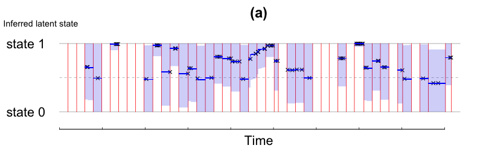

#### (b) One pair -- qq plot
```{r, eval=chunk_run_list$plot.real}
parameter_result <- stanResult(cohort_number = current_cohort, path = data_path) 

Lambda.test.mmhp<-mmhpCompensator(params=list(lambda0=parameter_result$lambda0_matrix[current_i,current_j],
                                              lambda1=parameter_result$lambda1_matrix[current_i,current_j],
                                            alpha=parameter_result$alpha_matrix[current_i,current_j],
                                            beta=parameter_result$beta_matrix[current_i,current_j],
                                            q1=parameter_result$q1_matrix[current_i,current_j],
                                            q2=parameter_result$q2_matrix[current_i,current_j]), 
                                  t=c(0,current_event_time),
                                  pzt=2-unlist(parameter_result$pztv_list_pair[current_i,current_j][[1]]),
                                  if.pzt=FALSE)

png(paste(plot_path,"real_qq.png",sep=""), height=350, width=400)
par(mfrow=c(1,1),tcl=0.2,mgp=c(3,0,0),
    mar=c(4.5,4.7,2.6,0.8), oma=c(0,0,0,0))
p <- ppoints(100)    # 100 equally spaced points on (0,1), excluding endpoints
q <- quantile(Lambda.test.mmhp,p=p,na.rm=TRUE) # percentiles of the sample distribution
plot(qexp(p),q, xlab="Theoretical Quantiles",ylab="Empirical Quantiles",cex.lab=2.2,xaxt="n",yaxt="n",
     pch=1,cex=1.5,col="Black",ylim=c(0,5),xlim=c(0,5))
#axis(2,at=c(0:5),cex.axis=2,lwd=0,lwd.ticks=1)
#axis(1,at=c(0:5),cex.axis=2,lwd=0,lwd.ticks=1)
mgp.axis(1,mgp=c(0,0.6,0),at=c(0:5),cex.axis=2,lwd=0,lwd.ticks=1)
mgp.axis(2,mgp=c(0,0.1,0),at=c(0:5),cex.axis=2,lwd=0,lwd.ticks=1)
title("(b)",line=0.7,cex.main=2)
qqline(q, distribution=qexp,col="Black", lty=1, lwd=2.5)

invisible(dev.off())
```
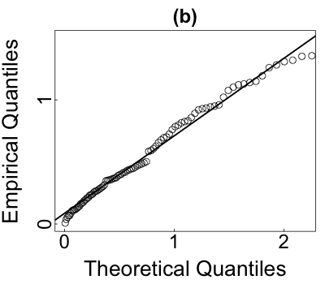

#### (c) One pair -- ks plot
```{r, eval=chunk_run_list$plot.real}
png(paste(plot_path,"real_ks.png",sep=""), height=350, width=400)

par(mfrow=c(1,1),tcl=0.2,mgp=c(3,0,0),
    mar=c(4.5,4.7,2.6,0.8), oma=c(0,0,0,0))
curve(pexp(x,1), min(Lambda.test.mmhp),max(Lambda.test.mmhp),col="Black",
      xlab="Compensator",ylab="CDF",cex.lab=2.2,xaxt="n",yaxt="n")
mgp.axis(1,mgp=c(0,0.6,0),at=c(0:4),cex.axis=2,lwd=0,lwd.ticks=1)
mgp.axis(2,mgp=c(0,0.1,0),at=seq(0,1,0.2),cex.axis=2,lwd=0,lwd.ticks=1)
title("(c)",line=0.7,cex.main=2)
plot(ecdf(Lambda.test.mmhp), add=TRUE, do.points=FALSE, col.01line = "white", verticals=TRUE,col="Red", lwd=3.5)
legend("bottomright",c("Exponential CDF","Empirical CDF"),lty=1,lwd=2,col=c("Black","Red"),
        bty="n",cex=2.2)

invisible(dev.off())
```
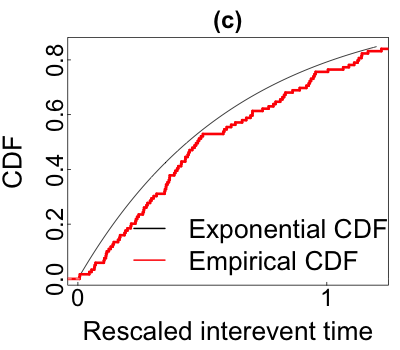

```{r combine.fig.7, eval=chunk_run_list$plot.simulation}
plots <- lapply(paste(plot_path,c("real_state_mmhp",
                                  "real_qq",
                                  "real_ks"),".png",sep=""),function(x){
    img <- as.raster(readPNG(x))
    rasterGrob(img, interpolate = FALSE)
})
lay <- rbind(c(1,1),
             c(2,3))
ggsave(paste(plot_path,"real_one_pair.png",sep=""), height=6, width=8, dpi=100, units = "in",
       marrangeGrob(grobs = plots, layout_matrix = lay, top=NULL, heights=c(5,7)))
```

### [Figure 7 (d)] MMHP result -- ks statsics for one cohort of mice

To compare the model performance, we fit the MMHP, MMHPSD, MMPP, Hawkes process and Poisson process model in `r cohort_names[current_cohort]` data and summary the K-S statistics in the plot.

```{r, eval=chunk_run_list$run.real}
current_cohort <- 5
clean_data <- cleanData(full_data[[cohort_names[current_cohort]]])

## Fit mmhpsd model
mmhpsd_par_result <- list()
event_lambda_estimation <- list()

for(i in 1:sum(clean_data$N_count>=cut_off)){
  current_event_time <- clean_data$day_hour[unlist(clean_data$indicator_each_pair[clean_data$I_fit[i],clean_data$J_fit[i]])]
  #mmhpsd_par_result[[i]] <- handelExceptionMmhpsd(current_event_time)
  event_lambda_estimation[[i]] <- numeric(length(current_event_time))
  for(j in 1:length(current_event_time)){
    est_result <- tryCatch(estSInt(tims = current_event_time[j],
                                   ti = c(0,current_event_time),
                                   lamb0 = mmhpsd_par_result[[i]]$lamb,
                                   nu0 = mmhpsd_par_result[[i]]$nu,
                                   eta0 = mmhpsd_par_result[[i]]$eta,
                                   Q0 = mmhpsd_par_result[[i]]$Q,
                                   pai0 = mmhpsd_par_result[[i]]$pai, fortran = TRUE),
                           warning = function(w) {0},
                           error = function(e) {0})
    event_lambda_estimation[[i]][j] <- ifelse(class(est_result)=="list",est_result$lambdat,est_result)
  }
}
## Fit mmpp model
fit_mmpp <- stan("../lib/mmpp_real_data.stan",
                 data=list(max_Nm=max(clean_data$N_count),
                           N_til=sum(clean_data$N_count>=cut_off),
                           Nm=as.vector(clean_data$N_count[clean_data$N_count>=cut_off]),
                           time_matrix=clean_data$time_matrix,
                           max_interevent=clean_data$max_interevent),
                 iter=1000, chains=4)
sim_mmpp_pair <- rstan::extract(fit_mmpp)

save(current_cohort,mmhpsd_par_result,event_lambda_estimation, fit_mmpp, sim_mmpp_pair,
     file=paste(data_path,cohort_names[current_cohort],"/cohort_mmhpsd_mmpp.RData",sep=''))
```

```{r, eval=chunk_run_list$plot.real}
current_cohort <- 5
clean_data <- cleanData(full_data[[cohort_names[current_cohort]]])
x.ks <- rep(NA,sum(clean_data$N_count>=cut_off))

##KS statistics for mmhp
parameter_result <- stanResult(cohort_number = current_cohort, path = data_path) 
KS.result.stat.mmhp <- rep(NA,sum(clean_data$N_count>=cut_off))

for(l in 1:sum(clean_data$N_count>=cut_off)){
  i <- clean_data$I_fit[l]
  j <- clean_data$J_fit[l]
  temp_t <- clean_data$day_hour[unlist(clean_data$indicator_each_pair[i,j])]
  Lambda.test<-mmhpCompensator(params=list(lambda0=parameter_result$lambda0_matrix[i,j],
                                           lambda1=parameter_result$lambda1_matrix[i,j],
                                           alpha=parameter_result$alpha_matrix[i,j],
                                           beta=parameter_result$beta_matrix[i,j],
                                           q1=parameter_result$q1_matrix[i,j],
                                           q2=parameter_result$q2_matrix[i,j]), 
                               t=c(0,temp_t),
                               pzt=2-unlist(parameter_result$pztv_list_pair[i,j][[1]]),
                               if.pzt=FALSE)
  x.ks[l] <- clean_data$N_count[i,j]
  KS.result.stat.mmhp[l] <-ks.test(Lambda.test,"pexp")$statistic
}

##KS statistics for mmhpsd
load(paste(data_path,cohort_names[current_cohort],"/cohort_mmhpsd_mmpp.RData",sep=''))
KS.result.stat.mmhpsd <- rep(NA,sum(clean_data$N_count>=cut_off))
for(i in 1:sum(clean_data$N_count>=cut_off)){
  current_event_time <- clean_data$day_hour[unlist(clean_data$indicator_each_pair[clean_data$I_fit[i],clean_data$J_fit[i]])]
  Lambda.test<-event_lambda_estimation[[i]]*diff(c(0,current_event_time))/2
  KS.result.stat.mmhpsd[i]<-ks.test(Lambda.test,"pexp")$statistic
}

##KS statistics for mmpp
zt_mmpp_pair <- ifelse(apply(sim_mmpp_pair$zt[1001:2000,,],c(2,3),function(x) sum(x==1)) >500,rep(1,1000),rep(2,1000))
ztv_mmpp_pair <- t(ifelse(apply(sim_mmpp_pair$zt_v[1001:2000,,],c(2,3),function(x) sum(x==1)) >500,rep(1,1000),rep(2,1000)))
pztv_mmpp_pair <- t(apply(sim_mmpp_pair$zt_v[1001:2000,,],c(2,3),mean))
lambda0_pair <- apply(sim_mmpp_pair$lambda0[1001:2000,],2,mean)
c_pair <- apply(sim_mmpp_pair$c[1001:2000,],2,mean)
q1_pair <- apply(sim_mmpp_pair$q1[1001:2000,],2,mean)
q2_pair <- apply(sim_mmpp_pair$q2[1001:2000,],2,mean)

lambda0_matrix <- matrix(0,ncol=12,nrow=12)
c_matrix <- matrix(0,ncol=12,nrow=12)
q1_matrix <- matrix(0,ncol=12,nrow=12)
q2_matrix <- matrix(0,ncol=12,nrow=12)
zt_list_pair <- matrix(rep(list(),144),12,12)
zt_list_sample_pair <- array(rep(list(),144*1000),dim=c(12,12,1000))
ztv_list_pair <- matrix(rep(list(),144),12,12)
pztv_list_pair <- matrix(rep(list(),144),12,12)
ztv_list_sample_pair <- array(rep(list(),144*1000),dim=c(12,12,1000))

for(i in 1:sum(clean_data$N_count>=cut_off)){
  lambda0_matrix[clean_data$I_fit[i],clean_data$J_fit[i]] <- lambda0_pair[i]
  c_matrix[clean_data$I_fit[i],clean_data$J_fit[i]] <- c_pair[i]
  q1_matrix[clean_data$I_fit[i],clean_data$J_fit[i]] <- q1_pair[i]
  q2_matrix[clean_data$I_fit[i],clean_data$J_fit[i]] <- q2_pair[i]
  zt_list_pair[clean_data$I_fit[i],clean_data$J_fit[i]][[1]] <- zt_mmpp_pair[i,1:c(clean_data$N_count[clean_data$I_fit[i],clean_data$J_fit[i]]-1)]
  ztv_list_pair[clean_data$I_fit[i],clean_data$J_fit[i]][[1]] <- ztv_mmpp_pair[i,1:(clean_data$N_count[clean_data$I_fit[i],clean_data$J_fit[i]]-1)]
  pztv_list_pair[clean_data$I_fit[i],clean_data$J_fit[i]][[1]] <- pztv_mmpp_pair[i,1:(clean_data$N_count[clean_data$I_fit[i],clean_data$J_fit[i]]-1)]
  for(k in 1:1000){
    zt_list_sample_pair[clean_data$I_fit[i],clean_data$J_fit[i],k][[1]] <- sim_mmpp_pair$zt[k+1000,i,1:(clean_data$N_count[clean_data$I_fit[i],clean_data$J_fit[i]]-1)]
    ztv_list_sample_pair[clean_data$I_fit[i],clean_data$J_fit[i],k][[1]] <- sim_mmpp_pair$zt_v[k+1000,1:(clean_data$N_count[clean_data$I_fit[i],clean_data$J_fit[i]]-1),i]
  }
}

fun.result.array <- array(NA,dim=c(12,12,1000,2000))
ztfunc.mmpp.df <- matrix(rep(list(),144),12,12)
time.segment <- seq(0,max(clean_data$day_hour),length.out=2000)
time.segment.delta <- time.segment[2]-time.segment[1]


KS.result.stat.mmpp <- rep(NA,sum(clean_data$N_count>=cut_off))

for(l in 1:sum(clean_data$N_count>=cut_off)){
  i <- clean_data$I_fit[l]
  j <- clean_data$J_fit[l]
  temp_t <- clean_data$day_hour[unlist(clean_data$indicator_each_pair[i,j])]
  Lambda.test<-mmppCompensator(params=list(lambda0=lambda0_matrix[i,j],c=c_matrix[i,j],
                                           q1=q1_matrix[i,j],q2=q2_matrix[i,j]),t=temp_t,
                               pzt=2-unlist(pztv_list_pair[i,j][[1]]))
  KS.result.stat.mmpp[l] <-ks.test(Lambda.test,"pexp")$statistic
}
#######The function return integral of intensity from t_i-1 to t_i, same length as point process events
uniHawkesCompensator<-function(lambda0,alpha,beta,t){
  n<-length(t)
  delta.t<-t-c(0,t[-n])
  Lambda<-rep(0,n)
  A<-0
  Lambda[1]<-lambda0*(t[1])*2
  for(i in 2:n){
    A<-1+exp(-beta*(delta.t[i-1]))*A
    Lambda[i]<-lambda0*(delta.t[i])*2+alpha/beta*(1-exp(-beta*delta.t[i]))*A
  }
  return(Lambda)
}

#######This is a function for caculating the negative of log-likelihood for univariate Hawkes process
uniHawkesNegLogLik <- function(params=list(lambda0,alpha,beta), t) {
  lambda0 <- params[[1]]
  alpha <- params[[2]]
  beta <- params[[3]]
  n <- length(t)
  r <- rep(0,n)
  for(i in 2:n) {
    r[i] <- exp(-beta*(t[i]-t[i-1]))*(1+r[i-1])
  }
  loglik <- -t[n]*lambda0
  loglik <- loglik+alpha/beta*sum(exp(-beta*(t[n]-t))-1)
  if(any(lambda0+alpha*r<=0)){
    loglik<--1e+10 
  }else{
    loglik <- loglik+sum(log(lambda0+alpha*r))
  }
  return(-loglik)
}

## KS statistics for hawkes
KS.result.stat.hawkes <- rep(NA,sum(clean_data$N_count>=cut_off))

for(l in 1:sum(clean_data$N_count>=cut_off)){
  i <- clean_data$I_fit[l]
  j <- clean_data$J_fit[l]
  temp_t <- clean_data$day_hour[unlist(clean_data$indicator_each_pair[i,j])]
  hawkes.par<-optim(par=rep(0.01,3), fn=uniHawkesNegLogLik, method="CG", 
                    t=temp_t)
  Lambda.test<-uniHawkesCompensator(lambda0=hawkes.par$par[1],alpha=hawkes.par$par[2],beta=hawkes.par$par[3],
                              clean_data$day_hour[unlist(clean_data$indicator_each_pair[i,j])])
  KS.result.stat.hawkes[l] <-ks.test(Lambda.test,"pexp")$statistic
}

##KS statistics for poisson process
KS.result.stat.pp <- rep(NA,sum(clean_data$N_count>=cut_off))

for(l in 1:sum(clean_data$N_count>=cut_off)){
  i <- clean_data$I_fit[l]
  j <- clean_data$J_fit[l]
  temp_t <- clean_data$day_hour[unlist(clean_data$indicator_each_pair[i,j])]
  Lambda.test <- rep(1,length(temp_t)-1)
  KS.result.stat.pp[l] <-ks.test(Lambda.test,"pexp")$statistic
}

## KS quantiles
## Ref: http://www.real-statistics.com/statistics-tables/kolmogorov-smirnov-table/
ks_quantile_x <- c(1:20,seq(25,50,5),seq(55,120,5))
ks_quantile_y <- c(0.975,0.842,0.708,0.624,0.565,0.521,0.486,0.457,0.432,0.410,0.391,0.375,0.361,0.349,0.338,
                   0.328,0.318,0.309,0.301,0.294,0.270,0.240,0.230,0.210,0.2,0.19,1.36/sqrt(seq(55,120,5)))

##Get done with all the statistics, start to plot
png(paste(plot_path,"real_compare_ks.png",sep=""), height=600, width=600)

par(mfrow=c(1,1),tcl=0.2,mgp=c(3,0,0),
    mar=c(5,5,2.6,0.8), oma=c(0,0,0,0))

plot(0,0,xlim=c(6,max(x.ks)-10),ylim=c(0,0.65),xlab="Number of events",ylab="KS statistics",cex.lab=2.2,type="n",xaxt="n",yaxt="n")
title("(d)",line=0.7,cex.main=2)
mgp.axis(1,mgp=c(0,0.6,0),at=seq(0,100,20),cex.axis=2,lwd=0,lwd.ticks=1)
mgp.axis(2,mgp=c(0,0.1,0),at=seq(0,0.6,0.1),cex.axis=2,lwd=0,lwd.ticks=1)

ks.line.mmhp <- loess(KS.result.stat.mmhp~x.ks)
ks.line.mmhpsd <- loess(KS.result.stat.mmhpsd~x.ks)
ks.line.mmpp <- loess(KS.result.stat.mmpp~x.ks)
ks.line.hawkes <- loess(KS.result.stat.hawkes~x.ks)
ks.line.quantile <- loess(ks_quantile_y~ks_quantile_x)
new.ks <- data.frame(x.ks = seq(min(x.ks), max(x.ks), length.out = 100))
new.ks.q <- data.frame(ks_quantile_x = seq(min(x.ks), max(x.ks), length.out = 100))
new.ks$mmhp.pred <- predict(ks.line.mmhp, newdata=new.ks)
new.ks$mmhpsd.pred <- predict(ks.line.mmhpsd, newdata=new.ks)
new.ks$mmpp.pred <- predict(ks.line.mmpp, newdata=new.ks)
new.ks$hawkes.pred <- predict(ks.line.hawkes, newdata=new.ks)
new.ks$quantile <- predict(ks.line.quantile, newdata=new.ks.q)
with(new.ks,lines(x=x.ks,y=mmhp.pred,col="#FC4E07",lwd=4.5))
with(new.ks,lines(x=x.ks,y=mmhpsd.pred,col="darkviolet",lwd=4.5))
with(new.ks,lines(x=x.ks,y=mmpp.pred,col="#00AFBB",lwd=4))
with(new.ks,lines(x=x.ks,y=hawkes.pred,col="#E7B800",lwd=4))
with(new.ks,lines(x=x.ks,y=quantile,col="grey",lwd=4))
abline(h=unique(KS.result.stat.pp),col="#2d8d39",lwd=4)
legend(46,0.6,c("MMHP","MMHPSD","MMPP","Hawkes","Poisson process","Critical value"),lty=1,lwd=5,
       col=c("#FC4E07","darkviolet","#00AFBB","#E7B800","#2d8d39","grey"),bty="n",cex=2.2)

dev.off()
```

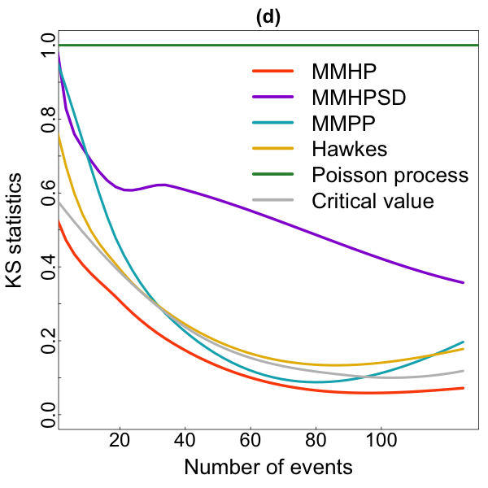

### [Figure 8] State separation (one cohort)

After we have inferred the latent processes, at each event time $t$, we can categorize the event according to the latent state into utility v.s. social state. We separate the interaction events and plot `state_separation_RANKMETHOD` in the folder `r data_path` specified before, where `RANKMETHOD` could be naive_rank (win-lose count) and [expert rank](https://www.sciencedirect.com/science/article/pii/S0003347297907089).

```{r, message=FALSE, results = 'hide', eval=chunk_run_list$plot.real}
for(current_cohort in c(5)){
  clean_data <- cleanData(full_data[[cohort_names[current_cohort]]])
  I_fit <- clean_data$I_fit
  J_fit <- clean_data$J_fit
  N_count <- clean_data$N_count
  day_hour <- clean_data$day_hour
  time_matrix <- clean_data$time_matrix
  indicator_each_pair <- clean_data$indicator_each_pair
  M <- clean_data$M
  start <- clean_data$start
  end <- clean_data$end

  #naive_rank <- naiveRankHierarchy(full_data[[cohort_names[current_cohort]]])
  #expert_rank <- expertRankHierarchy(full_data[[cohort_names[current_cohort]]])
  expert_rank <- c(8,2,6,3,9,1,4,7,11,12,10,5)
  
  # ------------- Load the saved stan result, plot the inferred parameters and save
  parameter_result <- stanResult(cohort_number = current_cohort, 
                                 path = data_path)
  
  # ----- all event data
  mice_event_array <- array(0,dim=c(M,mice_number,mice_number))
  for(m in 1:M){
    for(i in 1:mice_number){
      for(j in 1:mice_number){
        mice_event_array[m,i,j] <- sum(start[m]==i&end[m]==j)
      }
    }
  }

  adjm<-apply(mice_event_array,c(2,3),cumsum)
  M_half <- M/2
  
  # ------ separate active state and inactive
  utility_state_cumcount <- array(0,dim=c(M,mice_number,mice_number))
  utility_state_cumcount[2,start[1],end[1]] <- ifelse(parameter_result$ztv_list_pair[start[1],end[1]] == "NULL", 0, unlist(parameter_result$ztv_list_pair[start[1],end[1]])[1]==1)
  
  for(m in 3:M){
    utility_state_cumcount[m,,] <- utility_state_cumcount[m-1,,]
    if(length(unlist(indicator_each_pair[start[m],end[m]]))>=cut_off){
      if(which(unlist(indicator_each_pair[start[m],end[m]])==m)==1){
        temp_increment <- 0
      }else{
        temp_increment <- parameter_result$ztv_list_pair[start[m],end[m]][[1]][which(unlist(indicator_each_pair[start[m],end[m]])==m)-1]==1
      }
      utility_state_cumcount[m,start[m],end[m]] <- utility_state_cumcount[m,start[m],end[m]] + temp_increment
    }
  }
  
  # ------ plot state separation (v.s. expert_rank)
  
  png(paste(plot_path,"real_state_separation_1.png",sep=""), height=600, width=600)
  matrix1 <- adjm[M,,]-adjm[M_half,,]
  matrix1[matrix1>40]<- 40
  matrix1[matrix1==0]<--10
  myImagePlot(matrix1[expert_rank,expert_rank],xLabels=expert_rank,
                    yLabels=expert_rank, zlim=c(0,40),colorPalette="Greens") 
  invisible(dev.off())
  
  png(paste(plot_path,"real_state_separation_2.png",sep=""), height=600, width=600)
  matrix2 <-utility_state_cumcount[M,,]-utility_state_cumcount[M_half,,]
  matrix2[matrix2>45]<- matrix2[matrix2>45]-5
  matrix2[matrix2==0]<--10
  matrix2[(matrix2>=10)&(matrix2<20)]<-matrix2[(matrix2>=10)&(matrix2<20)]+5
  matrix2[(matrix2>0)&(matrix2<10)]<-matrix2[(matrix2>0)&(matrix2<10)]+10
  myImagePlot(matrix2[expert_rank,expert_rank],xLabels=expert_rank,
              yLabels=expert_rank,zlim=c(0,max(matrix2))) 
  invisible(dev.off())
  
  png(paste(plot_path,"real_state_separation_3.png",sep=""), height=600, width=600)
  matrix3 <-adjm[M,expert_rank,expert_rank]-utility_state_cumcount[M,expert_rank,expert_rank]-adjm[M_half,expert_rank,expert_rank]+utility_state_cumcount[M_half,expert_rank,expert_rank]
  myImagePlot(matrix3[expert_rank,expert_rank],xLabels=expert_rank,
              yLabels=expert_rank,smallScale=TRUE,colorPalette="YlOrRd") 
  invisible(dev.off())
}
```

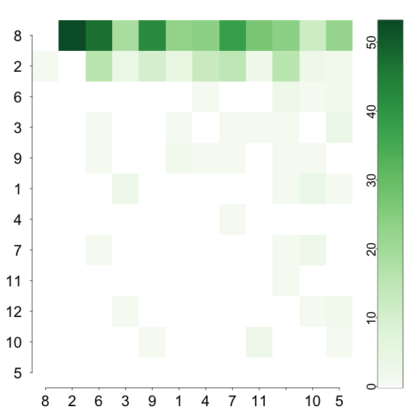{ width=30% } { width=30% } { width=30% }

### [Figure 9 (a)] State separation measurements (all cohorts)

Using the frequency win/loss sociomatrices, we calculated the following measures of the strength of the social hierarchy (ranked by using utility state events): [Ref](http://curleylab.psych.columbia.edu/compete.html)

1. Directional Consistency - 0 meaning no directional consistency and 1 indicating that all contests are won by more dominant individuals over more subordinate individuals. 

2. Triangle transitivity -  the proportion of transitive versus intransitive triads within the directed network. The index ranges between 0 and 1, with 1 indicating that all triads are transitive (i.e. there are no cycles).

3. Counts of inconsistencies (I) ranking - Using the after-ranking binary win/loss sociomatrices.

```{r, message = FALSE, results = 'hide', eval=chunk_run_list$plot.real}
state_types <- c("total","utility","social") 
metric_types <- c("dc","ttri","i")
state_separation_result <- data.frame(array(0,c(10*length(state_types)*length(metric_types),4)))
colnames(state_separation_result) <- c("cohort", "state", "metric", "value")  

for(current_cohort in c(1:10)){
  clean_data <- cleanData(full_data[[cohort_names[current_cohort]]])
  expert_rank <- expertRankHierarchy(full_data[[cohort_names[current_cohort]]])
  
  # ------------- Load the saved stan result, plot the inferred parameters and save
  parameter_result <- stanResult(cohort_number = current_cohort, path = data_path) 
  
  # ----- all event data
  mice_event_array <- array(0,dim=c(clean_data$M,mice_number,mice_number))
  for(m in 1:clean_data$M){
    for(i in 1:mice_number){
      for(j in 1:mice_number){
        mice_event_array[m,i,j] <- sum(clean_data$start[m]==i&clean_data$end[m]==j)
      }
    }
  }
  adjm<-apply(mice_event_array,c(2,3),cumsum)
  
  # ------ separate active state and inactive
  utility_state_cumcount <- array(0,dim=c(clean_data$M,mice_number,mice_number))
  utility_state_cumcount[1,clean_data$start[1],clean_data$end[1]] <- ifelse(parameter_result$ztv_list_pair[clean_data$start[1],clean_data$end[1]] == "NULL", 0, unlist(parameter_result$ztv_list_pair[clean_data$start[1],clean_data$end[1]])[1]==1)
  
  for(m in 2:clean_data$M){
    utility_state_cumcount[m,,] <- utility_state_cumcount[m-1,,]
    if(length(unlist(clean_data$indicator_each_pair[clean_data$start[m],clean_data$end[m]]))>=cut_off){
      if(which(unlist(clean_data$indicator_each_pair[clean_data$start[m],clean_data$end[m]])==m)==1){
        temp_increment <- 0
      }else{
        temp_increment <- parameter_result$ztv_list_pair[clean_data$start[m],clean_data$end[m]][[1]][which(unlist(clean_data$indicator_each_pair[clean_data$start[m],clean_data$end[m]])==m)-1]==1
      }
      utility_state_cumcount[m,clean_data$start[m],clean_data$end[m]] <- utility_state_cumcount[m,clean_data$start[m],clean_data$end[m]] + temp_increment
    }
  }
  
  # ------ compute metrics ------
  state_separation_result$cohort[((current_cohort-1)*length(metric_types)*length(state_types)+1):(current_cohort*length(metric_types)*length(state_types))] <- cohort_names[current_cohort]
  state_separation_result$metric[((current_cohort-1)*length(metric_types)*length(state_types)+1):(current_cohort*length(metric_types)*length(state_types))] <- rep(c("dc","ttri","i"),length(state_types))
  
  state_separation_result$state[((current_cohort-1)*length(metric_types)*length(state_types)+1):(current_cohort*length(metric_types)*length(state_types)-length(metric_types)*2)] <- "total"
  state_separation_result$value[((current_cohort-1)*length(metric_types)*length(state_types)+1):(current_cohort*length(metric_types)*length(state_types)-length(metric_types)*2)] <- unlist(metricsStateSeparation(start=0, end=clean_data$M, type="total", rank=expert_rank))
  
  state_separation_result$state[((current_cohort-1)*length(metric_types)*length(state_types)+length(metric_types)+1):(current_cohort*length(metric_types)*length(state_types)-length(metric_types))] <- "utility"
  state_separation_result$value[((current_cohort-1)*length(metric_types)*length(state_types)+length(metric_types)+1):(current_cohort*length(metric_types)*length(state_types)-length(metric_types))] <- unlist(metricsStateSeparation(start=0, end=clean_data$M, type="utility", rank=expert_rank))
  
  state_separation_result$state[(current_cohort*length(metric_types)*length(state_types)-length(metric_types)+1):(current_cohort*length(metric_types)*length(state_types))] <- "social"
  state_separation_result$value[(current_cohort*length(metric_types)*length(state_types)-length(metric_types)+1):(current_cohort*length(metric_types)*length(state_types))] <- unlist(metricsStateSeparation(start=0, end=clean_data$M, type="social", rank=expert_rank))
}

Type <- c(rep("All",10), rep("Active",10), rep("Inactive",10))
for (i in 1:length(metric_types)) {
  inds <- list(3)
  for (j in 1:length(state_types)) {  # t.id <- 1 i <- 1   
    inds[[j]] <- which(state_separation_result$state == state_types[j] & 
                    state_separation_result$metric == metric_types[i]) # rows for this sub.type and task.type what we'll plot. 
  } 
  assign(metric_types[i],state_separation_result$value[unlist(inds)])
}  

df1 <- data.frame(Type,dc,ttri,i)

df1_long <- melt(df1, id.vars=c("Type"))
df1_long$Type <- factor(df1_long$Type,
                       levels = c('Inactive','Active','All'),ordered = TRUE)
df1_long$variable <- factor(df1_long$variable, 
                            labels = c("Directional consistency",
                                       "Triangle transitivity", 
                                       "Inconsistencies in ranking"))
#then plot
png(paste(plot_path,"real_box_plot.png",sep=""), height=400, width=700)
common_layer <- list(scale_fill_manual(values=c('cornsilk', 'cadetblue1', 'lightgreen')), 
                labs(x = "", y=" "),
                facet_wrap(~variable),
                theme_bw(),
                coord_flip(),
                theme(panel.background = element_blank(),
                      text = element_text(size=23),
                      legend.position="none",
                      plot.margin = margin(2, 7, -20, -18, "pt")))
p1 <- ggplot(df1_long[df1_long$variable=="Directional consistency",], 
             aes(x=Type, y=value, fill=Type)) +
  geom_boxplot() + 
  scale_y_continuous(expand = c(0, 0.02), limits = c(0, 1), labels = c("0","0.25","0.5","0.75","1")) +
  common_layer
p2 <- ggplot(df1_long[df1_long$variable=="Triangle transitivity",], 
             aes(x=Type, y=value, fill=Type)) +
  geom_boxplot() + 
  scale_y_continuous(expand = c(0, 0.02), limits = c(0, 1), labels = c("0","0.25","0.5","0.75","1")) +
  common_layer
p3 <- ggplot(df1_long[df1_long$variable=="Inconsistencies in ranking",], 
             aes(x=Type, y=value, fill=Type)) +
  geom_boxplot() + 
  scale_y_continuous(expand = c(0, 0.12), limits = c(0, 6)) +
  common_layer
  
gridExtra::grid.arrange(p1, p2, p3, nrow=3)
invisible(dev.off())
```


### [Figure 10] Community structure (one cohort)

Based on the social state interactions, we further do clustering and plot the trend of community evolvement.

```{r, results='hide', eval=chunk_run_list$plot.real}
current_cohort <- 5
clean_data <- cleanData(full_data[[cohort_names[current_cohort]]])
indicator.each.pair <- clean_data$indicator_each_pair
parameter_result <- stanResult(cohort_number = current_cohort, 
                                 path = data_path)
###separate active state and inactive
utility_state_cumcount <- array(0,dim=c(clean_data$M,mice_number,mice_number))
utility_state_cumcount[2,clean_data$start[2],clean_data$end[2]] <- unlist(parameter_result$ztv_list_pair[clean_data$start[2],clean_data$end[2]])[1]==1

for(m in 3:clean_data$M){
  utility_state_cumcount[m,,] <- utility_state_cumcount[m-1,,]
  if(length(unlist(indicator.each.pair[clean_data$start[m],clean_data$end[m]]))>=cut_off){
    if(which(unlist(indicator.each.pair[clean_data$start[m],clean_data$end[m]])==m)==1){
      temp_incre <- 0
    }else{
      temp_incre <- parameter_result$ztv_list_pair[clean_data$start[m],clean_data$end[m]][[1]][which(unlist(indicator.each.pair[clean_data$start[m],clean_data$end[m]])==m)-1]==1
    }
    utility_state_cumcount[m,clean_data$start[m],clean_data$end[m]] <- utility_state_cumcount[m,clean_data$start[m],clean_data$end[m]] + temp_incre
  }
}

new_S_temp<-array(0,dim=c(clean_data$M,mice_number,mice_number))
for(m in 1:clean_data$M){
  for(i in 1:mice_number){
    for(j in 1:mice_number){
      new_S_temp[m,i,j] <- sum(clean_data$start[m]==i&clean_data$end[m]==j)
    }
  }
}

adjm<-apply(new_S_temp,c(2,3),cumsum)

# g_community1 <- graph_from_adjacency_matrix(adjm[400,,]-utility_state_cumcount[400,,],mode="undirected")
# lec1 <- cluster_leading_eigen(g_community1)
# 
# g_community2 <- graph_from_adjacency_matrix(adjm[700,,]-utility_state_cumcount[700,,]-adjm[400,,]+utility_state_cumcount[400,,],mode="undirected")
# lec2 <- cluster_leading_eigen(g_community2)
# 
# g_community3 <- graph_from_adjacency_matrix(adjm[clean_data$M,,]-utility_state_cumcount[clean_data$M,,]-adjm[700,,]+utility_state_cumcount[700,,],mode="undirected")
# lec3 <- cluster_leading_eigen(g_community3)

### Make plot for t=1
png(paste(plot_path,"real_clustering_1.png",sep=""), height=600, width=600)
myCircularPlot(cur.matrix = adjm[400,,]-utility_state_cumcount[400,,],
               cur.order = c(4,12,3,5,10,2,7,1,6,9,8,11),
               cur.color = c(colorRampPalette(brewer.pal(name="YlOrBr", n = 8))(10)[c(9:2)],
                             colorRampPalette(brewer.pal(name="PuRd", n = 8))(10)[6],
                             colorRampPalette(brewer.pal(name="Blues", n = 8))(10)[c(5,7,9)]),
               cur.gap=c(rep(5,7),30,30,rep(5,2),30))
dev.off()

### Make plot for t=2
png(paste(plot_path,"real_clustering_2.png",sep=""), height=600, width=600)
myCircularPlot(cur.matrix=adjm[700,,]-utility_state_cumcount[700,,]-adjm[400,,]+utility_state_cumcount[400,,],
               cur.order=c(9,11,10,2,7,6,4,1,5,3,8),
               cur.color = c(colorRampPalette(brewer.pal(name="YlOrBr", n = 8))(10)[c(9,7,5)],
             colorRampPalette(brewer.pal(name="PuRd", n = 8))(10)[c(4,6,8)],
             colorRampPalette(brewer.pal(name="Blues", n = 8))(18)[c(4,7,10,13,16)+2]),
             cur.gap=c(rep(5,2),30,rep(5,2),30,rep(5,4),30))
dev.off()

### Make plot for t=3
png(paste(plot_path,"real_clustering_3.png",sep=""), height=600, width=600)
myCircularPlot(cur.matrix=adjm[clean_data$M,,]-utility_state_cumcount[clean_data$M,,]-adjm[700,,]+utility_state_cumcount[700,,],
               cur.order=c(9,12,10,2,5,11,4,1,8,3,6,7),
               cur.color=c(colorRampPalette(brewer.pal(name="YlOrBr", n = 8))(10)[c(9,7,5,3)],
             colorRampPalette(brewer.pal(name="Blues", n = 8))(22)[c(4,7,10,13,15,17,19,22)]),
             cur.gap=c(rep(5,3),30,rep(5,7),30))
dev.off()
```

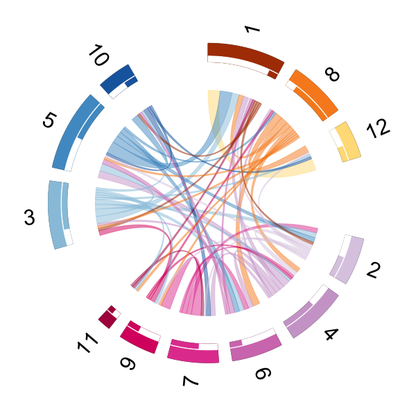{ width=30% } 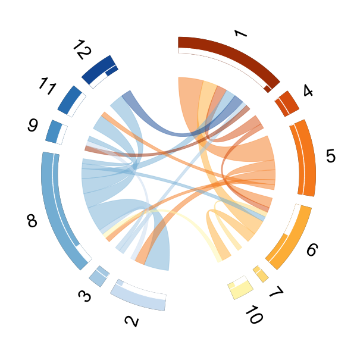{ width=30% } { width=30% }

### [Figure 9 (b)] Community structure (all cohort)

For all the ten cohorts, we plot the evolving of cluster betweenness ratio of the social interactions.

```{r, results='hide', eval=chunk_run_list$plot.real}
xl <- list()
yl <- list()
for(current_cohort in c(1:10)){
  clean_data <- cleanData(full_data[[cohort_names[current_cohort]]])
  
  # ------------- Load the saved stan result by using stanResult function -------------
  parameter_result <- stanResult(cohort_number = current_cohort, path = data_path) 
  
  # ----- all event data
  mice_event_array <- array(0,dim=c(clean_data$M,mice_number,mice_number))
  for(m in 1:clean_data$M){
    for(i in 1:mice_number){
      for(j in 1:mice_number){
        mice_event_array[m,i,j] <- sum(clean_data$start[m]==i&clean_data$end[m]==j)
      }
    }
  }
  adjm<-apply(mice_event_array,c(2,3),cumsum)
  
  # ------ separate active state and inactive
  utility_state_cumcount <- array(0,dim=c(clean_data$M,mice_number,mice_number))
  utility_state_cumcount[1,clean_data$start[1],clean_data$end[1]] <- ifelse(parameter_result$ztv_list_pair[clean_data$start[1],clean_data$end[1]] == "NULL", 
                                                                            0, 
                                                                            unlist(parameter_result$ztv_list_pair[clean_data$start[1],clean_data$end[1]])[1]==1)
  
  for(m in 2:clean_data$M){
    utility_state_cumcount[m,,] <- utility_state_cumcount[m-1,,]
    if(length(unlist(clean_data$indicator_each_pair[clean_data$start[m],clean_data$end[m]]))>=cut_off){
      if(which(unlist(clean_data$indicator_each_pair[clean_data$start[m],clean_data$end[m]])==m)==1){
        temp_increment <- 0
      }else{
        temp_increment <- parameter_result$ztv_list_pair[clean_data$start[m],clean_data$end[m]][[1]][which(unlist(clean_data$indicator_each_pair[clean_data$start[m],clean_data$end[m]])==m)-1]==1
      }
      utility_state_cumcount[m,clean_data$start[m],clean_data$end[m]] <- utility_state_cumcount[m,clean_data$start[m],clean_data$end[m]] + temp_increment
    }
  }
  
  # ------- record the in-class interactions and between-class interactions and compute ratio
  time_horizon <- tail(clean_data$day_hour,1)
  time_segment <- 1
  step_wise <- 0.5
  total_length <- floor((time_horizon-time_segment)/step_wise)
  clustering_result <- data.frame(y=numeric(total_length+1),
                                  x=c(0:total_length)*step_wise+time_segment/2)
  start_idx <- 0
  for(i in 0:total_length){
    start_idx <- ifelse(i==0,0,max(which(clean_data$day_hour<=i*step_wise)))
    end_idx <- max(which(clean_data$day_hour<=i*step_wise+time_segment))
    clustering_result[i,"y"] <- ifelse(is.na(clusterAnalysis(start=start_idx, end=end_idx)),
                                       0,
                                       clusterAnalysis(start=start_idx, end=end_idx))
  }
  xl[[current_cohort]] <- seq(min(clustering_result$x),max(clustering_result$x), (max(clustering_result$x) - min(clustering_result$x))/1000)
  yl[[current_cohort]] <- predict(loess(y ~ x, data = clustering_result),xl[[current_cohort]])
}

### plot
png(paste(plot_path,"real_cluster.png",sep=""),height=400, width=600)
par(mfrow=c(1,1),mgp=c(1.4,0.5,0),
    mar=c(3,4.4,0.4,0.4), oma=c(0,0,0,0))
color_vector <- colorRampPalette(brewer.pal(name="Paired", n = 12))(10)[c(8,10,1,4,5,6,7,9,2,3)]
plot(0,0,xlim=c(0,24*23.5),ylim=c(0,0.14), type="n", xlab='', ylab='', cex.lab=2.2,
     xaxt='n', yaxt='n')
mtext(side = 1, text = "Time (hours)", line = 2.1, cex=2)
mtext(side = 2, text = "Cluster betweenness ratio", line = 2.3, cex=2.2)
axis(1,cex.axis=1.8)
axis(2,cex.axis=1.8)
for(current_cohort in c(1:9)){
  clean_data <- cleanData(full_data[[cohort_names[current_cohort]]])
  sameTimeHorizonPlot(xl[[current_cohort]],yl[[current_cohort]],
                      clean_data,color_vector[current_cohort])
}
legend(200,0.15,cohort_short_names[1:5],lty=1,lwd=4,col=color_vector[1:5],bty="n",cex=2.2)
legend(380,0.15,cohort_short_names[6:10],lty=1,lwd=4,col=color_vector[6:10],bty="n",cex=2.2)
segments(240,-0.01,240,0.05,col="gray48",lwd=2)
text(240,0.06,"Day 10",cex=2)
dev.off()
```
