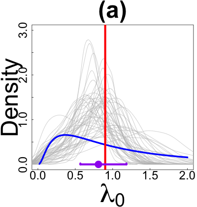
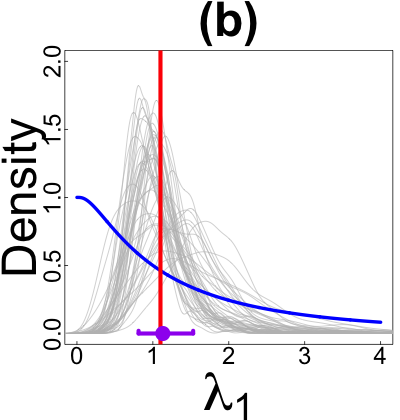
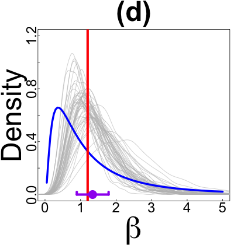
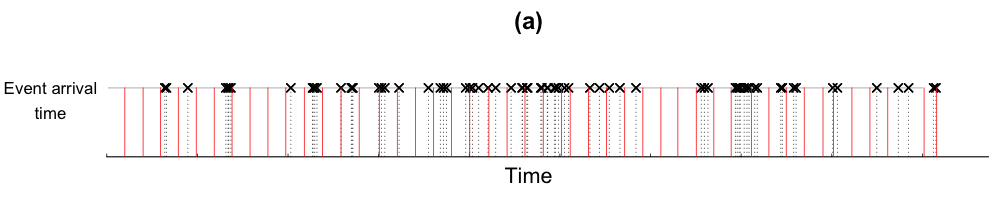
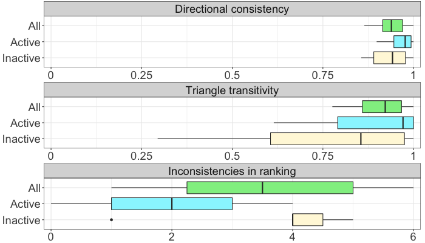

<style type="text/css">
h1.title {
  font-size: 30px;
  color: Black;
}
h1 { /* Header 1 */
  font-size: 24px;
  color: Black;
}
h2 { /* Header 2 */
  font-size: 20px;
  color: Black;
}
h3 { /* Header 3 */
  font-size: 16px;
  color: Black;
}
h4 { /* Header 4 */
  font-size: 14px;
  color: Grey;
}
</style>

# Simulation experiments

Load packages, source code, change directory and define global variables.
```{r sim.prepare, message = FALSE}
###############################################################################
#Load packages,source code, change directory and define global variables
###############################################################################
if (!require("pacman")) install.packages("pacman")
pacman::p_load(rstan, SPIn, knitr, 
               HiddenMarkov, MMHP, #packages for comparing to MMPP and MMHPSD models
               beeswarm, grid, png, gridExtra)

#Change directory
setwd("~/Dropbox/Thesis/code/part1/main")

#Specify directory for saving simulation and model fitting data (change based on your own system)
data_path <- '../../../../../Google Drive/thesis_data/part1/simulation/'

#Specify directory for saving plots
plot_path <- '../fig/'

#Load source code from ../lib/ 
source('../lib/mmhp.R')
source('../lib/inferLatentMmhp.R')
source('../lib/mmpp.R')
source('../lib/handelExceptionMmhpsd.R')
source('../lib/plotIntensity.R')
source('../lib/integralAbsoluteError.R')

#Define global variables
mmhp_par_name <- c("lambda0","lambda1","alpha","beta","q1","q2") #q2 corresponds to q0 in the paper
no_vec_events <- c(50,100,200,500)
no_sim <- 50
###############################################################################
#Specify the r chunks that need to run
###############################################################################
chunk_run_list <- list(run.simulation=FALSE, #if you haven't simulate the data before, change this to TRUE
                       plot.simulation=FALSE, #if you haven't plot before, change this to TRUE
                       run.real=FALSE,
                       plot.real=FALSE)
```

## Estimation of parameters

To validate the accuracy of estimating parameters using our method, simulate 50 independent MMHPs including 50 events with parameter value $\lambda_0=0.9$, $\lambda_1=1.1$, $\alpha=0.8$, $\beta=1.2$, $q_1=0.4$, $q_0=0.2$, $\delta = (\frac{1}{3}, \frac{2}{3})^T$. The simulation procedure is based on *thinning theorem*. Then fit the data in `mmhp.stan`. The simulated data and fitting result will be saved in `data_path` folder specified in the initial chunk and as `common_pars_result_50.Rdata`.


```{r sim.parameter.1, eval=chunk_run_list$run.simulation}
object <-list(lambda0=0.9, lambda1=1.1, alpha=0.8, beta=1.2, q1=0.4, q2=0.2, delta=c(1/3,2/3))

for(no_events in no_vec_events[1]){
  common.pars.processes <- rep(list(),no_sim)
  common.pars.stan.result <- rep(list(),no_sim)
  common.pars.stan.time <- rep(NA,no_sim)
  
  for(i in 1:no_sim){
    common.pars.processes[i][[1]] <- simulate.mmhp(object,nsim=no_events)
    current_N <- length(common.pars.processes[i][[1]]$tau)
    current_interevent <- common.pars.processes[i][[1]]$tau[-1]-common.pars.processes[i][[1]]$tau[-current_N]
    start_time <- Sys.time()
    fit_mmhp <- stan("../lib/sim_mmhp.stan", 
                     data=list(N=current_N-1, interevent=current_interevent,  
                               event=cumsum(current_interevent), delta_1=0.5),
                     refresh = -1, iter=1000, chains=4, control=list(adapt_delta=0.95))
    end_time <- Sys.time()
    common.pars.stan.time[i] <- end_time-start_time
    sim_mmhp <- extract(fit_mmhp)
    common.pars.stan.result[i][[1]] <- list(lambda0=sim_mmhp$lambda0,
                                            lambda1=sim_mmhp$lambda1,
                                            alpha=sim_mmhp$alpha,
                                            beta=sim_mmhp$beta,
                                            q1=sim_mmhp$q1,
                                            q2=sim_mmhp$q2,
                                            lp__=sim_mmhp$lp__)
  }
  save(common.pars.processes,common.pars.stan.result,common.pars.stan.time,object,
       file=paste(data_path,"common_pars_result_",no_events,".Rdata",sep=""))
}
```

### [Figure 4] Estimation of parameters for simulated MMHPs.

```{r sim.parameter.2, eval=chunk_run_list$plot.simulation}
for(no_events in no_vec_events[1]){
  #-------- load estimation results
  if(!file.exists(paste(data_path,"common_pars_result_",no_events,".Rdata",sep=""))){
    print("The Rdata not exist, please run the chunk \'sim.parameter.1\`")
  }else{
    load(paste(data_path,"common_pars_result_",no_events,".Rdata",sep=""))
  }
  
  #-------- summarize estimation results
  common.pars.array <- array(NA,dim=c(no_sim,length(mmhp_par_name),3))
  for(i in 1:no_sim){
    for(j in 1:length(mmhp_par_name)){
      common.pars.array[i,j,1] <- median(unlist(common.pars.stan.result[i][[1]][mmhp_par_name[j]])[1001:2000])
      common.pars.array[i,j,2] <- min(unlist(common.pars.stan.result[i][[1]][mmhp_par_name[j]])[1001:2000])
      common.pars.array[i,j,3] <- max(unlist(common.pars.stan.result[i][[1]][mmhp_par_name[j]])[1001:2000])
    }
  }
  
  #-------- plot each parameter
  ylim_ub <- c(3,2,2,1.2,4,5)
  xlim_ub <- c(2,4,5,5,3,3)
  par_name_expression <- c(expression(lambda[0]),expression(lambda[1]),expression(alpha),expression(beta),expression(q[1]),expression(q[0]))

  for(j in c(1:length(mmhp_par_name))){
    if(j == length(mmhp_par_name)){
      png(paste(plot_path,"sim_par_",no_events,"_q0.png",sep=""), height=420, width=400)
    }else{
      png(paste(plot_path,"sim_par_",no_events,"_",mmhp_par_name[j],".png",sep=""), height=420, width=400)
    }
    par(mfrow=c(1,1),tcl=0.2,mgp=c(1.8,0.5,0),
        mar=c(5.25,4.5,3.5,0.5))
    lowerLimit <- min(common.pars.array[,j,2])
    upperLimit <- xlim_ub[j]
    
    plot(1,4,xlim=c(0,xlim_ub[j]),ylim=c(0,ylim_ub[j]), type="n",xlab="",ylab="Density",cex.lab=4,xaxt="n",yaxt="n")
    title(paste("(",letters[j],")",sep=""),line=1,cex.main=4)
    axis(2,cex.axis=2,lwd=0,lwd.ticks=0,pos=-0.08)
    axis(2,label=FALSE,lwd=0,lwd.ticks=1)
    axis(1,cex.axis=2,lwd=0,lwd.ticks=1)
    mtext(par_name_expression[j], side=1, line=4.4, cex=4.5)
    
    for(i in 1:no_sim){
      lines(density(unlist(common.pars.stan.result[i][[1]][mmhp_par_name[j]])[1001:2000]),col="grey",cex=0.6,lwd=0.8)
    }
    
    # -------- plot prior
    if(j==1){
      curve(1/(sqrt(2*pi)*x)*exp(-(log(x)^2/2)),0,upperLimit,add=TRUE,col="blue",lwd=4.5)
    }else if(j==2){
      x_plot <- seq(0,4,length.out = 1000)
      integrand_f <- function(x) 1/(sqrt(2*pi)*x)*exp(-(log(x)^2/2))
      y_plot <- sapply(x_plot,function(x) integrate(integrand_f, lower = x, upper = Inf)$value) 
      lines(x_plot,y_plot,col="blue",lwd=4.5)
    }else if(j==3){
      curve(1/(sqrt(2*pi)*5)*exp(-x^2/2/5**2),0,upperLimit,add=TRUE,col="blue",lwd=4.5)
    }else if(j==4){
      curve(1/(sqrt(2*pi)*x)*exp(-(log(x)^2/2)),0,upperLimit,add=TRUE,col="blue",lwd=4.5)
    }else{
      curve(1/(sqrt(2*pi)*x)*exp(-((log(x)+1)^2/2)),0,upperLimit,add=TRUE,col="blue",lwd=4.5)
    }
    
    abline(v=object[[j]],col="red",lwd=5.5) #true value
    points(mean(common.pars.array[,j,1]),0,col="purple",cex=2.8,pch=16) # estimated mean
    spin_result <- SPIn(common.pars.array[,j,1])$spin
    segments(x0=spin_result[1],spin_result[2],y0=0,col="purple",lwd=5.5) # estimated confidence interval
    segments(x0=spin_result[1],y0=0,y1=0.02,col="purple",lwd=5.5)
    segments(x0=spin_result[2],y0=0,y1=0.02,col="purple",lwd=5.5)
    invisible(dev.off())
  }
}
```

{ width=30% } { width=30% } { width=30% } { width=30% } { width=30% } { width=30% }

## Estimation of latent Markov processes

To validate the accuracy of estimating latent state trajectory using our method, conditioning on the same latent Makov process with parameter $q_1=0.2$, $q_0=0.4$, $\delta = (\frac{2}{3}, \frac{1}{3})^T$, simulate 50 independent MMHPs including 500 events with parameter value $\lambda_0=\lambda_1=1$, $\alpha=1.6$, $\beta=0.9$. The simulation procedure is based on *thinning theorem*.

```{r sim.latent.1, eval=chunk_run_list$run.simulation}
object <- list(lambda0=1, lambda1=1, alpha=1.6, beta=0.9, q1=0.2, q2=0.4, delta=c(2/3,1/3))
## Generating 500 events
no_events <- 500
test.mmhp.fix <- simulate.mmhp(object, nsim=no_events) 

#fixed.state.processes <- rep(list(),no_sim)
fixed.state.stan.result <- rep(list(),no_sim)
fixed.state.stan.time <- rep(NA,no_sim)

for(i in 1:no_sim){
  fixed.state.processes[i][[1]] <- simulate.mmhp.given.state(object,
                                                             states=list(x=test.mmhp.fix$x,
                                                                         z=test.mmhp.fix$z),
                                                             ending=tail(test.mmhp.fix$tau,1),
                                                             max.nsim=1000)
  
  start_time <- Sys.time()
  current_N <- length(fixed.state.processes[i][[1]]$tau)
  current_interevent <- fixed.state.processes[i][[1]]$tau[-1]-fixed.state.processes[i][[1]]$tau[-current_N]
  fit_mmhp <- stan("../lib/sim_mmhp_state.stan", 
                     data=list(N=current_N-1, interevent=current_interevent,  
                               event=cumsum(current_interevent), delta_1=0.5),
                     refresh = -1, iter=1000, chains=4, control=list(adapt_delta=0.95))
  end_time <- Sys.time()
  
  fixed.state.stan.time[i] <- end_time-start_time
  fixed.state.stan.result[i][[1]] <- extract(fit_mmhp)
} 
save(fixed.state.processes,fixed.state.stan.result,
     fixed.state.stan.time,object,test.mmhp.fix,
     file=paste(data_path,"fixed_state_stan_result_",no_events,".Rdata",sep=""))
```

The scenarios with 50/100/200 events are generated by conditioning on truncated previous latent process (truncation length of latent process is according to the average number of emission events). Then fit the data in `mmhp.stan`. The simulated data and fitting result will be saved in `data_path` folder specified in the initial chunk and as `fixed_state_stan_result_numberOfEvents.Rdata`.

```{r sim.latent.2, eval=chunk_run_list$run.simulation}
if(!file.exists(paste(data_path,"fixed_state_stan_result_500.Rdata",sep=""))){
  print("The Rdata not exist, please run the chunk \'sim.latent.1\`")
}else{
  load(paste(data_path,"fixed_state_stan_result_500.Rdata",sep=""))
}
horizon_time_vec <- c(7.5,10,13)

long.test.mmhp.fix <- test.mmhp.fix
for(l in c(1:3)){
  no_events <- no_vec_events[l]
  horizon_time <- horizon_time_vec[l]
  horizon_x <- max(which(long.test.mmhp.fix$x<=horizon_time))+1
  horizon_tau <- max(which(long.test.mmhp.fix$tau<=horizon_time))
  new.test.mmhp.fix <- list(x=long.test.mmhp.fix$x[1:horizon_x],
                            z=long.test.mmhp.fix$z[1:horizon_x],
                            tau=long.test.mmhp.fix$tau[1:horizon_tau],
                            zt=long.test.mmhp.fix$zt[1:horizon_tau])
  
  new.fixed.state.processes <- rep(list(),no_sim)
  fixed.state.stan.result <- rep(list(),no_sim)
  fixed.state.stan.time <- rep(NA,no_sim)
  for(i in 1:no_sim){
    horizon_tau <- max(which(fixed.state.processes[i][[1]]$tau<=horizon_time))
    if(horizon_tau<20){
      new.fixed.state.processes[i][[1]] <- simulate.mmhp.given.state(object,
                                                                     states=list(x=new.test.mmhp.fix$x,
                                                                                 z=new.test.mmhp.fix$z),
                                                                     ending=tail(new.test.mmhp.fix$tau,1),
                                                                     max.nsim=300)
    }else{
      new.fixed.state.processes[i][[1]] <- list(tau=fixed.state.processes[i][[1]]$tau[1:horizon_tau],
                                                zt=fixed.state.processes[i][[1]]$zt[1:horizon_tau])
    }
    current_N <- length(new.fixed.state.processes[i][[1]]$tau)
    current_interevent <- new.fixed.state.processes[i][[1]]$tau[-1]-new.fixed.state.processes[i][[1]]$tau[-current_N]
    start_time <- Sys.time()
    fit_mmhp <- stan("../lib/sim_mmhp_state.stan",
                     data=list(N=current_N-1, interevent=current_interevent,
                               event=cumsum(current_interevent), delta_1=0.5),
                     refresh = -1, iter=1000, chains=4, control=list(adapt_delta=0.95))
    end_time <- Sys.time()
    fixed.state.stan.time[i] <- end_time-start_time
    fixed.state.stan.result[i][[1]] <- extract(fit_mmhp)
  }
  
  fixed.state.processes <- new.fixed.state.processes
  test.mmhp.fix <- new.test.mmhp.fix
  save(fixed.state.processes,fixed.state.stan.result,
       fixed.state.stan.time,test.mmhp.fix,object,
       file=paste(data_path,"fixed_state_stan_result_",no_events,".Rdata",sep=""))
}
```

### [Figure 5] Estimation of latent Markov processes

#### (a) Estimated MMHP latent trajectory

Process the latent trajectory estimation results and save in the RData.
```{r sim.latent.3, eval=chunk_run_list$run.simulation}
fun.result.list <- list()
true.mmhp.list <- list()
for(l in c(1:4)){
  no_events <- no_vec_events[l]
  load(paste(data_path,"fixed_state_stan_result_",no_events,".Rdata",sep=""))
  fixed.state.array <- matrix(NA,nrow=no_sim,ncol=5)
  fixed.state.latent.fun <- rep(list(),no_sim)
  temp_par_name <- c("lambda0","alpha","beta","q1","q2") 
  true.mmhp.list[[l]] <- test.mmhp.fix
  for(i in 1:no_sim){
    for(j in c(1:5)){
      fixed.state.array[i,j] <- mean(unlist(fixed.state.stan.result[i][[1]][temp_par_name[j]])[1001:2000])
    }
    #estimate latent state
    test.mmhp <- fixed.state.processes[i][[1]]
    object_hat <- list(lambda0=fixed.state.array[i,1], lambda1=fixed.state.array[i,1], alpha=fixed.state.array[i,2], beta=fixed.state.array[i,3], q1=fixed.state.array[i,4], q2=fixed.state.array[i,5])
    test.latent <- stepfun(test.mmhp.fix$x[-1],test.mmhp.fix$z)
    time.segment <- seq(test.mmhp$tau[2],tail(test.mmhp$tau,1),length.out=2000)
    time.segment.delta <- time.segment[2]-time.segment[1]
    
    #2 estimation methods
    fixed.state.est.latent <- ifelse(apply(fixed.state.stan.result[i][[1]]$zt_v[1001:2000,],2,function(x) sum(x==1)) >500,rep(1,1000),rep(2,1000))
    
    #preperation for step function
    fixed.state.est.latent  <- modifiedLatentTrajectory(params=object_hat, interevent = test.mmhp$tau[-1]-test.mmhp$tau[-length(test.mmhp$tau)], zt = fixed.state.est.latent)
    
    #interpolated function for each method
    fixed.state.latent.fun[i][[1]] <- stepfun(fixed.state.est.latent$x.hat[-1],fixed.state.est.latent$z.hat)
  }
  
  #plot
  time.segment <- seq(0,tail(test.mmhp.fix$tau,1),length.out = 5000) 
  fun.result.list[[l]] <- array(NA,dim=c(no_sim,5000))
  for(i in 1:no_sim){
    fun.result.list[[l]][i,] <- fixed.state.latent.fun[i][[1]](time.segment)
  }
}

## save the intermediate result to rdata
save(true.mmhp.list,fun.result.list,
     file="../output/fixed_state_zt_est_plot.Rdata")
```

```{r sim.latent.4, eval=chunk_run_list$plot.simulation}
if(!file.exists("../output/fixed_state_zt_est_plot.Rdata")){
  print("The Rdata not exist, please run the chunk \'sim.latent.3\`")
}else{
  load("../output/fixed_state_zt_est_plot.Rdata")
}

png(paste(plot_path,"sim_state_plots_mmhp.png",sep=""), height=500, width=1000)

par(mfrow=c(1,1),tcl=0.2,mgp=c(1.7,0,0),
    mar=c(3.5,6.7,3,0.8))
plot(1,4,xlim=c(0.27,23),ylim=c(-0.5,9), type="n",xlab="Time",ylab="",xaxt="n",yaxt="n",cex.lab=2.5,bty="n")
title("(a)",line=1,cex.main=3)
axis(2,at=c(0,1,2.5,3.5,5,6,7.5,8.5),labels=FALSE,cex.lab=2,las=2,lwd=0,lwd.ticks=1)
axis(1,at=seq(0,20,length.out=5),labels=FALSE,cex.lab=2,las=2,lwd=0,lwd.ticks=1,line=-0.7)
text(-1.8, y=c(0,1,2.5,3.5,5,6,7.5,8.5), labels=paste(rep(c("        ","state"),4),rep(c(0,1),4)," "), cex=2.5, srt=0, xpd=TRUE)
text(seq(0,20,length.out=5), y=-1, labels=seq(0,20,length.out=5), cex=2, srt=0, xpd=TRUE)

for(l in c(1:4)){
  no_events <- no_vec_events[l]
  
  #plot
  time.segment <- seq(0,tail(true.mmhp.list[[l]]$tau,1),length.out = 5000)
  draw.start<-1
  draw.end<-length(true.mmhp.list[[l]]$tau)
  draw.true.x<-which(true.mmhp.list[[l]]$x>true.mmhp.list[[l]]$tau[draw.start]&true.mmhp.list[[l]]$x<true.mmhp.list[[l]]$tau[draw.end])
  draw.true.time<-c(true.mmhp.list[[l]]$tau[draw.start],true.mmhp.list[[l]]$x[draw.true.x],true.mmhp.list[[l]]$tau[draw.end])
  draw.true.state<-3-c(true.mmhp.list[[l]]$z[head(draw.true.x,1)-1],true.mmhp.list[[l]]$z[draw.true.x],true.mmhp.list[[l]]$z[tail(draw.true.x,1)])
  
  change <- 9-l*2.5
  cur_method <- 2
  for(i in 1:no_sim){
    state_mmhp <- fun.result.list[[l]][i,]
    lines(3-state_mmhp+change~time.segment, type="l", 
          col=rgb(169,169,169,maxColorValue=255), lwd=0.35)
  }
  
  lower.ci <- apply(fun.result.list[[l]],2,mean)-apply(fun.result.list[[l]],2,sd)
  lower.ci <- ifelse(lower.ci<1,rep(1,length(lower.ci)),lower.ci)
  upper.ci <- apply(fun.result.list[[l]],2,mean)+apply(fun.result.list[[l]],2,sd)
  upper.ci <- ifelse(upper.ci>2,rep(2,length(upper.ci)),upper.ci)
  lines(3-apply(fun.result.list[[l]],2,mean)+change~time.segment,type="l",col="blue",lwd=4)
  polygon(c(time.segment,rev(time.segment)),
          c(3-lower.ci+change,rev(3-upper.ci+change)),
          col=rgb(0,0,225,alpha=50,maxColorValue=255),border=FALSE)
  
  lines(draw.true.state+change~draw.true.time,type="s",col="grey27",lwd=4.5)
  segments(x0=-0.5,y0=7-(l-1)*2.5,y1=9-(l-1)*2.5)
  segments(x0=c(22.5,16,14.3,11)[5-l]+1.25,y0=7-(l-1)*2.5,y1=9-(l-1)*2.5)
  segments(x0=-0.5,x1=c(22.5,16,14.3,11)[5-l]+1.25,y0=7-(l-1)*2.5)
  segments(x0=-0.5,x1=c(22.5,16,14.3,11)[5-l]+1.25,y0=9-(l-1)*2.5)
}

legend(15,10,c("truth","MMHP mean","confidence band","individual process"),
       lty=1, lwd=c(5,5,20,5), x.intersp=0.3,
       col=c(rgb(0,0,0),rgb(0,0,225,maxColorValue=255),
             rgb(0,0,225,alpha=100,maxColorValue=255),rgb(169,169,169,maxColorValue=255)),
       bg=rgb(0,0,0,alpha=0), bty="n",cex=2.75,seg.len=0.85)
text(c(22.5,15,12.5,9.5),c(0.5,3,5.5,8),paste("M=",rev(no_vec_events),sep=""),cex=2.5)
invisible(dev.off())
```


#### (c) Estimated MMPP latent trajectory

Fitting the above data in MMPP model.
```{r sim.latent.5, eval=chunk_run_list$run.simulation}
for(l in c(1:length(no_vec_events))){
  no_events <- no_vec_events[l]
  load(paste(data_path,"fixed_state_stan_result_",no_events,".Rdata",sep=""))

  for(i in 1:no_sim){
    current_N <- length(fixed.state.processes[i][[1]]$tau)
    current_interevent <- fixed.state.processes[i][[1]]$tau[-1]-fixed.state.processes[i][[1]]$tau[-current_N]
    fit_mmpp <- stan("../lib/mmpp.stan",
                     data=list(N=current_N-1,interevent=current_interevent),
                     refresh = -1, iter=1000, chains=4, control = list(adapt_delta=0.95))
    fixed.state.stan.result[i][[1]] <- extract(fit_mmpp)
  }
  
  save(fixed.state.processes,fixed.state.stan.result,
       test.mmhp.fix,object,
       file=paste(data_path,"mmpp_fixed_state_stan_result_",no_events,".Rdata",sep=""))
}
```

Process the latent trajectory estimation results by MMPP and save in the RData.
```{r sim.latent.6, eval=chunk_run_list$run.simulation}
fun.result.mmpp.list <- list()
true.mmhp.list <- list()

mmpp_par_name <- c("lambda0","c","q1","q2")

for(l in c(1:4)){
  no_events <- no_vec_events[l]
  load(paste(data_path,"mmpp_fixed_state_stan_result_",no_events,".Rdata",sep=""))
  fixed.state.array <- matrix(NA,nrow=50,ncol=4)
  fixed.state.latent.fun <- rep(list(),50)
  true.mmhp.list[[l]] <- test.mmhp.fix
  
  for(i in 1:50){
    for(j in 1:4){
      fixed.state.array[i,j] <- mean(unlist(fixed.state.stan.result[i][[1]][mmpp_par_name[j]])[1001:2000])
    }
    
    #estimate latent state
    test.mmhp <- fixed.state.processes[i][[1]]
    object_hat <- list(lambda0=fixed.state.array[i,1], c=fixed.state.array[i,2], q1=fixed.state.array[i,3], q2=fixed.state.array[i,4])
    test.latent <- stepfun(test.mmhp.fix$x[-1],test.mmhp.fix$z)
    time.segment <- seq(test.mmhp$tau[2],tail(test.mmhp$tau,1),length.out=2000)
    time.segment.delta <- time.segment[2]-time.segment[1]
    
    #2 estimation methods
    fixed.state.est.latent <- ifelse(apply(fixed.state.stan.result[i][[1]]$zt_v[1001:2000,],2,function(x) sum(x==1)) >500,rep(1,1000),rep(2,1000))
    
    #preperation for step function
    fixed.state.est.latent <- mmppModifiedLatentTrajectory(params=object_hat, interevent = test.mmhp$tau[-1]-test.mmhp$tau[-length(test.mmhp$tau)], zt = fixed.state.est.latent)
    
    #interpolated function for each method
    fixed.state.latent.fun[i][[1]] <- stepfun(fixed.state.est.latent$x.hat[-1],fixed.state.est.latent$z.hat)
  }
  
  #plot
  time.segment <- seq(0,tail(test.mmhp.fix$tau,1),length.out = 5000)
  fun.result.mmpp.list[[l]] <- array(NA,dim=c(50,5000))
  for(i in 1:50){
    fun.result.mmpp.list[[l]][i,] <- fixed.state.latent.fun[i][[1]](time.segment)
  }
}
save(true.mmhp.list,fun.result.mmpp.list,
     file="../output/fixed_state_mmpp_est_plot.Rdata")
```

Plot the latent trajectory inferred by MMPP model.
```{r sim.latent.7, eval=chunk_run_list$plot.simulation}
if(!file.exists("../output/fixed_state_mmpp_est_plot.Rdata")){
  print("The Rdata not exist, please run the chunk \'sim.latent.6\`")
}else{
  load("../output/fixed_state_mmpp_est_plot.Rdata")
}

png(paste(plot_path,"sim_state_plots_mmpp.png",sep=""), height=500, width=1000)
par(mfrow=c(1,1),tcl=0.2,mgp=c(1.7,0,0),
    mar=c(3.5,6.7,3,0.8))
plot(1,4,xlim=c(0.27,23),ylim=c(-0.5,9), type="n",xlab="Time",ylab="",xaxt="n",yaxt="n",cex.lab=2.5,bty="n")
title("(c)",line=1,cex.main=3)
axis(2,at=c(0,1,2.5,3.5,5,6,7.5,8.5),labels=FALSE,cex.lab=2,las=2,lwd=0,lwd.ticks=1)
axis(1,at=seq(0,20,length.out=5),labels=FALSE,cex.lab=2,las=2,lwd=0,lwd.ticks=1,line=-0.7)
text(-1.8, y=c(0,1,2.5,3.5,5,6,7.5,8.5), labels=paste(rep(c("        ","state"),4),rep(c(0,1),4)," "), cex=2.5, srt=0, xpd=TRUE)
text(seq(0,20,length.out=5), y=-1, labels=seq(0,20,length.out=5), cex=2, srt=0, xpd=TRUE)

for(l in c(1:4)){
  #plot
  time.segment <- seq(0,tail(true.mmhp.list[[l]]$tau,1),length.out = 5000)
  draw.start<-1
  draw.end<-length(true.mmhp.list[[l]]$tau)
  draw.true.x<-which(true.mmhp.list[[l]]$x>true.mmhp.list[[l]]$tau[draw.start]&true.mmhp.list[[l]]$x<true.mmhp.list[[l]]$tau[draw.end])
  draw.true.time<-c(true.mmhp.list[[l]]$tau[draw.start],true.mmhp.list[[l]]$x[draw.true.x],true.mmhp.list[[l]]$tau[draw.end])
  draw.true.state<-3-c(true.mmhp.list[[l]]$z[head(draw.true.x,1)-1],true.mmhp.list[[l]]$z[draw.true.x],true.mmhp.list[[l]]$z[tail(draw.true.x,1)])
  
  change <- 9-l*2.5
  
  for(i in 1:50){
    state_mmpp <- fun.result.mmpp.list[[l]][i,] #2-(state_estimation<0.5)
    lines(3-state_mmpp+change~time.segment, type="l", 
          col=rgb(169,169,169,maxColorValue=255), lwd=0.35)
  }
  
  lower.ci <- apply(fun.result.mmpp.list[[l]],2,mean)-apply(fun.result.mmpp.list[[l]],2,sd)
  lower.ci <- ifelse(lower.ci<1,rep(1,length(lower.ci)),lower.ci)
  upper.ci <- apply(fun.result.mmpp.list[[l]],2,mean)+apply(fun.result.mmpp.list[[l]],2,sd)
  upper.ci <- ifelse(upper.ci>2,rep(2,length(upper.ci)),upper.ci)
  lines(3-apply(fun.result.mmpp.list[[l]],2,mean)+change~time.segment,type="l",col="blue",lwd=4)
  polygon(c(time.segment,rev(time.segment)),
          c(3-lower.ci+change,rev(3-upper.ci+change)),
          col=rgb(0,0,225,alpha=50,maxColorValue=255),border=FALSE)
  
  lines(draw.true.state+change~draw.true.time,type="s",col="grey27",lwd=4.5)
  segments(x0=-0.5,y0=7-(l-1)*2.5,y1=9-(l-1)*2.5)
  segments(x0=c(22.5,16,14.3,11)[5-l]+1.25,y0=7-(l-1)*2.5,y1=9-(l-1)*2.5)
  segments(x0=-0.5,x1=c(22.5,16,14.3,11)[5-l]+1.25,y0=7-(l-1)*2.5)
  segments(x0=-0.5,x1=c(22.5,16,14.3,11)[5-l]+1.25,y0=9-(l-1)*2.5)
}

legend(15,10,c("truth","MMPP mean","confidence band","individual process"),
       lty=1, lwd=c(5,5,20,5), x.intersp=0.3,
       col=c(rgb(0,0,0),rgb(0,0,225,maxColorValue=255),
             rgb(0,0,225,alpha=100,maxColorValue=255),rgb(169,169,169,maxColorValue=255)),
       bg=rgb(0,0,0,alpha=0), bty="n",cex=2.75,seg.len=0.85)
text(c(22.5,15,12.5,9.5),c(0.5,3,5.5,8),paste("M=",rev(no_vec_events),sep=""),cex=2.5)
invisible(dev.off())
```


#### (d) Estimated MMHPSD latent trajectory

Fitting the above data in MMHPSD model.
```{r sim.latent.8, eval=chunk_run_list$run.simulation}
for(l in c(1:length(no_vec_events))){
  no_events <- no_vec_events[l]
  load(paste(data_path,"fixed_state_stan_result_",no_events,".Rdata",sep=""))
  time_horizon <- tail(test.mmhp.fix$tau,1)
  time_segment <- 0.05
  
  mmhpsd_par_result <- rep(list(),50)
  for(i in 1:50){
    event_time <- fixed.state.processes[i][[1]]$tau
    mmhpsd_par_result[i][[1]] <- handelExceptionMmhpsd(event_time)
  }
  
  state_estimation_matrix <- matrix(0,nrow=50,ncol=1+(round(time_horizon/time_segment)))
  event_state_estimation <- rep(list(),50)
  for(i in 1:50){
    event_time <- fixed.state.processes[i][[1]]$tau
    for(j in 0:(round(time_horizon/time_segment))){
      if(j*time_segment>tail(event_time,1)){
        next
      }else{
        est_result <- tryCatch(estSInt(tims = j*time_segment,
                                       ti = event_time,
                                       lamb0 = mmhpsd_par_result[i][[1]]$lamb,
                                       nu0 = mmhpsd_par_result[i][[1]]$nu,
                                       eta0 = mmhpsd_par_result[i][[1]]$eta,
                                       Q0 = mmhpsd_par_result[i][[1]]$Q,
                                       pai0 = mmhpsd_par_result[i][[1]]$pai, fortran = TRUE),
                               warning = function(w) {0},
                               error = function(e) {0})
        state_estimation_matrix[i,j+1] <- ifelse(class(est_result)=="list",est_result$estStat[2],est_result)
      }
    }
    event_state_estimation[i][[1]] <- numeric(length(event_time))
    for(j in 1:length(event_time)){
      est_result <- tryCatch(estSInt(tims = event_time[j],
                                        ti = event_time,
                                        lamb0 = mmhpsd_par_result[i][[1]]$lamb,
                                        nu0 = mmhpsd_par_result[i][[1]]$nu,
                                        eta0 = mmhpsd_par_result[i][[1]]$eta,
                                        Q0 = mmhpsd_par_result[i][[1]]$Q,
                                        pai0 = mmhpsd_par_result[i][[1]]$pai, fortran = TRUE),
                               warning = function(w) {0},
                               error = function(e) {0})
      event_state_estimation[i][[1]][j] <- ifelse(class(est_result)=="list",est_result$estStat[2],est_result)
    }
  }
  save(fixed.state.processes,test.mmhp.fix,object,mmhpsd_par_result,state_estimation_matrix,event_state_estimation,
       file=paste(data_path,"fixed_state_mmhpsd_result_",no_events,".Rdata",sep=""))
}
```

Process the latent trajectory estimation results by MMHPSD and save in the RData.
```{r sim.latent.9, eval=chunk_run_list$run.simulation}
fun.result.mmhpsd.list <- list()
true.mmhp.list <- list()

for(l in c(1:4)){
  no_events <- no_vec_events[l]
  load(paste(data_path,"fixed_state_mmhpsd_result_",no_events,".Rdata",sep=""))
  true.mmhp.list[[l]] <- test.mmhp.fix
  fun.result.mmhpsd.list[[l]] <- state_estimation_matrix
}
save(true.mmhp.list,fun.result.mmhpsd.list,
     file="../output/fixed_state_mmhpsd_est_plot.Rdata")
```

Plot the latent trajectory inferred by MMHPSD model.
```{r sim.latent.10, eval=chunk_run_list$plot.simulation}
if(!file.exists("../output/fixed_state_mmhpsd_est_plot.Rdata")){
  print("The Rdata not exist, please run the chunk \'sim.latent.9\`")
}else{
  load("../output/fixed_state_mmhpsd_est_plot.Rdata")
}

png(paste(plot_path,"sim_state_plots_mmhpsd.png",sep=""), height=500, width=1000)
par(mfrow=c(1,1),tcl=0.2,mgp=c(1.7,0,0),
    mar=c(3.5,6.7,3,0.8))
plot(1,4,xlim=c(0.27,23),ylim=c(-0.5,9), type="n",xlab="Time",ylab="",xaxt="n",yaxt="n",cex.lab=2.5,bty="n")
title("(d)",line=1,cex.main=3)
axis(2,at=c(0,1,2.5,3.5,5,6,7.5,8.5),labels=FALSE,cex.lab=2,las=2,lwd=0,lwd.ticks=1)
axis(1,at=seq(0,20,length.out=5),labels=FALSE,cex.lab=2,las=2,lwd=0,lwd.ticks=1,line=-0.7)
text(-1.8, y=c(0,1,2.5,3.5,5,6,7.5,8.5), labels=paste(rep(c("        ","state"),4),rep(c(0,1),4)," "), cex=2.5, srt=0, xpd=TRUE)
text(seq(0,20,length.out=5), y=-1, labels=seq(0,20,length.out=5), cex=2, srt=0, xpd=TRUE)


for(l in c(1:4)){
  no_events <- no_vec_events[l]
  time_segment <- 0.05
  time_horizon <- tail(true.mmhp.list[[l]]$tau,1)
  time.segment <- c(0:round(time_horizon/time_segment))*time_segment
  draw.start<-1
  draw.end<-length(true.mmhp.list[[l]]$tau)
  draw.true.x<-which(true.mmhp.list[[l]]$x>true.mmhp.list[[l]]$tau[draw.start]&true.mmhp.list[[l]]$x<true.mmhp.list[[l]]$tau[draw.end])
  draw.true.time<-c(true.mmhp.list[[l]]$tau[draw.start],true.mmhp.list[[l]]$x[draw.true.x],true.mmhp.list[[l]]$tau[draw.end])
  draw.true.state<-3-c(true.mmhp.list[[l]]$z[head(draw.true.x,1)-1],true.mmhp.list[[l]]$z[draw.true.x],true.mmhp.list[[l]]$z[tail(draw.true.x,1)])
  
  change <- 9-l*2.5
  
  for(i in 1:50){
    state_mmhpsd <- 2-(fun.result.mmhpsd.list[[l]][i,]<0.5)
    time_mmhpsd <- c(0:(round(time_horizon/time_segment)))*time_segment
    lines(state_mmhpsd+change~time_mmhpsd, type="l", 
          col=rgb(169,169,169,maxColorValue=255), lwd=0.35)
  }
  
  lower.ci <- apply(fun.result.mmhpsd.list[[l]]<0.5,2,mean)+apply(fun.result.mmhpsd.list[[l]]<0.5,2,sd)
  lower.ci <- ifelse(lower.ci>1,rep(1,length(lower.ci)),lower.ci)
  upper.ci <- apply(fun.result.mmhpsd.list[[l]]<0.5,2,mean)-apply(fun.result.mmhpsd.list[[l]]<0.5,2,sd)
  upper.ci <- ifelse(upper.ci<0,rep(0,length(upper.ci)),upper.ci)
  
  lines(2-apply(fun.result.mmhpsd.list[[l]]<0.5,2,mean)+change~time.segment,type="l",col="blue",lwd=4)
  polygon(c(time.segment,rev(time.segment)),
          c(2-lower.ci+change,rev(2-upper.ci+change)),
          col=rgb(0,0,225,alpha=50,maxColorValue=255),border=FALSE)
  lines(draw.true.state+change~draw.true.time,type="s",col="grey27",lwd=4.5)
  segments(x0=-0.5,y0=7-(l-1)*2.5,y1=9-(l-1)*2.5)
  segments(x0=c(22.5,16,14.3,11)[5-l]+1.25,y0=7-(l-1)*2.5,y1=9-(l-1)*2.5)
  segments(x0=-0.5,x1=c(22.5,16,14.3,11)[5-l]+1.25,y0=7-(l-1)*2.5)
  segments(x0=-0.5,x1=c(22.5,16,14.3,11)[5-l]+1.25,y0=9-(l-1)*2.5)
}

legend(15,10,c("truth","MMHPSD mean","confidence band","individual process"),
       lty=1, lwd=c(5,5,20,5), x.intersp=0.3,
       col=c(rgb(0,0,0),rgb(0,0,225,maxColorValue=255),
             rgb(0,0,225,alpha=100,maxColorValue=255),rgb(169,169,169,maxColorValue=255)),
       bg=rgb(0,0,0,alpha=0), bty="n",cex=2.75,seg.len=0.85)
text(c(22.5,15,12.5,9.5),c(0.5,3,5.5,8),paste("M=",rev(no_vec_events),sep=""),cex=2.5)
invisible(dev.off())
```


#### (b) Inferred intensity comparison 

Choose one of the simulated point processes with 100 events and plot the intensity function.
```{r sim.latent.10, eval=chunk_run_list$plot.simulation}
png(paste(plot_path,"sim_intensity.png",sep=""), height=500, width=1000)
plotIntensityThreeModel(data_path, no.events=100, plot.idx=16)
invisible(dev.off())
```


```{r combine.fig.5, eval=chunk_run_list$plot.simulation}
### To combine above four plots
plots <- lapply(paste(plot_path,c("sim_state_plots_mmhp",
                                  "sim_state_plots_mmpp",
                                  "sim_intensity",
                                  "sim_state_plots_mmhpsd"),".png",sep=""),function(x){
    img <- as.raster(readPNG(x))
    rasterGrob(img, interpolate = FALSE)
})
ggsave(paste(plot_path,"sim_four_plots.png",sep=""), height=10, width=20, dpi=100,units = "in",
       marrangeGrob(grobs = plots, nrow=2, ncol=2,top=NULL))
```

### [Figure 6] Comparison of intergated absolute error between MMHP and MMHPSD latent process

To demonstrate that latent process of MMHPSD transits more frequent then MMHP, we use the integrated absolute error of inferred latent process $\hat{Z}(t)$: $\int_0^T|Z(t)-\hat{Z}(t)|dt$, where $Z(t)$ is the true latent process. Follwing plot demonstrates this quantity.

#### (a) Demonstration plot

```{r, eval=chunk_run_list$plot.simulation}
png(paste(plot_path,"mmhpsd_mmhp_area_difference.png",sep=""), height=350, width=500)
plotIntAbsErrorExample(data_path, no.events=200, plot.idx=37)
invisible(dev.off())
```


#### (b) Error comparison

Error comparison under different simulation scenarios.

```{r, eval=chunk_run_list$plot.simulation}
png(paste(plot_path,"mmhpsd_mmhp_beeswarm.png",sep=""), height=350, width=600)
plotIAEBeeswarm(data_path,c("fixed_state_stan_result_", "fixed_state_mmhpsd_result_"))
invisible(dev.off())
```


```{r combine.fig.6, eval=chunk_run_list$plot.simulation}
### To combine above four plots
plots <- lapply(paste(plot_path,c("mmhpsd_mmhp_area_difference",
                                  "mmhpsd_mmhp_beeswarm"),".png",sep=""),function(x){
    img <- as.raster(readPNG(x))
    rasterGrob(img, interpolate = FALSE)
})
ggsave(paste(plot_path,"sim_integrated_error.png",sep=""), height=3.5, width=11, dpi=100,units = "in",
       marrangeGrob(grobs = plots, nrow=1, ncol=2, widths = c(5,6), top=NULL))
```

# Real data experiments

Load packages,source code, change directory and define global variables.
```{r, message = FALSE}
###############################################################################
#Load packages,source code, change directory and define global variables
###############################################################################
pacman::p_load(devtools, RColorBrewer, dichromat, steepness, Hmisc, 
               igraph, dplyr, circlize, reshape2, ggplot2)
devtools::install_github('jalapic/compete')
library(compete)

#Change directory
setwd("~/Dropbox/Thesis/code/part1/main")

#Specify directory for saving simulation and model fitting data (change based on your own system)
data_path <- '../../../../../Google Drive/thesis_data/part1/real_data/'

#Specify directory for saving plots
plot_path <- '../fig/'

#Load source code from ../lib/ 
source('../lib/cleanData.R') 
source('../lib/expertRankHierarchy.R')
source('../lib/handelExceptionMmhpsd.R')
source('../lib/uniHawkes.R')
source('../lib/matrixPlotParameter.R')
source('../lib/myImagePlot.R') 
source('../lib/iAndSI.R') 
source('../lib/circularPlot.R')
source('../lib/clusterAnalysis.R')
source('../lib/sameTimeHorizonPlot.R')
# source('../lib/stanResult.R') 
# source('../lib/matrixPlotParameter.R')
# source('../lib/metricsStateSeparation.R') 

#Define global variable
full_data <- readRDS("../data/mice.RData")
# A=c9, B=c10, C=c12, D=c15, E=c16, F=c17, G=c18, H=c37, I=c38. J=c45
cohort_names <- paste("cohort",c(9,10,12,15,16,17,18,37,38,45),sep='')
cohort_short_names <- paste("C",c(9,10,12,15,16,17,18,37,38,45),sep='')
cut_off <- 3
mice_number <- 12

fit_cohorts <- c(1:10)
expert_rank_10 <- list()
for(current_cohort in fit_cohorts){
  expert_rank_10[[current_cohort]] <- expertRankHierarchy(full_data[[cohort_names[current_cohort]]])
}
```

## Load the data, clean and fit in the model

Load the data (10 cohorts), clean the data using source function `..\lib\cleanData.R`, fit the data into the model using `..\lib\mmhp_real_data.stan`. Store the model fitting result for next step analysis in the folder specified before (`r data_path`).

```{r real.mmhp.1, eval = chunk_run_list$run.real}
for(current_cohort in c(1:10)){
  print(current_cohort)
  clean_data <- cleanData(full_data[[cohort_names[current_cohort]]])
  return_df <- cleanObservationPeriod(current_cohort, clean_data)
  
  unique_pairs_df <- return_df %>% group_by(initiator, recipient) %>% dplyr::summarize(count=n(), observe=list(observe.id))
  unique_observe_win <- unique(return_df[,c("observe.id","observe.time")])
  
  time_array <- array(0,dim=c(nrow(unique_pairs_df),max(return_df$observe.id),max(unlist(lapply(return_df$event.times,length)))+1))
  count_matrix <- matrix(0,nrow=nrow(unique_pairs_df),ncol=max(return_df$observe.id))
  max_interevent <- rep(0,nrow(unique_pairs_df))
  
  for(pair in 1:nrow(unique_pairs_df)){
    current_initiator <- as.numeric(unique_pairs_df[pair,"initiator"])
    current_recipient <- as.numeric(unique_pairs_df[pair,"recipient"])
    current_window_vec <- unique_pairs_df$observe[[pair]]
    for(win in 1:max(return_df$observe.id)){
      row_indicator <- return_df$initiator==current_initiator&return_df$recipient==current_recipient&return_df$observe.id==win
      if(sum(row_indicator)==0){ # no events during observation window
        count_matrix[pair,win] <- 0
        time_array[pair,win,1] <- unique_observe_win[unique_observe_win$observe.id==win,"observe.time"]
        max_interevent[pair] <- max(max_interevent[pair],time_array[pair,win,1])
      }else{
        time_vec <- return_df[row_indicator,"event.times"][[1]]
        observe_period <- unique_observe_win[unique_observe_win$observe.id==win,"observe.time"]
        count_matrix[pair,win] <- length(time_vec)
        time_array[pair,win,(1:(length(time_vec)+1))] <- diff(c(0,time_vec,observe_period))
        max_interevent[pair] <- max(max_interevent[pair],time_array[pair,win,(1:(length(time_vec)+1))])
      }
    }
  }
  
  fit_mmhp_sep <- stan("../lib/mmhp_real_data.stan",
                       data=list(N_til=nrow(unique_pairs_df),
                                 no_observations=max(return_df$observe.id),
                                 max_Nm=max(unlist(lapply(return_df$event.times,length))),
                                 Nm=count_matrix,
                                 time_matrix=time_array,
                                 max_interevent=max_interevent),
                       warmup = 1000, iter = 2000, thin = 4, chains = 4) 
  sim_mmhp_sep <- rstan::extract(fit_mmhp_sep)
  dir.create(paste(data_path, cohort_names[current_cohort],sep=''), recursive = TRUE, showWarnings = FALSE)
  save(sim_mmhp_sep, fit_mmhp_sep,
       file = paste(data_path,cohort_names[current_cohort],
                    "/sep_mmhp_stan_result_",cohort_names[current_cohort],
                    ".RData",sep=''))
}
```

## Infer the latent Markov processes and plotting

Load stan simulation result, infer the latent process and give the confidence band. Save all latent process result and the plots of inferred parameters (save as mmhp_latent_state_COHORTNAME.Rdata and parameter_COHORTNAME.pdf in the `r data_path`/COHORTNAME/ folder).

```{r real.mmhp.2, eval = chunk_run_list$run.real}
for(current_cohort in c(1:10)){
  print(current_cohort)
  load(paste(data_path,cohort_names[current_cohort],
             "/sep_mmhp_stan_result_",cohort_names[current_cohort],
             ".RData",sep=''))
  clean_data <- cleanData(full_data[[cohort_names[current_cohort]]])
  return_df <- cleanObservationPeriod(current_cohort, clean_data)
  unique_pairs_df <- return_df %>% group_by(initiator, recipient) %>%
    summarize(count=n(),
              observe=list(observe.id),
              observe.length=list(observe.time),
              no.events=list(no.events))
  unique_observe_win <- unique(return_df[,c("observe.id","observe.time")])
  
  state_array_list <- list() 
  initial_state_list <- list()
  termination_state_list <- list()
  interpolation_array_list <- list()
  no_segments <- 5000
  
  for(pair in 1:nrow(unique_pairs_df)){
    print(pair)
    current_initiator <- as.numeric(unique_pairs_df[pair,"initiator"])
    current_recipient <- as.numeric(unique_pairs_df[pair,"recipient"])
    current_window_vec <- unique_pairs_df$observe[[pair]]
    
    param <- rep(list(),1000)
    delta_vec <- rep(0,1000)
    for(current_sim in 1:1000){
      param[[current_sim]] <- list(lambda1=sim_mmhp_sep$lambda1[current_sim,pair],
                                   lambda0=sim_mmhp_sep$lambda0[current_sim,pair],
                                   alpha=sim_mmhp_sep$alpha[current_sim,pair],
                                   beta=sim_mmhp_sep$beta[current_sim,pair],
                                   q1=sim_mmhp_sep$q1[current_sim,pair],
                                   q2=sim_mmhp_sep$q2[current_sim,pair])
      delta_vec[current_sim] <- sim_mmhp_sep$delta_1[current_sim,pair]
    }
    
    state_array_list[[pair]] <- list()
    initial_state_list[[pair]] <- list()
    termination_state_list[[pair]] <- list()
    interpolation_array_list[[pair]] <- list()
    
    for(current_win in current_window_vec){
      row_indicator <- return_df$initiator==current_initiator&return_df$recipient==current_recipient&return_df$observe.id==current_win
      
      time_vec <- return_df[row_indicator,"event.times"][[1]]
      observe_period <- unique_observe_win[unique_observe_win$observe.id==current_win,"observe.time"]
      time_segment <- seq(0,observe_period,length.out=no_segments)
      
      state_array_list[[pair]][[current_win]] <- matrix(0,nrow=length(time_vec),ncol=1000)
      initial_state_list[[pair]][[current_win]] <- matrix(0,nrow=1,ncol=1000)
      termination_state_list[[pair]][[current_win]] <- matrix(0,nrow=1,ncol=1000)
      interpolation_array_list[[pair]][[current_win]] <- matrix(0,nrow=no_segments,ncol=1000)
      
      for(current_sim in 1:1000){
        ## latent states at event times
        viterbi_result <- myViterbiWithInitial(events = time_vec, param = param[[current_sim]],
                                               initial.p = delta_vec[current_sim],
                                               termination = observe_period)
        state_array_list[[pair]][[current_win]][,current_sim] <- viterbi_result$zt_v
        initial_state_list[[pair]][[current_win]][1,current_sim] <- viterbi_result$initial_state
        termination_state_list[[pair]][[current_win]][1,current_sim] <- viterbi_result$termination_state
        
        ## interpolation
        latent_inter <- interpolateLatentTrajectory(param[[current_sim]], time_vec, viterbi_result$zt_v,
                                                    initial.state = viterbi_result$initial_state,
                                                    termination.time=observe_period,
                                                    termination.state = viterbi_result$termination_state)
        step_fun_est <- stepfun(latent_inter$x.hat,2-latent_inter$z.hat)
        interpolation_array_list[[pair]][[current_win]][,current_sim] <- step_fun_est(time_segment)
      }
    }
  }
  save(state_array_list,initial_state_list,termination_state_list,
       interpolation_array_list,no_segments,
       file=paste(data_path,cohort_names[current_cohort],
                  "/mmhp_est_zt_",cohort_names[current_cohort],".RData",sep=''))
}
```

```{r real.mmhp.3, eval = chunk_run_list$run.real}
for(current_cohort in c(1:10)){
  load(paste(data_path,cohort_names[current_cohort],
             "/sep_mmhp_stan_result_",cohort_names[current_cohort],
             ".RData",sep=''))
  load(paste(data_path,cohort_names[current_cohort],
             "/mmhp_est_zt_",cohort_names[current_cohort],".RData",sep=''))
  clean_data <- cleanData(full_data[[cohort_names[current_cohort]]])
  return_df <- cleanObservationPeriod(current_cohort, clean_data)
  unique_pairs_df <- return_df %>% group_by(initiator, recipient) %>%
    dplyr::summarize(count=n(),
              observe=list(observe.id),
              observe.length=list(observe.time),
              no.events=list(no.events))
  unique_observe_win <- unique(return_df[,c("observe.id","observe.time")])
  
  ## 1. plot all parameter values
  print(" ........ parameter plot........")
  pdf(paste(data_path,cohort_names[current_cohort],"/parameter_infer_",
            cohort_names[current_cohort],".pdf",sep=""),width=5,height=4)
  mmhp_par_names <- c("lambda0","lambda1","q1","q2","alpha","beta","delta_1")

  for(l in c(1:length(mmhp_par_names))){
    param_matrix <- matrix(0,nrow=12,ncol=12)
    for(pair in c(1:nrow(unique_pairs_df))){
      param_matrix[unique_pairs_df$initiator[pair],unique_pairs_df$recipient[pair]] <- mean(sim_mmhp_sep[[mmhp_par_names[l]]][1:1000,pair])
    }
    matrixPlotParameter(param_matrix[rev(expert_rank_10[[current_cohort]]),expert_rank_10[[current_cohort]]],
                        xLabels=expert_rank_10[[current_cohort]],
                        yLabels=rev(expert_rank_10[[current_cohort]]),
                        title=mmhp_par_names[l])
  }
  dev.off()

  ## 2. plot all states at event times
  print(" ........ all_ztv plot........")
  pdf(paste(data_path,cohort_names[current_cohort],"/all_ztv_",
            cohort_names[current_cohort],".pdf",sep=""),width=20,height=10)

  for(i in expert_rank_10[[current_cohort]]){
    for(j in expert_rank_10[[current_cohort]]){
      pair <- which(unique_pairs_df$initiator==i&unique_pairs_df$recipient==j)
      if(length(pair)>0){
        par(mfrow=c(6,6),mar=c(2,2,2,2), oma=c(0,0,3,0))
        current_window_vec <- unique_pairs_df$observe[[pair]] # reorder
        x_lim <- max(unique_pairs_df$observe.length[[pair]])
        reorder_current_window <- unique_pairs_df$observe[[pair]][order(unique_pairs_df$no.events[[pair]],decreasing=TRUE)]
        for(win in 1:length(current_window_vec)){
          cur_win <- reorder_current_window[win]
          current_event_time <- return_df[return_df$initiator==i&
                                            return_df$recipient==j&
                                            return_df$observe.id==cur_win,"event.times"][[1]]
          current_obs_time <- return_df[return_df$initiator==i&
                                          return_df$recipient==j&
                                          return_df$observe.id==cur_win,"observe.time"]
          plot(0,0,xlim=c(0,x_lim),ylim=c(0,1.2),type="n",xlab="",ylab="",
               main=paste("obs.id =",cur_win, ", n =",length(current_event_time)))
          abline(h=1,col="gray")
          abline(h=0.5,col="gray",lty=2)
          abline(h=0,col="gray")

          for(m in 1:length(current_event_time)){
            p1 <- sum(state_array_list[[pair]][[cur_win]][m,] == 1)/1000
            segments(x0=current_event_time[m],
                     y0=p1-sqrt(p1*(1-p1)),
                     y1=p1+sqrt(p1*(1-p1)),lwd=5,col=add.alpha("gray",0.8))
            segments(x0=current_event_time[m],y0=0,
                     y1=p1,col="blue")
            text(current_event_time[m],1.1,p1,cex=1.5,srt = 90)
            #points(current_event_time_trans[m],one_count/1000,pch=4,col="blue")
          }

          ## initial state
          p1 <- sum(initial_state_list[[pair]][[cur_win]][1,] == 1)/1000
          segments(x0=0,
                   y0=p1-sqrt(p1*(1-p1)),
                   y1=p1+sqrt(p1*(1-p1)),lwd=5,col=add.alpha("gray",0.8))
          segments(x0=0,y0=0,
                   y1=p1,col="red")
          text(0,1.1,p1,cex=1.5,srt = 90,col="red")

          ## termination state
          p1 <- sum(termination_state_list[[pair]][[cur_win]][1,] == 1)/1000
          segments(x0=current_obs_time,
                   y0=p1-sqrt(p1*(1-p1)),
                   y1=p1+sqrt(p1*(1-p1)),lwd=5,col=add.alpha("gray",0.8))
          segments(x0=current_obs_time,y0=0,
                   y1=p1,col="red")
          text(current_obs_time,1.1,p1,cex=1.5,srt = 90,col="red")
        }
        mtext(paste(i,"->",j,
                    "rank=",which(i==expert_rank_10[[current_cohort]]),"->",
                    which(j==expert_rank_10[[current_cohort]])),outer=TRUE)
      }
    }
  }
  dev.off()

  ### 3. plot interpolated states
  print(".......all_inter_ztv plot........")
  pdf(paste(data_path,cohort_names[current_cohort],"/all_inter_ztv_",
            cohort_names[current_cohort],".pdf",sep=""),width=20,height=10)

  for(i in expert_rank_10[[current_cohort]]){
    print(which(i==expert_rank_10[[current_cohort]]))
    for(j in expert_rank_10[[current_cohort]]){
      pair <- which(unique_pairs_df$initiator==i&unique_pairs_df$recipient==j)
      if(length(pair)>0){
        par(mfrow=c(6,6),mar=c(2,2,2,2), oma=c(0,0,3,0))
        current_window_vec <- unique_pairs_df$observe[[pair]] # reorder
        x_lim <- max(unique_pairs_df$observe.length[[pair]])
        reorder_current_window <- unique_pairs_df$observe[[pair]][order(unique_pairs_df$no.events[[pair]],decreasing=TRUE)]
        for(win in 1:length(current_window_vec)){
          cur_win <- reorder_current_window[win]
          current_event_time <- return_df[return_df$initiator==i&
                                            return_df$recipient==j&
                                            return_df$observe.id==cur_win,"event.times"][[1]]
          current_obs_time <- return_df[return_df$initiator==i&
                                          return_df$recipient==j&
                                          return_df$observe.id==cur_win,"observe.time"]

          plot(0,0,xlim=c(0,x_lim),ylim=c(-0.5,1.5),type="n",xlab="",ylab="",
               main=paste("obs.id =",cur_win, ", n =",length(current_event_time)))
          abline(h=1,col="gray")
          abline(h=0.5,col="gray",lty=2)
          abline(h=0,col="gray")

          segments(x0=current_obs_time,y0=-0.5,y1=1.5,lwd=1,col="red")

          ## plot states at event times
          for(m in 1:length(current_event_time)){
            p1 <- sum(state_array_list[[pair]][[cur_win]][m,] == 1)/1000
            segments(x0=current_event_time[m],y0=0,
                     y1=p1,col="black")
            points(current_event_time[m],p1,pch=4,col="black")
          }

          ## plot interpolated state
          time_segment <- seq(0,current_obs_time,length.out=no_segments)
          plot.mean <- apply(interpolation_array_list[[pair]][[cur_win]],1,mean)
          plot.sd <- apply(interpolation_array_list[[pair]][[cur_win]],1,sd)
          lines(plot.mean~time_segment,type="l",col="blue",lwd=1)

          polygon(c(time_segment,rev(time_segment)),
                  c(plot.mean-plot.sd,
                    rev(plot.mean+plot.sd)),
                  col=rgb(0,0,225,alpha=50,maxColorValue=255),border=FALSE)
        }
        mtext(paste(i,"->",j,
                    "rank=",which(i==expert_rank_10[[current_cohort]]),"->",
                    which(j==expert_rank_10[[current_cohort]])),outer=TRUE)
      }
    }
  }
  dev.off()

  ## 4. plot interpolated states on one time line
  print(".......continuous_inter_ztv plot........")
  pdf(paste(data_path,cohort_names[current_cohort],"/continuous_inter_ztv_",
            cohort_names[current_cohort],".pdf",sep=""),width=15,height=7)

  for(i in expert_rank_10[[current_cohort]]){
    for(j in expert_rank_10[[current_cohort]]){
      pair <- which(unique_pairs_df$initiator==i&unique_pairs_df$recipient==j)
      if(length(pair)>0){
        par(mfrow=c(1,1),mar=c(2,2,2,2), oma=c(0,0,2,0))
        current_window_vec <- unique_pairs_df$observe[[pair]] # reorder
        x_lim <- sum(unique_observe_win$observe.time)+0.2*(nrow(unique_observe_win)-1)
        plot(0,0,xlim=c(0,x_lim),ylim=c(-0.5,1.5),type="n",xlab="",ylab="",
             main=paste(i,"->",j,
                        "rank=",which(i==expert_rank_10[[current_cohort]]),"->",
                        which(j==expert_rank_10[[current_cohort]])))
        abline(h=1,col="gray")
        abline(h=0.5,col="gray",lty=2)
        abline(h=0,col="gray")

        for(cur_win in current_window_vec){
          if(cur_win>1){
            delta.x <- sum(unique_observe_win$observe.time[1:(cur_win-1)])+0.2*(cur_win-1)
            segments(x0=delta.x,y0=0,y1=1.2,col='red')
          }
          current_event_time <- return_df[return_df$initiator==i&
                                            return_df$recipient==j&
                                            return_df$observe.id==cur_win,"event.times"][[1]]
          current_obs_time <- return_df[return_df$initiator==i&
                                          return_df$recipient==j&
                                          return_df$observe.id==cur_win,"observe.time"]

          ## plot states at event times
          for(m in 1:length(current_event_time)){
            p1 <- sum(state_array_list[[pair]][[cur_win]][m,] == 1)/1000
            segments(x0=current_event_time[m]+delta.x,y0=0,
                     y1=p1,col="blue")
            points(current_event_time[m]+delta.x,p1,pch=4,col="black")
          }

          ## plot interpolated state
          time_segment <- seq(0,current_obs_time,length.out=no_segments)+delta.x
          plot.mean <- apply(interpolation_array_list[[pair]][[cur_win]],1,mean)
          plot.sd <- apply(interpolation_array_list[[pair]][[cur_win]],1,sd)
          lines(plot.mean~time_segment,type="l",col="blue",lwd=1)
          polygon(c(time_segment,rev(time_segment)),
                  c(plot.mean-plot.sd,
                    rev(plot.mean+plot.sd)),
                  col=rgb(0,0,225,alpha=50,maxColorValue=255),border=FALSE)

          ## annotate observation period id
          text(delta.x,1.2,cur_win)
        }
      }
    }
  }
  dev.off()

  ## 5.  find how many 1s for each pair
  print(".......state separation plot........")
  total_event_array <- array(0,dim=c(mice_number,mice_number,max(return_df$observe.id)))
  active_event_array <- array(0,dim=c(mice_number,mice_number,max(return_df$observe.id)))

  for(i in 1:mice_number){
    for(j in 1:mice_number){
      pair <- which(unique_pairs_df$initiator==i&unique_pairs_df$recipient==j)
      if(length(pair)>0){
        current_window_vec <- unique_pairs_df$observe[[pair]]
        for(cur_win in current_window_vec){
          row_indicator <- return_df$initiator==i&return_df$recipient==j&return_df$observe.id==cur_win
          total_event_array[i,j,cur_win] <- length(return_df[row_indicator,"event.times"][[1]])
          active_event_array[i,j,cur_win] <- sum(apply(2-state_array_list[[pair]][[cur_win]],1,mean) > 0.5)
        }
      }
    }
  }

  pdf(paste(data_path,cohort_names[current_cohort],"/state_separation_",
            cohort_names[current_cohort],".pdf",sep=""),height=6, width=6)
  start_win <- floor(max(return_df$observe.id)/2)
  end_win <- max(return_df$observe.id)
  matrix1 <- apply(total_event_array[,,start_win:end_win],c(1,2),sum)
  myImagePlot(matrix1[expert_rank_10[[current_cohort]],expert_rank_10[[current_cohort]]],
              xLabels=expert_rank_10[[current_cohort]],
              yLabels=expert_rank_10[[current_cohort]], colorPalette="Greens",
              zlim=c(0,max(matrix1)))
  matrix2 <- apply(active_event_array[,,start_win:end_win],c(1,2),sum)
  myImagePlot(matrix2[expert_rank_10[[current_cohort]],expert_rank_10[[current_cohort]]],
              xLabels=expert_rank_10[[current_cohort]],
              yLabels=expert_rank_10[[current_cohort]])
  matrix3 <- apply(total_event_array[,,start_win:end_win]-active_event_array[,,start_win:end_win],c(1,2),sum)
  myImagePlot(matrix3[expert_rank_10[[current_cohort]],expert_rank_10[[current_cohort]]],
              xLabels=expert_rank_10[[current_cohort]],
              yLabels=expert_rank_10[[current_cohort]], colorPalette="YlOrRd")
  dev.off()

  ## 6. diagnosis
  print("........diagnosis plot........")
  Lambda_matrix <- matrix(list(),nrow=mice_number,ncol=mice_number)
  ks_stat_matrix <- matrix(0,nrow=mice_number,ncol=mice_number)
  ks_p_matrix <- matrix(0,nrow=mice_number,ncol=mice_number)
  for(i in c(1:mice_number)){
    print(i)
    for(j in c(1:mice_number)){
      pair <- which(unique_pairs_df$initiator==i&unique_pairs_df$recipient==j)
      if(length(pair)>0){
        param_mean <- list(lambda0=mean(sim_mmhp_sep$lambda0[,pair]),
                           lambda1=mean(sim_mmhp_sep$lambda1[,pair]),
                           alpha=mean(sim_mmhp_sep$alpha[,pair]),
                           beta=mean(sim_mmhp_sep$beta[,pair]),
                           q1=mean(sim_mmhp_sep$q1[,pair]),
                           q2=mean(sim_mmhp_sep$q2[,pair]))
        param_delta_1 <- mean(sim_mmhp_sep$delta_1[,pair])
        current_window_vec <- unique_pairs_df$observe[[pair]]
        current_count_win <- unique_pairs_df$no.events[[pair]]
        all_Lambda <- numeric(0)
        ## add non observation period
        for(cur in c(1:length(current_window_vec))){ ## check length > 2
            cur_win <- current_window_vec[cur]
            current_event_time <- return_df[return_df$initiator==i&
                                              return_df$recipient==j&
                                              return_df$observe.id==cur_win,"event.times"][[1]]
            current_obs_time <- return_df[return_df$initiator==i&
                                            return_df$recipient==j&
                                            return_df$observe.id==cur_win,"observe.time"]
            time_segment <- seq(0,current_obs_time,length.out=no_segments)
            latent_mean <- apply(interpolation_array_list[[pair]][[cur_win]],1,mean)
            lambda_mix_vec <- mmhpIntensityNumeric(params=param_mean,
                                                   t=current_event_time,
                                                   time.vec=time_segment,
                                                   latent.vec=latent_mean)
            Lambda_vec <- rep(0,length(current_event_time)+1)
            temp_time_vec <- c(0,current_event_time,current_obs_time)
            for(m in 1:(length(current_event_time)+1)){
              interevent_idx <- (time_segment>=temp_time_vec[m]) & (time_segment<temp_time_vec[m+1])
              Lambda_vec[m] <- sum(lambda_mix_vec[interevent_idx])*(time_segment[2]-time_segment[1])
            }
            all_Lambda <- c(all_Lambda,Lambda_vec)
        }
        # if(length(current_window_vec)<max(unique_observe_win$observe.id)){
        #   non_observe_wins <- unique_observe_win$observe.time[!c(1:max(unique_observe_win$observe.id))%in%current_window_vec]
        #   all_Lambda <- c(all_Lambda,(param_mean$lambda0*(1-param_delta_1)+param_mean$lambda1*param_delta_1)*non_observe_wins)
        # }
        Lambda_matrix[i,j][[1]] <- all_Lambda #check length(Lambda_matrix[i,j][[1]]) == (sum(current_count_win[current_count_win>1])-sum(current_count_win>1))
        if(length(Lambda_matrix[i,j][[1]])>0){
          ks_stat_matrix[i,j] <- ks.test(Lambda_matrix[i,j][[1]],"pexp")$statistic
          ks_p_matrix[i,j] <- ks.test(Lambda_matrix[i,j][[1]],"pexp")$p.value
        }
      }
    }
  }
  
  pdf(paste(data_path,cohort_names[current_cohort],"/all_diagnosis_",
            cohort_names[current_cohort],".pdf",sep=""), height=6, width=6)
  #------------- QQ plot
  par(mfrow=c(mice_number,mice_number),
      oma = c(2,2,.5,.5),
      mar=c(.5,.5,1.5,.5),
      mgp = c(0, .2, 0))
  for(i in expert_rank_10[[current_cohort]]){
    for(j in expert_rank_10[[current_cohort]]){
      if(length(Lambda_matrix[i,j][[1]])==0){
        plot(0,0,xlim=c(0,5),ylim=c(0,5),type="n", xlab="", ylab="", axes = FALSE, frame=TRUE)
        mtext(paste(i,"->",j,sep=""),
              side=3, line=0.8, cex=0.6)
        mtext(paste("N=",0,sep=""), side=3, line=0, cex=0.5)
      }else{
        Lambda.test <- Lambda_matrix[i,j][[1]]
        p <- ppoints(100)    # 100 equally spaced points on (0,1), excluding endpoints
        q <- quantile(Lambda.test,p=p,na.rm=TRUE) # percentiles of the sample distribution
        plot(qexp(p), q, xlab="", ylab="", axes = FALSE, frame=TRUE, cex=0.5)
        qqline(q, distribution=qexp, col="blue", lty=2)
        mtext(paste(i,"->",j), side=3, line=0.8, cex=0.6)
        mtext(paste("N=",length(Lambda.test),sep=""), side=3, line=0, cex=0.5)
      }
    }
  }
  title(xlab = "Theoretical Quantiles",
        ylab = "Empirical Quantiles",
        outer = TRUE, line = 0)
  
  #---------- KS plot
  par(mfrow=c(mice_number,mice_number),
      oma = c(2,2,.5,.5),
      mar=c(.5,.5,1.5,.5),
      mgp = c(0, .2, 0))
  col.vec <- cRamp(as.vector(ks_stat_matrix))
  my.lwd <- 1
  
  for(i in expert_rank_10[[current_cohort]]){
    for(j in expert_rank_10[[current_cohort]]){
      if(length(Lambda_matrix[i,j][[1]])==0){
        plot(0,0,xlim=c(0,5),ylim=c(0,5),type="n", xlab="", ylab="", axes = FALSE, frame=TRUE)
        rect(par('usr')[1],par('usr')[3],par('usr')[2],par('usr')[4], border = 0, col = 'white')
        mtext(paste(i,"->",j,sep=""),
              side=3, line=0.8, cex=0.6)
        mtext(paste("N=",0,sep=""), side=3, line=0, cex=0.5)
      }else{
        plot(0,0, xlim=range(unlist(Lambda_matrix)), 
             ylim=c(0,1.05), type="n", ylab="",xlab="",axes = FALSE, frame=TRUE)
        rect(par('usr')[1],par('usr')[3],par('usr')[2],par('usr')[4], border = 0, col = col.vec[matrixToVecIdx(i,j,mice_number)])
        curve(pexp(x,1), from=min(unlist(Lambda_matrix)), to=max(unlist(Lambda_matrix)),
              lwd=my.lwd*1.1,
              ylab="",xlab="", add=TRUE)
        plot(ecdf(c(max(unlist(Lambda_matrix)),Lambda_matrix[i,j][[1]])), add=TRUE, do.points=FALSE, verticals=TRUE, col="red", lwd=my.lwd)
        mtext(paste(i,"->",j,sep=""),
              side=3, line=0.8, cex=0.6)
        mtext(paste("ks=",round(ks_stat_matrix[i,j],2),sep=""), side=3, line=0, cex=0.5)
      }
    }
  }
  dev.off()
}
```

## Further analysis and plots in paper

### [Figure 1] Introduction - event arrival time and distribution

To demonstrate the sporadic and bursty nature of event occurrences in the real data, we use the interactions of one pair of mice (`r current_i`->`r current_j`) mice interactions in cohort `r current_cohort`.

#### (a) Event arrival time
```{r, eval=chunk_run_list$plot.real}
png(paste(plot_path,"real_intro_event_time.png",sep=""), height=200, width=1000) #700
current_cohort <- 5
current_i <- 8
current_j <- 9
clean_data <- cleanData(full_data[[cohort_names[current_cohort]]])
current_event_time <- clean_data$day_hour[unlist(clean_data$indicator_each_pair[current_i,current_j])]

par(mfrow=c(1,1),tcl=0.2,mgp=c(1,0,0),
    mar=c(3,4.8,3,0.8), oma=c(0,0,0,0))

plot(0.5,0,xlim=c(-0.2,max(clean_data$day_hour)),ylim=c(0.7,2), type="n",
     xlab="Time",ylab="",xaxt="n",yaxt="n",cex.lab=1.8,bty="n")
title("(a)",line=1,cex.main=2)
axis(2,at=c(1,2),labels=FALSE,cex.lab=1.8,las=2,lwd=0,lwd.ticks=0)
axis(1,at=seq(0,50,5),labels=FALSE,cex.lab=1.8,las=2,lwd=1.5,lwd.ticks=1)
#text(seq(0,45,5), y=0.5, labels=seq(0,45,5), cex=1.7, srt=0, xpd=TRUE)

segments(x0=0.1,x1=45,y0=1.5,col="lightgrey",lwd=2)
points(current_event_time,rep(1.5,length(current_event_time)),pch=4,col="black",cex=1.5,lwd=2)
for(i in 1:length(current_event_time)){
  segments(x0=current_event_time[i],x1=current_event_time[i],
           y0=0.5,y1=1.5,lty=3)
}
points(current_event_time,rep(1.5,length(current_event_time)),pch=4,col="black",cex=1.5,lwd=2)
segments(x0=clean_data$observation_change,y0=0.5,y1=1.5,lty=1,col="red") # add observation period

text(-3.1, y=1.5, labels="Event arrival", cex=1.4, srt=0, xpd=TRUE)
text(-3.1, y=1.2, labels="time", cex=1.4, srt=0, xpd=TRUE)

invisible(dev.off())
```



#### (b) Distribution of interevent time

```{r, eval=chunk_run_list$plot.real}
current_cohort <- 5
# current_i <- 2
# current_j <- 12
#expert_rank_10[[5]] 8  2  6  3  9  1  4  7 11 12 10  5
clean_data <- cleanData(full_data[[cohort_names[current_cohort]]])
return_df <- cleanObservationPeriod(current_cohort, clean_data)
unique_pairs_df <- return_df %>% group_by(initiator, recipient) %>%
  dplyr::summarize(count=n(),
                   observe=list(observe.id),
                   observe.length=list(observe.time),
                   no.events=list(no.events))
unique_observe_win <- unique(return_df[,c("observe.id","observe.time")])
interevent_time_vec <- numeric(0)
for(current_i in 8){
  for(current_j in 9){
    pair <- which(unique_pairs_df$initiator==current_i&unique_pairs_df$recipient==current_j)
    if(length(pair)>0){
      current_window_vec <- unique_pairs_df$observe[[pair]]
      for(cur_win in current_window_vec){
        current_event_time <- return_df[return_df$initiator==current_i&
                                          return_df$recipient==current_j&
                                          return_df$observe.id==cur_win,"event.times"][[1]]
        current_obs_time <- return_df[return_df$initiator==current_i&
                                        return_df$recipient==current_j&
                                        return_df$observe.id==cur_win,"observe.time"]
        interevent_time_vec <- c(interevent_time_vec,diff(c(current_event_time,current_obs_time)))
      }
      interevent_time_vec <- c(interevent_time_vec,
                               unique_observe_win$observe.time[!unique_observe_win$observe.id%in%current_window_vec])
    }
  }
}

png(paste(plot_path,"real_intro_hist.png",sep=""), height=200, width=300)
par(mfrow=c(1,1),tcl=0.2,mgp=c(1.2,0,0),
    mar=c(2.7,2.5,1,0.5), oma=c(0,0,0,0))
hist(interevent_time_vec,freq=F,breaks=15,
     xlab="",ylab="Density",
     xaxt="n",yaxt="n",
     main="",cex.lab=1.7, bty="o")

title("(b)",line=-0.5,cex.main=2)
axis(2,at=c(0:3),labels=FALSE,cex.lab=1.8,las=2,lwd=1.2,lwd.ticks=1)
axis(1,at=seq(0,1,0.2),labels=FALSE,cex.lab=1.8,las=2,lwd=1.2,lwd.ticks=1)
text(-0.08, y=seq(0,3,1), labels=seq(0,3,1), cex=1.4, srt=0, xpd=TRUE)
text(seq(0,1,0.2), y=-0.3, labels=seq(0,1,0.2), cex=1.4, srt=0, xpd=TRUE)
text(0.5,-0.7,"Interevent time", cex=1.6, srt=0, xpd=TRUE)

## Plot the density curve for interevent time
# h <- hist(current_event_time[-1]-current_event_time[-length(current_event_time)], plot = FALSE, breaks=10)
# xl <- seq(0, max(h$mids), (max(h$mids))/1000)
# lines(xl, predict(loess(c(1,h$density) ~ c(-0.5,h$mids), span = 1.2), xl), lwd = 3, col="blue")

## Plot the density curve for exponential
exp_lambda_hat <- 1/(mean(interevent_time_vec))
curve(dexp(x, rate=exp_lambda_hat),
      xlim=c(0,2),
      lwd=3, col="red", add = TRUE)

legend(0.065,3.1,c("Homogeneous Poisson \ninterevent time density"),
       lty=1,lwd=4,col=c("red"),y.intersp=0.9,x.intersp=0.4,seg.len=0.8,bty="n",cex=1.35)

invisible(dev.off())
```

```{r}
plots <- lapply(paste(plot_path,c("real_intro_event_time",
                                  "real_intro_hist"),".png",sep=""),function(x){
    img <- as.raster(readPNG(x))
    rasterGrob(img, interpolate = FALSE)
})
ggsave(paste(plot_path,"real_intro_example.png",sep=""), height=2, width=13, dpi=100, units = "in",
       marrangeGrob(grobs = plots, nrow=1, ncol=2, top=NULL, widths=c(10,3)))
```

### [Figure 2] Introduction - comparison of MMPP and MMHPSD

In order to demonstrate MMPP and MMHPSD are not satisfied models for our data, we fit (`r current_i`->`r current_j`) mice interactions in cohort `r current_cohort` in both models (same pair as in the previous example). The data is saved in `r paste(data_path,cohort_names[current_cohort],sep="")`.

#### Fit in MMPP model
```{r, eval=chunk_run_list$run.real}
for(current_cohort in c(5)){
  print(current_cohort)
  clean_data <- cleanData(full_data[[cohort_names[current_cohort]]])
  return_df <- cleanObservationPeriod(current_cohort, clean_data)
  
  unique_pairs_df <- return_df %>% group_by(initiator, recipient) %>% dplyr::summarize(count=n(), observe=list(observe.id))
  unique_observe_win <- unique(return_df[,c("observe.id","observe.time")])
  
  time_array <- array(0,dim=c(nrow(unique_pairs_df),max(return_df$observe.id),max(unlist(lapply(return_df$event.times,length)))+1))
  count_matrix <- matrix(0,nrow=nrow(unique_pairs_df),ncol=max(return_df$observe.id))
  max_interevent <- rep(0,nrow(unique_pairs_df))
  
  for(pair in 1:nrow(unique_pairs_df)){
    current_initiator <- as.numeric(unique_pairs_df[pair,"initiator"])
    current_recipient <- as.numeric(unique_pairs_df[pair,"recipient"])
    current_window_vec <- unique_pairs_df$observe[[pair]]
    for(win in 1:max(return_df$observe.id)){
      row_indicator <- return_df$initiator==current_initiator&return_df$recipient==current_recipient&return_df$observe.id==win
      if(sum(row_indicator)==0){ # no events during observation window
        count_matrix[pair,win] <- 0
        time_array[pair,win,1] <- unique_observe_win[unique_observe_win$observe.id==win,"observe.time"]
        max_interevent[pair] <- max(max_interevent[pair],time_array[pair,win,1])
      }else{
        time_vec <- return_df[row_indicator,"event.times"][[1]]
        observe_period <- unique_observe_win[unique_observe_win$observe.id==win,"observe.time"]
        count_matrix[pair,win] <- length(time_vec)
        time_array[pair,win,(1:(length(time_vec)+1))] <- diff(c(0,time_vec,observe_period))
        max_interevent[pair] <- max(max_interevent[pair],time_array[pair,win,(1:(length(time_vec)+1))])
      }
    }
  }
  
  fit_mmpp_sep <- stan("../lib/mmpp_real_data.stan",
                       data=list(N_til=nrow(unique_pairs_df),
                                 no_observations=max(return_df$observe.id),
                                 max_Nm=max(unlist(lapply(return_df$event.times,length))),
                                 Nm=count_matrix,
                                 time_matrix=time_array,
                                 max_interevent=max_interevent),
                       warmup = 1000, iter = 2000, thin = 4, chains = 4) 
  sim_mmpp_sep <- rstan::extract(fit_mmpp_sep)
  dir.create(paste(data_path, cohort_names[current_cohort],sep=''), recursive = TRUE, showWarnings = FALSE)
  save(sim_mmpp_sep, fit_mmpp_sep,
       file = paste(data_path,cohort_names[current_cohort],
                    "/sep_mmpp_stan_result_",cohort_names[current_cohort],
                    ".RData",sep=''))
}

## inter latent state for all the pairs
for(current_cohort in c(5)){
  print(current_cohort)
  load(paste(data_path,cohort_names[current_cohort],
             "/sep_mmpp_stan_result_",cohort_names[current_cohort],
             ".RData",sep=''))
  clean_data <- cleanData(full_data[[cohort_names[current_cohort]]])
  return_df <- cleanObservationPeriod(current_cohort, clean_data)
  unique_pairs_df <- return_df %>% group_by(initiator, recipient) %>%
    summarize(count=n(),
              observe=list(observe.id),
              observe.length=list(observe.time),
              no.events=list(no.events))
  unique_observe_win <- unique(return_df[,c("observe.id","observe.time")])
  
  state_array_list <- list() 
  interpolation_array_list <- list()
  no_segments <- 5000
  
  for(pair in c(1:nrow(unique_pairs_df))){
    print(pair)
    i <- unique_pairs_df$initiator[pair]
    j <- unique_pairs_df$recipient[pair]
    current_window_vec <- unique_pairs_df$observe[[pair]]
    
    param <- rep(list(),1000)
    for(current_sim in 1:1000){
      param[[current_sim]] <- list(c=sim_mmpp_sep$c[current_sim,pair],
                                   lambda0=sim_mmpp_sep$lambda0[current_sim,pair],
                                   q1=sim_mmpp_sep$q1[current_sim,pair],
                                   q2=sim_mmpp_sep$q2[current_sim,pair])
    }
    
    state_array_list[[pair]] <- list()
    interpolation_array_list[[pair]] <- list()
    
    for(current_win in current_window_vec){
      #print(current_win)
      row_indicator <- return_df$initiator==i&return_df$recipient==j&return_df$observe.id==current_win
      
      time_vec <- return_df[row_indicator,"event.times"][[1]]
      observe_period <- unique_observe_win[unique_observe_win$observe.id==current_win,"observe.time"]
      time_segment <- seq(0,observe_period,length.out=no_segments)
      
      state_array_list[[pair]][[current_win]] <- matrix(0,nrow=length(time_vec),ncol=1000)
      interpolation_array_list[[pair]][[current_win]] <- matrix(0,nrow=no_segments,ncol=1000)
      
      for(current_sim in 1:1000){
        ## latent states at event times
        viterbi_result <- myViterbiMMPP(events = time_vec, param = param[[current_sim]],
                                        termination = observe_period)
        state_array_list[[pair]][[current_win]][,current_sim] <- viterbi_result$zt_v
        
        ## interpolation
        if(length(unique(viterbi_result$zt_v))==1){
          step_fun_est <- stepfun(observe_period,rep(2-unique(viterbi_result$zt_v),2))
        }else{
          latent_inter <- mmppModifiedLatentTrajectory(params=list(lambda0=sim_mmpp_sep$lambda0[current_sim,pair],
                                                                   c=sim_mmpp_sep$c[current_sim,pair],
                                                                   q1=sim_mmpp_sep$q1[current_sim,pair],
                                                                   q2=sim_mmpp_sep$q2[current_sim,pair]), 
                                                       interevent=time_vec[-1]-time_vec[-length(time_vec)], 
                                                       zt=viterbi_result$zt_v, start=0)
          step_fun_est <- stepfun(latent_inter$x.hat,2-c(latent_inter$z.hat,viterbi_result$termination_state))
        }
        interpolation_array_list[[pair]][[current_win]][,current_sim] <- step_fun_est(time_segment)
      }
    }
  }
  save(state_array_list,interpolation_array_list,no_segments,
       file=paste(data_path,cohort_names[current_cohort],
                  "/mmpp_state_est_",cohort_names[current_cohort],
                  ".RData",sep=''))
}

## to infer latent state for intro plot
for(current_cohort in c(5)){
  print(current_cohort)
  load(paste(data_path,cohort_names[current_cohort],
             "/sep_mmpp_stan_result_",cohort_names[current_cohort],
             ".RData",sep=''))
  clean_data <- cleanData(full_data[[cohort_names[current_cohort]]])
  return_df <- cleanObservationPeriod(current_cohort, clean_data)
  unique_pairs_df <- return_df %>% group_by(initiator, recipient) %>%
    summarize(count=n(),
              observe=list(observe.id),
              observe.length=list(observe.time),
              no.events=list(no.events))
  unique_observe_win <- unique(return_df[,c("observe.id","observe.time")])
  
  state_array_list <- list() 
  interpolation_array_list <- list()
  no_segments <- 5000
  
  pair <- which(unique_pairs_df$initiator==current_i&unique_pairs_df$recipient==current_j)
  current_window_vec <- unique_pairs_df$observe[[pair]]
  
  param <- rep(list(),1000)
  for(current_sim in 1:1000){
    param[[current_sim]] <- list(c=sim_mmpp_sep$c[current_sim,pair],
                                 lambda0=sim_mmpp_sep$lambda0[current_sim,pair],
                                 q1=sim_mmpp_sep$q1[current_sim,pair],
                                 q2=sim_mmpp_sep$q2[current_sim,pair])
  }
  
  state_array_list[[pair]] <- list()
  interpolation_array_list[[pair]] <- list()
  
  for(current_win in current_window_vec){
    print(current_win)
    row_indicator <- return_df$initiator==current_i&return_df$recipient==current_j&return_df$observe.id==current_win
    
    time_vec <- return_df[row_indicator,"event.times"][[1]]
    observe_period <- unique_observe_win[unique_observe_win$observe.id==current_win,"observe.time"]
    time_segment <- seq(0,observe_period,length.out=no_segments)
    
    state_array_list[[pair]][[current_win]] <- matrix(0,nrow=length(time_vec),ncol=1000)
    interpolation_array_list[[pair]][[current_win]] <- matrix(0,nrow=no_segments,ncol=1000)

    for(current_sim in 1:1000){
      ## latent states at event times
      viterbi_result <- myViterbiMMPP(events = time_vec, param = param[[current_sim]],
                                      termination = observe_period)
      state_array_list[[pair]][[current_win]][,current_sim] <- viterbi_result$zt_v
      
      ## interpolation
      if(length(unique(viterbi_result$zt_v))==1){
        step_fun_est <- stepfun(observe_period,rep(2-unique(viterbi_result$zt_v),2))
      }else{
        latent_inter <- mmppModifiedLatentTrajectory(params=list(lambda0=sim_mmpp_sep$lambda0[current_sim,pair],
                                                                 c=sim_mmpp_sep$c[current_sim,pair],
                                                                 q1=sim_mmpp_sep$q1[current_sim,pair],
                                                                 q2=sim_mmpp_sep$q2[current_sim,pair]), 
                                                     interevent=time_vec[-1]-time_vec[-length(time_vec)], 
                                                     zt=viterbi_result$zt_v, start=0)
        step_fun_est <- stepfun(latent_inter$x.hat,2-c(latent_inter$z.hat,viterbi_result$termination_state))
      }
      interpolation_array_list[[pair]][[current_win]][,current_sim] <- step_fun_est(time_segment)
    }
  }
  save(state_array_list,interpolation_array_list,no_segments,
       file="../output/mmpp_est_zt_plot.RData")
}
```

Plot latent state for MMPP model
```{r, eval=chunk_run_list$plot.real}
load("../output/mmpp_est_zt_plot.RData")
clean_data <- cleanData(full_data[[cohort_names[current_cohort]]])
return_df <- cleanObservationPeriod(current_cohort, clean_data)
unique_pairs_df <- return_df %>% group_by(initiator, recipient) %>%
  dplyr::summarize(count=n(),
            observe=list(observe.id),
            observe.length=list(observe.time),
            no.events=list(no.events))
unique_observe_win <- unique(return_df[,c("observe.id","observe.time")])
pair <- which(unique_pairs_df$initiator==current_i&unique_pairs_df$recipient==current_j)

png(paste(plot_path,"real_intro_mmpp.png",sep=""), height=250, width=800)
par(mfrow=c(1,1),tcl=0.2,mgp=c(1,0,0),
    mar=c(2.5,4.8,3,0.8), oma=c(0,0,0,0))
current_window_vec <- unique_pairs_df$observe[[pair]] # reorder
x_lim <- sum(unique_observe_win$observe.time)
plot(0,0,xlim=c(-0.2,x_lim),ylim=c(-0.2,1.2), type="n",
     xlab="Time",ylab="",xaxt="n",yaxt="n",cex.lab=1.8,bty="n")
title("(a) MMPP",line=1,cex.main=2)
axis(2,at=c(1,2),labels=FALSE,cex.lab=1.8,las=2,lwd=0,lwd.ticks=0)
axis(1,at=seq(0,x_lim,5),labels=FALSE,cex.lab=1.8,las=2,lwd=1.5,lwd.ticks=1)
text(-3.6, y=c(0,1), labels=paste(c("state","state"),c(0,1)," "), cex=1.8, srt=0, xpd=TRUE)
text(-2, y=1.3, labels="Inferred latent state", cex=1.2, srt=0, xpd=TRUE)
#text(seq(0,x_lim,5), y=-0.2, labels=seq(0,x_lim,5), cex=1.7, srt=0, xpd=TRUE)

segments(x0=0,x1=x_lim,y0=1,col="lightgrey",lwd=2)
segments(x0=0,x1=x_lim,y0=0,col="lightgrey",lwd=2)
segments(x0=0,x1=x_lim,y0=0.5,col="darkgrey",lwd=1,lty=2)
segments(x0=clean_data$observation_change,y0=0,y1=1,col='red')

for(cur_win in current_window_vec){
  if(cur_win>1){
    delta.x <- sum(unique_observe_win$observe.time[1:(cur_win-1)])
  }
  current_event_time <- return_df[return_df$initiator==current_i&
                                    return_df$recipient==current_j&
                                    return_df$observe.id==cur_win,"event.times"][[1]]
  current_obs_time <- return_df[return_df$initiator==current_i&
                                  return_df$recipient==current_j&
                                  return_df$observe.id==cur_win,"observe.time"]
  
  ## plot states at event times
  for(m in 1:length(current_event_time)){
    p1 <- sum(state_array_list[[pair]][[cur_win]][m,] == 1)/1000
    # segments(x0=current_event_time[m]+delta.x,y0=0,
    #          y1=p1,col="blue")
    points(current_event_time[m]+delta.x,p1,pch=4,col="black",lwd=1.5)
  }
  
  ## plot interpolated state
  time_segment <- seq(0,current_obs_time,length.out=no_segments)+delta.x
  plot.mean <- apply(interpolation_array_list[[pair]][[cur_win]],1,mean)
  plot.sd <- apply(interpolation_array_list[[pair]][[cur_win]],1,sd)
  lines(plot.mean~time_segment,type="l",col="blue",lwd=1)
  polygon(c(time_segment,rev(time_segment)),
          c(ifelse(plot.mean-plot.sd<0,rep(0,length(plot.mean)),plot.mean-plot.sd),
            rev(ifelse(plot.mean+plot.sd>1,rep(1,length(plot.mean)),plot.mean+plot.sd))),
          col=rgb(0,0,225,alpha=50,maxColorValue=255),border=FALSE)
}
dev.off()
```

#### Fit in MMHPSD model
```{r, eval=chunk_run_list$run.real}
for(current_cohort in c(5)){
  print(current_cohort)
  mmhpsd_par_result <- list()
  event_lambda_estimation <- list()
  event_state_estimation <- list()
  clean_data <- cleanData(full_data[[cohort_names[current_cohort]]])
  return_df <- cleanObservationPeriod(current_cohort, clean_data)
  
  for(cur_row in c(1:nrow(return_df))){
    print(cur_row)
    current_event_time <- return_df[cur_row,"event.times"][[1]]
    event_lambda_estimation[[cur_row]] <- numeric(length(current_event_time))
    event_state_estimation[[cur_row]] <- numeric(length(current_event_time))
    mmhpsd_par_result[[cur_row]] <- handelExceptionMmhpsd(current_event_time)
    for(j in 1:length(current_event_time)){
      est_result <- tryCatch(estSInt(tims = current_event_time[j],
                                     ti = c(0,current_event_time),
                                     lamb0 = mmhpsd_par_result[[cur_row]]$lamb,
                                     nu0 = mmhpsd_par_result[[cur_row]]$nu,
                                     eta0 = mmhpsd_par_result[[cur_row]]$eta,
                                     Q0 = mmhpsd_par_result[[cur_row]]$Q,
                                     pai0 = mmhpsd_par_result[[cur_row]]$pai, fortran = TRUE),
                             warning = function(w) {0},
                             error = function(e) {0})
      event_lambda_estimation[[cur_row]][j] <- ifelse(class(est_result)=="list",est_result$lambdat,est_result)
      event_state_estimation[[cur_row]][j] <- ifelse(class(est_result)=="list",est_result$estStat[2],est_result)
    }
  }
  save(mmhpsd_par_result, event_lambda_estimation,event_state_estimation,
       file = paste(data_path,cohort_names[current_cohort],
                    "/sep_mmhpsd_result_",cohort_names[current_cohort],
                    ".RData",sep=''))
}

for(current_cohort in c(5)){
  print(current_cohort)
  load(paste(data_path,cohort_names[current_cohort],
             "/sep_mmhpsd_result_",cohort_names[current_cohort],
             ".RData",sep=''))
  clean_data <- cleanData(full_data[[cohort_names[current_cohort]]])
  return_df <- cleanObservationPeriod(current_cohort, clean_data)
  
  mmhpsd_event_state_array_list <- list() 
  mmhpsd_inter_state_array_list <- list()
  no_segments <- 5000
  
  current_i <- 8
  current_j <- 9
  row_idx <- which(return_df$initiator==current_i&return_df$recipient==current_j)
  
  for(cur_row in row_idx){
    print(cur_row)
  
    current_event_time <- return_df[cur_row,"event.times"][[1]]
    observe_period <- return_df[cur_row,"observe.time"]
    time_segment <- seq(0,observe_period,length.out=no_segments)
    
    mmhpsd_event_state_array_list[[cur_row]] <- event_state_estimation[[cur_row]]
    mmhpsd_inter_state_array_list[[cur_row]] <- rep(0,no_segments)
    
    for(i in 1:length(time_segment)){
      est_result <- tryCatch(estSInt(tims = time_segment[i],
                                     ti = c(0,current_event_time),
                                     lamb0 = mmhpsd_par_result[[cur_row]]$lamb,
                                     nu0 = mmhpsd_par_result[[cur_row]]$nu,
                                     eta0 = mmhpsd_par_result[[cur_row]]$eta,
                                     Q0 = mmhpsd_par_result[[cur_row]]$Q,
                                     pai0 = mmhpsd_par_result[[cur_row]]$pai, fortran = TRUE),
                             warning = function(w) {0},
                             error = function(e) {0})
      mmhpsd_inter_state_array_list[[cur_row]][i] <- ifelse(class(est_result)=="list",est_result$estStat[2],est_result)
    }
  }
  save(mmhpsd_event_state_array_list,mmhpsd_inter_state_array_list,no_segments,
       file="../output/mmhpsd_est_zt_plot.RData")
}
```

Plot latent state for MMHPSD model
```{r, eval=chunk_run_list$plot.real}
load("../output/mmhpsd_est_zt_plot.RData")
clean_data <- cleanData(full_data[[cohort_names[current_cohort]]])
return_df <- cleanObservationPeriod(current_cohort, clean_data)
row_idx <- which(return_df$initiator==current_i&return_df$recipient==current_j)
unique_observe_win <- unique(return_df[,c("observe.id","observe.time")])

png(paste(plot_path,"real_intro_mmhpsd.png",sep=""), height=250, width=800)
par(mfrow=c(1,1),tcl=0.2,mgp=c(1,0,0),
    mar=c(2.5,4.8,3,0.8), oma=c(0,0,0,0))
x_lim <- sum(unique_observe_win$observe.time)
plot(0,0,xlim=c(-0.2,x_lim),ylim=c(-0.2,1.2), type="n",
     xlab="Time",ylab="",xaxt="n",yaxt="n",cex.lab=1.8,bty="n")
title("(b) MMHPSD",line=1,cex.main=2)
axis(2,at=c(1,2),labels=FALSE,cex.lab=1.8,las=2,lwd=0,lwd.ticks=0)
axis(1,at=seq(0,x_lim,5),labels=FALSE,cex.lab=1.8,las=2,lwd=1.5,lwd.ticks=1)
text(-3.6, y=c(0,1), labels=paste(c("state","state"),c(0,1)," "), cex=1.8, srt=0, xpd=TRUE)
text(-2, y=1.3, labels="Inferred latent state", cex=1.2, srt=0, xpd=TRUE)
#text(seq(0,x_lim,5), y=-0.2, labels=seq(0,x_lim,5), cex=1.7, srt=0, xpd=TRUE)

segments(x0=0,x1=x_lim,y0=1,col="lightgrey",lwd=2)
segments(x0=0,x1=x_lim,y0=0,col="lightgrey",lwd=2)
segments(x0=0,x1=x_lim,y0=0.5,col="darkgrey",lwd=1,lty=2)
segments(x0=clean_data$observation_change,y0=0,y1=1,col='red')

for(cur_row in row_idx){
  cur_win <- return_df[cur_row,"observe.id"]
  if(cur_win>1){
    delta.x <- sum(unique_observe_win$observe.time[1:(cur_win-1)])
  }
  current_event_time <- return_df[cur_row,"event.times"][[1]]
  current_obs_time <- return_df[cur_row,"observe.time"]
  
  ## plot states at event times
  points(current_event_time+delta.x,
         mmhpsd_event_state_array_list[[cur_row]],pch=4,col="black",lwd=1.5)
  
  ## plot interpolated state
  time_mmhpsd <- seq(0,current_obs_time,length.out=no_segments)+delta.x
  state_mmhpsd <- mmhpsd_inter_state_array_list[[cur_row]]
  lines(state_mmhpsd~time_mmhpsd, type="l",col="blue",lwd=1)
}
dev.off()
```

```{r, results='hide', eval=chunk_run_list$run.real}
plots <- lapply(paste(plot_path,c("real_intro_mmpp",
                                  "real_intro_mmhpsd"),".png",sep=""),function(x){
    img <- as.raster(readPNG(x))
    rasterGrob(img, interpolate = FALSE)
})
ggsave(paste(plot_path,"real_intro_mmhpsd_mmpp.png",sep=""), height=2.5, width=16, dpi=100, units = "in",
       marrangeGrob(grobs = plots, nrow=1, ncol=2, top=NULL, widths=c(1,1)))
```

### [Figure 7 (a-c)] MMHP result -- one pair of mice

```{r}
current_cohort <- 5
current_i <- 8
current_j <- 9
```

Following plots are visualizing result from fitting cohort `r cohort_names[current_cohort]` (`r current_i`->`r current_j`) pair in MMHP model. Comparing to the first plot in the paper using same data, we could see that our model fits the data better.

#### (a) One pair -- latent state plot
```{r}
load(paste(data_path,cohort_names[current_cohort],
             "/mmhp_est_zt_",cohort_names[current_cohort],".RData",sep=''))
pair <- which(unique_pairs_df$initiator==current_i&unique_pairs_df$recipient==current_j)
clean_data <- cleanData(full_data[[cohort_names[current_cohort]]])
return_df <- cleanObservationPeriod(current_cohort, clean_data)
unique_pairs_df <- return_df %>% group_by(initiator, recipient) %>%
  summarize(count=n(),
            observe=list(observe.id),
            observe.length=list(observe.time),
            no.events=list(no.events))
unique_observe_win <- unique(return_df[,c("observe.id","observe.time")])

png(paste(plot_path,"real_state_mmhp.png",sep=""), height=250, width=800)
par(mfrow=c(1,1),tcl=0.2,mgp=c(1,0,0),
    mar=c(2.5,4.8,3,0.8), oma=c(0,0,0,0))
current_window_vec <- unique_pairs_df$observe[[pair]] # reorder
x_lim <- sum(unique_observe_win$observe.time)
plot(0,0,xlim=c(-0.2,x_lim),ylim=c(-0.2,1.2), type="n",
     xlab="Time",ylab="",xaxt="n",yaxt="n",cex.lab=1.8,bty="n")
title("(a)",line=1,cex.main=2)
axis(2,at=c(1,2),labels=FALSE,cex.lab=1.8,las=2,lwd=0,lwd.ticks=0)
axis(1,at=seq(0,x_lim,5),labels=FALSE,cex.lab=1.8,las=2,lwd=1.5,lwd.ticks=1)
text(-3.5, y=c(0,1), labels=paste(c("state","state"),c(0,1)," "), cex=1.8, srt=0, xpd=TRUE)
text(-2.2, y=1.3, labels="Inferred latent state", cex=1.2, srt=0, xpd=TRUE)
#text(seq(0,x_lim,5), y=-0.2, labels=seq(0,x_lim,5), cex=1.7, srt=0, xpd=TRUE)

segments(x0=0,x1=x_lim,y0=1,col="lightgrey",lwd=2)
segments(x0=0,x1=x_lim,y0=0,col="lightgrey",lwd=2)
segments(x0=0,x1=x_lim,y0=0.5,col="darkgrey",lwd=1,lty=2)
segments(x0=clean_data$observation_change,y0=0,y1=1,col='red')

for(cur_win in current_window_vec){
  if(cur_win>1){
    delta.x <- sum(unique_observe_win$observe.time[1:(cur_win-1)])
  }
  current_event_time <- return_df[return_df$initiator==current_i&
                                    return_df$recipient==current_j&
                                    return_df$observe.id==cur_win,"event.times"][[1]]
  current_obs_time <- return_df[return_df$initiator==current_i&
                                  return_df$recipient==current_j&
                                  return_df$observe.id==cur_win,"observe.time"]

  ## plot states at event times
  for(m in 1:length(current_event_time)){
    p1 <- sum(state_array_list[[pair]][[cur_win]][m,] == 1)/1000
    # segments(x0=current_event_time[m]+delta.x,y0=0,
    #          y1=p1,col="blue")
    points(current_event_time[m]+delta.x,p1,pch=4,col="black",lwd=1.5)
  }

  ## plot interpolated state
  time_segment <- seq(0,current_obs_time,length.out=no_segments)+delta.x
  plot.mean <- apply(interpolation_array_list[[pair]][[cur_win]],1,mean)
  plot.sd <- apply(interpolation_array_list[[pair]][[cur_win]],1,sd)
  lines(plot.mean~time_segment,type="l",col="blue",lwd=1)
  polygon(c(time_segment,rev(time_segment)),
          c(ifelse(plot.mean-plot.sd<0,rep(0,length(plot.mean)),plot.mean-plot.sd),
            ifelse(rev(plot.mean+plot.sd)>1,rep(1,length(plot.mean)),plot.mean+plot.sd)),
          col=rgb(0,0,225,alpha=50,maxColorValue=255),border=FALSE)
}
dev.off()
```


#### (b) One pair -- qq plot
```{r, eval=chunk_run_list$plot.real}
load(paste(data_path,cohort_names[current_cohort],
           "/sep_mmhp_stan_result_",cohort_names[current_cohort],
           ".RData",sep=''))
load(paste(data_path,cohort_names[current_cohort],
           "/mmhp_est_zt_",cohort_names[current_cohort],".RData",sep=''))
clean_data <- cleanData(full_data[[cohort_names[current_cohort]]])
return_df <- cleanObservationPeriod(current_cohort, clean_data)
unique_pairs_df <- return_df %>% group_by(initiator, recipient) %>%
  dplyr::summarize(count=n(),
            observe=list(observe.id),
            observe.length=list(observe.time),
            no.events=list(no.events))
unique_observe_win <- unique(return_df[,c("observe.id","observe.time")])

pair <- which(unique_pairs_df$initiator==current_i&unique_pairs_df$recipient==current_j)
param_mean <- list(lambda0=mean(sim_mmhp_sep$lambda0[,pair]),
                   lambda1=mean(sim_mmhp_sep$lambda1[,pair]),
                   alpha=mean(sim_mmhp_sep$alpha[,pair]),
                   beta=mean(sim_mmhp_sep$beta[,pair]),
                   q1=mean(sim_mmhp_sep$q1[,pair]),
                   q2=mean(sim_mmhp_sep$q2[,pair]))
param_delta_1 <- mean(sim_mmhp_sep$delta_1[,pair])
current_window_vec <- unique_pairs_df$observe[[pair]]
current_count_win <- unique_pairs_df$no.events[[pair]]
all_Lambda <- numeric(0)
## add non observation period
for(cur in c(1:length(current_window_vec))){ ## check length > 2
    cur_win <- current_window_vec[cur]
    current_event_time <- return_df[return_df$initiator==current_i&
                                      return_df$recipient==current_j&
                                      return_df$observe.id==cur_win,"event.times"][[1]]
    current_obs_time <- return_df[return_df$initiator==current_i&
                                    return_df$recipient==current_j&
                                    return_df$observe.id==cur_win,"observe.time"]
    time_segment <- seq(0,current_obs_time,length.out=no_segments)
    latent_mean <- apply(interpolation_array_list[[pair]][[cur_win]],1,mean)
    lambda_mix_vec <- mmhpIntensityNumeric(params=param_mean,
                                           t=current_event_time,
                                           time.vec=time_segment,
                                           latent.vec=latent_mean)
    Lambda_vec <- rep(0,length(current_event_time)+1)
    temp_time_vec <- c(0,current_event_time,current_obs_time)
    for(m in 1:(length(current_event_time)+1)){
      interevent_idx <- (time_segment>=temp_time_vec[m]) & (time_segment<temp_time_vec[m+1])
      Lambda_vec[m] <- sum(lambda_mix_vec[interevent_idx])*(time_segment[2]-time_segment[1])
    }
    all_Lambda <- c(all_Lambda,Lambda_vec)
}
if(length(current_window_vec)<max(unique_observe_win$observe.id)){
  non_observe_wins <- unique_observe_win$observe.time[!c(1:max(unique_observe_win$observe.id))%in%current_window_vec]
  all_Lambda <- c(all_Lambda,(param_mean$lambda0*(1-param_delta_1)+param_mean$lambda1*param_delta_1)*non_observe_wins)
}       

png(paste(plot_path,"real_qq.png",sep=""), height=350, width=400)
par(mfrow=c(1,1),tcl=0.2,mgp=c(3,0,0),
    mar=c(4.5,4.7,2.6,0.8), oma=c(0,0,0,0))
p <- ppoints(100)    # 100 equally spaced points on (0,1), excluding endpoints
q <- quantile(all_Lambda,p=p,na.rm=TRUE) # percentiles of the sample distribution
plot(qexp(p),q, xlab="Theoretical Quantiles",ylab="Empirical Quantiles",cex.lab=2.2,xaxt="n",yaxt="n",
     pch=1,cex=1.5,col="Black",ylim=c(0,1.5),xlim=c(0,2.2))
#axis(2,at=c(0:5),cex.axis=2,lwd=0,lwd.ticks=1)
#axis(1,at=c(0:5),cex.axis=2,lwd=0,lwd.ticks=1)
mgp.axis(1,mgp=c(0,0.6,0),at=c(0:3),cex.axis=2,lwd=0,lwd.ticks=1)
mgp.axis(2,mgp=c(0,0.1,0),at=c(0:3),cex.axis=2,lwd=0,lwd.ticks=1)
title("(b)",line=0.7,cex.main=2)
qqline(q, distribution=qexp,col="Black", lty=1, lwd=2.5)
invisible(dev.off())

png(paste(plot_path,"real_ks.png",sep=""), height=350, width=400)
par(mfrow=c(1,1),tcl=0.2,mgp=c(3,0,0),
    mar=c(4.5,4.7,2.6,0.8), oma=c(0,0,0,0))
curve(pexp(x,1/mean(all_Lambda)), min(all_Lambda),1.2,col="Black",
      xlab="Rescaled interevent time",ylab="CDF",cex.lab=2.2,xaxt="n",yaxt="n")
mgp.axis(1,mgp=c(0,0.6,0),at=c(0:4),cex.axis=2,lwd=0,lwd.ticks=1)
mgp.axis(2,mgp=c(0,0.1,0),at=seq(0,1,0.2),cex.axis=2,lwd=0,lwd.ticks=1)
title("(c)",line=0.7,cex.main=2)
plot(ecdf(all_Lambda), add=TRUE, do.points=FALSE, col.01line = "white", verticals=TRUE,col="Red", lwd=3.5)
legend(0.13,0.3,c("Exponential CDF","Empirical CDF"),lty=1,lwd=2,col=c("Black","Red"),
        bty="n",cex=2.2,seg.len=1.3)
invisible(dev.off())
```


```{r combine.fig.7, eval=chunk_run_list$plot.simulation}
plots <- lapply(paste(plot_path,c("real_state_mmhp",
                                  "real_qq",
                                  "real_ks"),".png",sep=""),function(x){
    img <- as.raster(readPNG(x))
    rasterGrob(img, interpolate = FALSE)
})
lay <- rbind(c(1,1),
             c(2,3))
ggsave(paste(plot_path,"real_one_pair.png",sep=""), height=6, width=8, dpi=100, units = "in",
       marrangeGrob(grobs = plots, layout_matrix = lay, top=NULL, heights=c(5,7)))
```

### [Figure 7 (d)] MMHP result -- ks statsics for one cohort of mice

To compare the model performance, we fit the MMHP, MMHPSD, MMPP, Hawkes process and Poisson process model in `r cohort_names[current_cohort]` data and summary the K-S statistics in the plot.
```{r, eval=chunk_run_list$run.real}
current_cohort <- 5
clean_data <- cleanData(full_data[[cohort_names[current_cohort]]])
return_df <- cleanObservationPeriod(current_cohort, clean_data)
unique_pairs_df <- return_df %>% group_by(initiator, recipient) %>%
  dplyr::summarize(count=n(),
            observe=list(observe.id),
            observe.length=list(observe.time),
            no.events=list(no.events))
unique_observe_win <- unique(return_df[,c("observe.id","observe.time")])
x.ks <- rep(NA,nrow(unique_pairs_df))

##KS statistics for mmhp
load(paste(data_path,cohort_names[current_cohort],
           "/sep_mmhp_stan_result_",cohort_names[current_cohort],
           ".RData",sep=''))
load(paste(data_path,cohort_names[current_cohort],
           "/mmhp_est_zt_",cohort_names[current_cohort],".RData",sep=''))
KS.result.stat.mmhp <- rep(NA,nrow(unique_pairs_df))

for(l in 1:nrow(unique_pairs_df)){
  i <- unique_pairs_df$initiator[l]
  j <- unique_pairs_df$recipient[l]
  pair <- which(unique_pairs_df$initiator==i&unique_pairs_df$recipient==j)
  param_mean <- list(lambda0=mean(sim_mmhp_sep$lambda0[,pair]),
                     lambda1=mean(sim_mmhp_sep$lambda1[,pair]),
                     alpha=mean(sim_mmhp_sep$alpha[,pair]),
                     beta=mean(sim_mmhp_sep$beta[,pair]),
                     q1=mean(sim_mmhp_sep$q1[,pair]),
                     q2=mean(sim_mmhp_sep$q2[,pair]))
  param_delta_1 <- mean(sim_mmhp_sep$delta_1[,pair])
  current_window_vec <- unique_pairs_df$observe[[pair]]
  current_count_win <- unique_pairs_df$no.events[[pair]]
  all_Lambda <- numeric(0)
  x.ks[l] <- 0
  ## add non observation period
  for(cur in c(1:length(current_window_vec))){ ## check length > 2
      cur_win <- current_window_vec[cur]
      current_event_time <- return_df[return_df$initiator==i&
                                        return_df$recipient==j&
                                        return_df$observe.id==cur_win,"event.times"][[1]]
      current_obs_time <- return_df[return_df$initiator==i&
                                      return_df$recipient==j&
                                      return_df$observe.id==cur_win,"observe.time"]
      x.ks[l] <- x.ks[l]+length(current_event_time)
      time_segment <- seq(0,current_obs_time,length.out=no_segments)
      latent_mean <- apply(interpolation_array_list[[pair]][[cur_win]],1,mean)
      lambda_mix_vec <- mmhpIntensityNumeric(params=param_mean,
                                             t=current_event_time,
                                             time.vec=time_segment,
                                             latent.vec=latent_mean)
      Lambda_vec <- rep(0,length(current_event_time)+1)
      temp_time_vec <- c(0,current_event_time,current_obs_time)
      for(m in 1:(length(current_event_time)+1)){
        interevent_idx <- (time_segment>=temp_time_vec[m]) & (time_segment<temp_time_vec[m+1])
        Lambda_vec[m] <- sum(lambda_mix_vec[interevent_idx])*(time_segment[2]-time_segment[1])
      }
      all_Lambda <- c(all_Lambda,Lambda_vec)
  }
  if(length(current_window_vec)<max(unique_observe_win$observe.id)){
    non_observe_wins <- unique_observe_win$observe.time[!c(1:max(unique_observe_win$observe.id))%in%current_window_vec]
    all_Lambda <- c(all_Lambda,(param_mean$lambda0*(1-param_delta_1)+param_mean$lambda1*param_delta_1)*non_observe_wins)
  }
  KS.result.stat.mmhp[l] <-ks.test(all_Lambda,"pexp",rate=1/mean(all_Lambda))$statistic
}

##KS statistics for mmhpsd
load(paste(data_path,cohort_names[current_cohort],"/sep_mmhpsd_result_",cohort_names[current_cohort],
                    ".RData",sep=''))
KS.result.stat.mmhpsd <- rep(NA,nrow(unique_pairs_df))
for(l in 1:nrow(unique_pairs_df)){
  i <- unique_pairs_df$initiator[l]
  j <- unique_pairs_df$recipient[l]
  pair <- which(unique_pairs_df$initiator==i&unique_pairs_df$recipient==j)
  current_window_vec <- unique_pairs_df$observe[[pair]]
  all_Lambda <- numeric(0)
  
  for(cur in c(1:length(current_window_vec))){ ## check length > 2
      cur_win <- current_window_vec[cur]
      cur_row <- which(return_df$initiator==i&return_df$recipient==j&return_df$observe.id==cur_win)
      current_event_time <- return_df[cur_row,"event.times"][[1]]
      all_Lambda <- c(all_Lambda, event_lambda_estimation[[cur_row]]*diff(c(0,current_event_time))/2)
  }
  KS.result.stat.mmhpsd[l] <-ks.test(all_Lambda,"pexp")$statistic
}

##KS statistics for mmpp
load(paste(data_path,cohort_names[current_cohort],"/sep_mmpp_stan_result_",cohort_names[current_cohort],
                    ".RData",sep=''))
load(paste(data_path,cohort_names[current_cohort],
                  "/mmpp_state_est_",cohort_names[current_cohort],
                  ".RData",sep=''))
KS.result.stat.mmpp <- rep(NA,nrow(unique_pairs_df))

for(l in 1:nrow(unique_pairs_df)){
  i <- unique_pairs_df$initiator[l]
  j <- unique_pairs_df$recipient[l]
  pair <- which(unique_pairs_df$initiator==i&unique_pairs_df$recipient==j)
  param_mean <- list(lambda0=mean(sim_mmpp_sep$lambda0[,pair]),
                     c=mean(sim_mmpp_sep$c[,pair]),
                     q1=mean(sim_mmpp_sep$q1[,pair]),
                     q2=mean(sim_mmpp_sep$q2[,pair]))
  current_window_vec <- unique_pairs_df$observe[[pair]]
  current_count_win <- unique_pairs_df$no.events[[pair]]
  all_Lambda <- numeric(0)
  ## add non observation period
  for(cur in c(1:length(current_window_vec))){ ## check length > 2
      cur_win <- current_window_vec[cur]
      current_event_time <- return_df[return_df$initiator==i&
                                        return_df$recipient==j&
                                        return_df$observe.id==cur_win,"event.times"][[1]]
      current_obs_time <- return_df[return_df$initiator==i&
                                      return_df$recipient==j&
                                      return_df$observe.id==cur_win,"observe.time"]
      time_segment <- seq(0,current_obs_time,length.out=no_segments)
      latent_mean <- apply(interpolation_array_list[[pair]][[cur_win]],1,mean)
      lambda_mix_vec <- mmppIntensityNumeric(params=param_mean,
                                             latent.vec=latent_mean)
      Lambda_vec <- rep(0,length(current_event_time)+1)
      temp_time_vec <- c(0,current_event_time,current_obs_time)
      for(m in 1:(length(current_event_time)+1)){
        interevent_idx <- (time_segment>=temp_time_vec[m]) & (time_segment<temp_time_vec[m+1])
        Lambda_vec[m] <- sum(lambda_mix_vec[interevent_idx])*(time_segment[2]-time_segment[1])
      }
      all_Lambda <- c(all_Lambda,Lambda_vec)
  }
  # if(length(current_window_vec)<max(unique_observe_win$observe.id)){
  #   non_observe_wins <- unique_observe_win$observe.time[!c(1:max(unique_observe_win$observe.id))%in%current_window_vec]
  #   all_Lambda <- c(all_Lambda,(param_mean$lambda0*(1+param_mean$c))*non_observe_wins)
  # }
  KS.result.stat.mmpp[l] <-ks.test(all_Lambda,"pexp")$statistic
}

## hawkes
load(paste(data_path,cohort_names[current_cohort],
                    "/hawkes_stan_result_",cohort_names[current_cohort],
                    ".RData",sep=''))
KS.result.stat.hawkes <- rep(NA,nrow(unique_pairs_df))

for(l in 1:nrow(unique_pairs_df)){
  i <- unique_pairs_df$initiator[l]
  j <- unique_pairs_df$recipient[l]
  pair <- which(unique_pairs_df$initiator==i&unique_pairs_df$recipient==j)
  param_mean <- list(lambda0=mean(sim_hawkes$lambda1[,pair]),
                     alpha=mean(sim_hawkes$alpha[,pair]),
                     beta=mean(sim_hawkes$beta[,pair]))
  current_window_vec <- unique_pairs_df$observe[[pair]]
  all_Lambda <- numeric(0)
  ## add non observation period
  for(cur in c(1:length(current_window_vec))){ ## check length > 2
      cur_win <- current_window_vec[cur]
      current_event_time <- return_df[return_df$initiator==i&
                                        return_df$recipient==j&
                                        return_df$observe.id==cur_win,"event.times"][[1]]
      current_obs_time <- return_df[return_df$initiator==i&
                                    return_df$recipient==j&
                                    return_df$observe.id==cur_win,"observe.time"]
      Lambda_vec <- uniHawkesCompensator(lambda0=param_mean$lambda0,alpha=param_mean$alpha,beta=param_mean$beta,
                              c(0,current_event_time,current_obs_time))
      all_Lambda <- c(all_Lambda,Lambda_vec)
  }
  if(length(current_window_vec)<max(unique_observe_win$observe.id)){
    non_observe_wins <- unique_observe_win$observe.time[!c(1:max(unique_observe_win$observe.id))%in%current_window_vec]
    all_Lambda <- c(all_Lambda,(param_mean$lambda0)*non_observe_wins)
  }
  KS.result.stat.hawkes[l] <-ks.test(all_Lambda,"pexp")$statistic
}

##KS statistics for poisson process
KS.result.stat.pp <- rep(1,nrow(unique_pairs_df))

## KS quantiles
## Ref: http://www.real-statistics.com/statistics-tables/kolmogorov-smirnov-table/
ks_quantile_x <- c(1:20,seq(25,50,5),seq(55,145,5))
ks_quantile_y <- c(0.975,0.842,0.708,0.624,0.565,0.521,0.486,0.457,0.432,0.410,0.391,0.375,0.361,0.349,0.338,
                   0.328,0.318,0.309,0.301,0.294,0.270,0.240,0.230,0.210,0.2,0.19,1.36/sqrt(seq(55,145,5)))

save(x.ks, KS.result.stat.mmhp, KS.result.stat.mmhpsd, KS.result.stat.mmpp,
     KS.result.stat.hawkes, KS.result.stat.pp, ks_quantile_x, ks_quantile_y,
       file = "../output/ks_all_models.RData")
```

Get done with all the statistics, start to plot

```{r, eval=chunk_run_list$plot.real}
load("../output/ks_all_models.RData")
png(paste(plot_path,"real_compare_ks.png",sep=""), height=600, width=600)
par(mfrow=c(1,1),tcl=0.2,mgp=c(3,0,0),
    mar=c(5,5,2.6,0.8), oma=c(0,0,0,0))

plot(0,0,xlim=c(6,max(x.ks)),ylim=c(0,1),xlab="Number of events",ylab="KS statistics",cex.lab=2.2,type="n",xaxt="n",yaxt="n")
title("(d)",line=0.7,cex.main=2)
mgp.axis(1,mgp=c(0,0.6,0),at=seq(0,100,20),cex.axis=2,lwd=0,lwd.ticks=1)
mgp.axis(2,mgp=c(0,0.1,0),at=seq(0,1,0.1),cex.axis=2,lwd=0,lwd.ticks=1)

ks.line.mmhp <- loess(KS.result.stat.mmhp~x.ks)
ks.line.mmhpsd <- loess(KS.result.stat.mmhpsd~x.ks)
ks.line.mmpp <- loess(KS.result.stat.mmpp~x.ks)
ks.line.hawkes <- loess(KS.result.stat.hawkes~x.ks)
ks.line.quantile <- loess(ks_quantile_y~ks_quantile_x,span=2)
new.ks <- data.frame(x.ks = seq(min(x.ks), max(x.ks), length.out = 50))
new.ks.q <- data.frame(ks_quantile_x = seq(min(x.ks), max(x.ks), length.out = 50))
new.ks$mmhp.pred <- predict(ks.line.mmhp, newdata=new.ks)
new.ks$mmhpsd.pred <- predict(ks.line.mmhpsd, newdata=new.ks)
new.ks$mmpp.pred <- predict(ks.line.mmpp, newdata=new.ks)
new.ks$hawkes.pred <- predict(ks.line.hawkes, newdata=new.ks)
new.ks$quantile <- predict(ks.line.quantile, newdata=new.ks.q)
with(new.ks,lines(x=x.ks,y=mmhp.pred,col="#FC4E07",lwd=4.5))
with(new.ks,lines(x=x.ks,y=mmhpsd.pred,col="darkviolet",lwd=4.5))
with(new.ks,lines(x=x.ks,y=mmpp.pred,col="#00AFBB",lwd=4))
with(new.ks,lines(x=x.ks,y=hawkes.pred,col="#E7B800",lwd=4))
abline(h=unique(KS.result.stat.pp),col="#2d8d39",lwd=4)
with(new.ks,lines(x=x.ks,y=quantile,col="grey",lwd=4))

legend(55,1,c("MMHP","MMHPSD","MMPP","Hawkes","Poisson process","Critical value"),lty=1,lwd=5,
       col=c("#FC4E07","darkviolet","#00AFBB","#E7B800","#2d8d39","grey"),bty="n",cex=2.2)

dev.off()
```

### [Figure 8] State separation (one cohort)

After we have inferred the latent processes, at each event time $t$, we can categorize the event according to the latent state into utility v.s. social state. We separate the interaction events and plot `state_separation_RANKMETHOD` in the folder `r data_path` specified before, where `RANKMETHOD` could be naive_rank (win-lose count) and [expert rank](https://www.sciencedirect.com/science/article/pii/S0003347297907089).

```{r}
for(current_cohort in c(5)){
  load(paste(data_path,cohort_names[current_cohort],
             "/sep_mmhp_stan_result_",cohort_names[current_cohort],
             ".RData",sep=''))
  load(paste(data_path,cohort_names[current_cohort],
             "/mmhp_est_zt_",cohort_names[current_cohort],".RData",sep=''))
  clean_data <- cleanData(full_data[[cohort_names[current_cohort]]])
  return_df <- cleanObservationPeriod(current_cohort, clean_data)
  unique_pairs_df <- return_df %>% group_by(initiator, recipient) %>%
    dplyr::summarize(count=n(),
                     observe=list(observe.id),
                     observe.length=list(observe.time),
                     no.events=list(no.events))
  unique_observe_win <- unique(return_df[,c("observe.id","observe.time")])
  
  ## 5.  find how many 1s for each pair
  print(".......state separation plot........")
  total_event_array <- array(0,dim=c(mice_number,mice_number,max(return_df$observe.id)))
  active_event_array <- array(0,dim=c(mice_number,mice_number,max(return_df$observe.id)))
  
  for(i in 1:mice_number){
    for(j in 1:mice_number){
      pair <- which(unique_pairs_df$initiator==i&unique_pairs_df$recipient==j)
      if(length(pair)>0){
        current_window_vec <- unique_pairs_df$observe[[pair]]
        for(cur_win in current_window_vec){
          row_indicator <- return_df$initiator==i&return_df$recipient==j&return_df$observe.id==cur_win
          total_event_array[i,j,cur_win] <- length(return_df[row_indicator,"event.times"][[1]])
          active_event_array[i,j,cur_win] <- sum(apply(2-state_array_list[[pair]][[cur_win]],1,mean) > 0.5)
        }
      }
    }
  }
  
  start_win <- floor(max(return_df$observe.id)/2)
  end_win <- max(return_df$observe.id)
  
  png(paste(plot_path,"real_state_separation_1.png",sep=""), height=600, width=600)
  matrix1 <- apply(total_event_array[,,start_win:end_win],c(1,2),sum)
  myImagePlot(matrix1[expert_rank_10[[current_cohort]],expert_rank_10[[current_cohort]]],
              xLabels=expert_rank_10[[current_cohort]],
              yLabels=expert_rank_10[[current_cohort]], colorPalette="Greens",
              zlim=c(0,max(matrix1)))
  invisible(dev.off())
  
  png(paste(plot_path,"real_state_separation_2.png",sep=""), height=600, width=600)
  matrix2 <- apply(active_event_array[,,start_win:end_win],c(1,2),sum)
  myImagePlot(matrix2[expert_rank_10[[current_cohort]],expert_rank_10[[current_cohort]]],
              xLabels=expert_rank_10[[current_cohort]],
              yLabels=expert_rank_10[[current_cohort]])
  invisible(dev.off())
  
  png(paste(plot_path,"real_state_separation_3.png",sep=""), height=600, width=600)
  matrix3 <- apply(total_event_array[,,start_win:end_win]-active_event_array[,,start_win:end_win],c(1,2),sum)
  myImagePlot(matrix3[expert_rank_10[[current_cohort]],expert_rank_10[[current_cohort]]],
              xLabels=expert_rank_10[[current_cohort]],
              yLabels=expert_rank_10[[current_cohort]], colorPalette="YlOrRd",
              zlim=c(0,13))
  invisible(dev.off())
}
```

### [Figure 9 (a)] State separation measurements (all cohorts)

Using the frequency win/loss sociomatrices, we calculated the following measures of the strength of the social hierarchy (ranked by using utility state events): [Ref](http://curleylab.psych.columbia.edu/compete.html)

1. Directional Consistency - 0 meaning no directional consistency and 1 indicating that all contests are won by more dominant individuals over more subordinate individuals. 

2. Triangle transitivity -  the proportion of transitive versus intransitive triads within the directed network. The index ranges between 0 and 1, with 1 indicating that all triads are transitive (i.e. there are no cycles).

3. Counts of inconsistencies (I) ranking - Using the after-ranking binary win/loss sociomatrices.

```{r, message = FALSE, results = 'hide', eval=chunk_run_list$run.real}
state_types <- c("total","utility","social") 
metric_types <- c("dc","ttri","i")
state_separation_result <- data.frame(array(0,c(10*length(state_types)*length(metric_types),4)))
colnames(state_separation_result) <- c("cohort", "state", "metric", "value")  

total_event_array_lst <- list()
active_event_array_lst <- list()
for(current_cohort in c(2:10)){
  print(current_cohort)
  load(paste(data_path,cohort_names[current_cohort],
             "/mmhp_est_zt_",cohort_names[current_cohort],".RData",sep=''))
  clean_data <- cleanData(full_data[[cohort_names[current_cohort]]])
  return_df <- cleanObservationPeriod(current_cohort, clean_data)
  unique_pairs_df <- return_df %>% group_by(initiator, recipient) %>%
    dplyr::summarize(count=n(),
              observe=list(observe.id),
              observe.length=list(observe.time),
              no.events=list(no.events))
  unique_observe_win <- unique(return_df[,c("observe.id","observe.time")])
  
  expert_rank <- expert_rank_10[[current_cohort]]
  
  # ------------- Load the saved stan result, plot the inferred parameters and save
  total_event_array_lst[[current_cohort]] <- array(0,dim=c(mice_number,mice_number,max(return_df$observe.id)))
  active_event_array_lst[[current_cohort]] <- array(0,dim=c(mice_number,mice_number,max(return_df$observe.id)))
  
  for(i in 1:mice_number){
    for(j in 1:mice_number){
      pair <- which(unique_pairs_df$initiator==i&unique_pairs_df$recipient==j)
      if(length(pair)>0){
        current_window_vec <- unique_pairs_df$observe[[pair]]
        for(cur_win in current_window_vec){
          row_indicator <- (return_df$initiator==i)&(return_df$recipient==j)&(return_df$observe.id==cur_win)
          total_event_array_lst[[current_cohort]][i,j,cur_win] <- length(return_df[row_indicator,"event.times"][[1]])
          active_event_array_lst[[current_cohort]][i,j,cur_win] <- sum(apply(2-state_array_list[[pair]][[cur_win]],1,mean) > 0.5)
        }
      }
    }
  }
  
  start_win <- floor(max(return_df$observe.id)/2)
  end_win <- max(return_df$observe.id)
  matrix1 <- apply(total_event_array_lst[[current_cohort]][,,start_win:end_win],c(1,2),sum)[expert_rank,expert_rank]
  matrix2 <- apply(active_event_array_lst[[current_cohort]][,,start_win:end_win],c(1,2),sum)[expert_rank,expert_rank]
  matrix3 <- apply(total_event_array_lst[[current_cohort]][,,start_win:end_win]-active_event_array_lst[[current_cohort]][,,start_win:end_win],c(1,2),sum)[expert_rank,expert_rank]
  
  # ------ compute metrics ------
  state_separation_result$cohort[((current_cohort-1)*length(metric_types)*length(state_types)+1):(current_cohort*length(metric_types)*length(state_types))] <- cohort_names[current_cohort]
  state_separation_result$metric[((current_cohort-1)*length(metric_types)*length(state_types)+1):(current_cohort*length(metric_types)*length(state_types))] <- rep(c("dc","ttri","i"),length(state_types))
  
  state_separation_result$state[((current_cohort-1)*length(metric_types)*length(state_types)+1):(current_cohort*length(metric_types)*length(state_types)-length(metric_types)*2)] <- "total"
  state_separation_result$value[((current_cohort-1)*length(metric_types)*length(state_types)+1):(current_cohort*length(metric_types)*length(state_types)-length(metric_types)*2)] <- c(dci(matrix1),ttri(matrix1)[[2]],iAndSI(matrix1)[1])
  
  state_separation_result$state[((current_cohort-1)*length(metric_types)*length(state_types)+length(metric_types)+1):(current_cohort*length(metric_types)*length(state_types)-length(metric_types))] <- "utility"
  state_separation_result$value[((current_cohort-1)*length(metric_types)*length(state_types)+length(metric_types)+1):(current_cohort*length(metric_types)*length(state_types)-length(metric_types))] <- c(dci(matrix2),ttri(matrix2)[[2]],iAndSI(matrix2)[1])
  
  state_separation_result$state[(current_cohort*length(metric_types)*length(state_types)-length(metric_types)+1):(current_cohort*length(metric_types)*length(state_types))] <- "social"
  state_separation_result$value[(current_cohort*length(metric_types)*length(state_types)-length(metric_types)+1):(current_cohort*length(metric_types)*length(state_types))] <- c(dci(matrix3),ttri(matrix3)[[2]],iAndSI(matrix3)[1])
}

save(state_types,metric_types,state_separation_result,
     total_event_array_lst,active_event_array_lst,
     file="../output/state_separation_plot.RData")
```

```{r, message = FALSE, results = 'hide', eval=chunk_run_list$plot.real}
load("../output/state_separation_plot.RData")
Type <- c(rep("All",10), rep("Active",10), rep("Inactive",10))
for (k in 1:length(metric_types)) {
  inds <- list(3)
  for (j in 1:length(state_types)) {  # t.id <- 1 i <- 1   
    inds[[j]] <- which(state_separation_result$state == state_types[j] & 
                         state_separation_result$metric == metric_types[k]) # rows for this sub.type and task.type what we'll plot. 
  } 
  assign(metric_types[k],state_separation_result$value[unlist(inds)])
}  

df1 <- data.frame(Type,dc,ttri,i)

df1_long <- melt(df1, id.vars=c("Type"))
df1_long$Type <- factor(df1_long$Type,
                        levels = c('Inactive','Active','All'),ordered = TRUE)
df1_long$variable <- factor(df1_long$variable, 
                            labels = c("Directional consistency",
                                       "Triangle transitivity", 
                                       "Inconsistencies in ranking"))
#then plot
png(paste(plot_path,"real_box_plot.png",sep=""), height=400, width=700)
common_layer <- list(scale_fill_manual(values=c('cornsilk', 'cadetblue1', 'lightgreen')), 
                     labs(x = "", y=" "),
                     facet_wrap(~variable),
                     theme_bw(),
                     coord_flip(),
                     theme(panel.background = element_blank(),
                           text = element_text(size=23),
                           legend.position="none",
                           plot.margin = margin(2, 7, -20, -18, "pt")))
p1 <- ggplot(df1_long[df1_long$variable=="Directional consistency",], 
             aes(x=Type, y=value, fill=Type)) +
  geom_boxplot() + 
  scale_y_continuous(expand = c(0, 0.02), limits = c(0, 1), labels = c("0","0.25","0.5","0.75","1")) +
  common_layer
p2 <- ggplot(df1_long[df1_long$variable=="Triangle transitivity",], 
             aes(x=Type, y=value, fill=Type)) +
  geom_boxplot() + 
  scale_y_continuous(expand = c(0, 0.02), limits = c(0, 1), labels = c("0","0.25","0.5","0.75","1")) +
  common_layer
p3 <- ggplot(df1_long[df1_long$variable=="Inconsistencies in ranking",], 
             aes(x=Type, y=value, fill=Type)) +
  geom_boxplot() + 
  scale_y_continuous(expand = c(0, 0.12), limits = c(0, 6)) +
  common_layer

gridExtra::grid.arrange(p1, p2, p3, nrow=3)
invisible(dev.off())
```



### [Figure 10] Community structure (one cohort)

Based on the social state interactions, we further do clustering and plot the trend of community evolvement.

```{r, results='hide', eval=chunk_run_list$plot.real}
load("../output/state_separation_plot.RData")
for(current_cohort in c(3)){
  total_event_array <- total_event_array_lst[[current_cohort]]
  active_event_array <- active_event_array_lst[[current_cohort]]
  clean_data <- cleanData(full_data[[cohort_names[current_cohort]]])
  return_df <- cleanObservationPeriod(current_cohort, clean_data)
  
  start_win <- floor(max(return_df$observe.id)/3)*(0:2)+1
  end_win <- floor(max(return_df$observe.id)/3)*(1:3)
  matrix1 <- apply(total_event_array[,,start_win[1]:end_win[1]]-active_event_array[,,start_win[1]:end_win[1]],
                   c(1,2),sum)
  matrix2 <- apply(total_event_array[,,start_win[2]:end_win[2]]-active_event_array[,,start_win[2]:end_win[2]],
                   c(1,2),sum)
  matrix3 <- apply(total_event_array[,,start_win[3]:end_win[3]]-active_event_array[,,start_win[3]:end_win[3]],
                   c(1,2),sum)

  g_community1 <- graph_from_adjacency_matrix(matrix1,mode="undirected")
  lec1 <- cluster_leading_eigen(g_community1)

  g_community2 <- graph_from_adjacency_matrix(matrix2,mode="undirected")
  lec2 <- cluster_leading_eigen(g_community2)

  g_community3 <- graph_from_adjacency_matrix(matrix3,mode="undirected")
  lec3 <- cluster_leading_eigen(g_community3)
  
  ### Make plot for t=1
  png(paste(plot_path,"real_clustering_1.png",sep=""), height=600, width=600)
  myCircularPlot(cur.matrix = matrix1,
                 cur.order = c(1,4,10,5,11,6,7,2,8,12,9,3),
                 cur.color = c(colorRampPalette(brewer.pal(name="YlOrBr", n = 8))(14)[c(13,9,5)],
                               colorRampPalette(brewer.pal(name="PuRd", n = 8))(15)[c(4,6,8,10,12,14)],
                               colorRampPalette(brewer.pal(name="Blues", n = 8))(10)[c(5,7,9)]),
                 cur.gap=c(rep(5,2),30,rep(5,5),30,rep(5,2),30))
  dev.off()
  
  ### Make plot for t=2
  png(paste(plot_path,"real_clustering_2.png",sep=""), height=600, width=600)
  myCircularPlot(cur.matrix = matrix2,
                 cur.order=c(1,7,8,2,3,4,5,9,10,6,11,12),
                 cur.color = c(colorRampPalette(brewer.pal(name="YlOrBr", n = 8))(14)[c(13,11,9,7,5,3)],
                               colorRampPalette(brewer.pal(name="Blues", n = 8))(15)[c(4,6,8,10,12,14)]),
                 cur.gap=c(rep(5,5),30,rep(5,5),30))
  dev.off()
  
  ### Make plot for t=3
  png(paste(plot_path,"real_clustering_3.png",sep=""), height=600, width=600)
  myCircularPlot(cur.matrix = matrix3[-3,-3],
                 cur.order=c(1,10,5,2,3,6,7,8,4,11,9),
                 cur.color=c(colorRampPalette(brewer.pal(name="YlOrBr", n = 8))(14)[c(13,9,5,3)],
                             colorRampPalette(brewer.pal(name="Blues", n = 8))(16)[c(7,9,11,13,15)],
                             colorRampPalette(brewer.pal(name="PuRd", n = 8))(15)[c(8,12)]),
                 cur.gap=c(rep(5,3),30,rep(5,4),30,rep(5,1),30),
                 cur.ID = c(1:12)[-3])
  dev.off()
}
```

### [Figure 9 (b)] Community structure (all cohort)

For all the ten cohorts, we plot the evolving of cluster betweenness ratio of the social interactions.

```{r, results='hide', eval=chunk_run_list$plot.real}
xl <- list()
yl <- list()

for(current_cohort in c(1:10)[-9]){
  print(current_cohort)
  clean_data <- cleanData(full_data[[cohort_names[current_cohort]]])
  return_df <- cleanObservationPeriod(current_cohort, clean_data)
  unique_pairs_df <- return_df %>% group_by(initiator, recipient) %>%
    dplyr::summarize(count=n(),
              observe=list(observe.id),
              observe.length=list(observe.time),
              no.events=list(no.events))
  unique_observe_win <- unique(return_df[,c("observe.id","observe.time","observe.start.trans")])
  total_event_array <- total_event_array_lst[[current_cohort]]
  active_event_array <- active_event_array_lst[[current_cohort]]
  
  # ------- record the in-class interactions and between-class interactions and compute ratio
  clustering_result <- data.frame(y=numeric(length(unique_observe_win$observe.id)),
                                  x=unique_observe_win$observe.start.trans)
  for(cur_win in unique_observe_win$observe.id[1:(length(unique_observe_win$observe.id)-1)]){
    clustering_result[cur_win,"y"] <- clusterAnalysis(apply(total_event_array[,,cur_win:(cur_win+1)]-active_event_array[,,cur_win:(cur_win+1)],c(1,2),sum))
  }
  xl[[current_cohort]] <- seq(min(clustering_result$x),max(clustering_result$x), (max(clustering_result$x) - min(clustering_result$x))/1000)
  yl[[current_cohort]] <- predict(loess(y ~ x, data = clustering_result),xl[[current_cohort]])
}

### plot
png(paste(plot_path,"real_cluster.png",sep=""),height=400, width=600)
par(mfrow=c(1,1),mgp=c(1.2,0.9,0),
    mar=c(3.3,4.4,0.6,0.4), oma=c(0,0,0,0))
color_vector <- colorRampPalette(brewer.pal(name="Paired", n = 12))(10)[c(8,10,1,4,5,6,7,9,2,3)]
plot(0,0,xlim=c(0,500),ylim=c(0,0.25), type="n", xlab='', ylab='', cex.lab=2.2,
     xaxt='n', yaxt='n')
mtext(side = 1, text = "Time (hours)", line = 2.3, cex=2)
mtext(side = 2, text = "Cluster betweenness ratio", line = 2.3, cex=2.2)
axis(1,cex.axis=1.8)
axis(2,cex.axis=1.8)
for(current_cohort in c(1:10)[-9]){
  clean_data <- cleanData(full_data[[cohort_names[current_cohort]]])
  sameTimeHorizonPlot(xl[[current_cohort]],yl[[current_cohort]],
                      clean_data,color_vector[current_cohort])
}
legend(220,0.27,cohort_short_names[1:5],lty=1,lwd=4,col=color_vector[1:5],bty="n",cex=2.2)
legend(365,0.27,cohort_short_names[6:10],lty=1,lwd=4,col=color_vector[6:10],bty="n",cex=2.2)
segments(240,-0.01,240,0.12,col="gray48",lwd=2)
text(290,0.12,"Day 10",cex=2)
dev.off()
```
